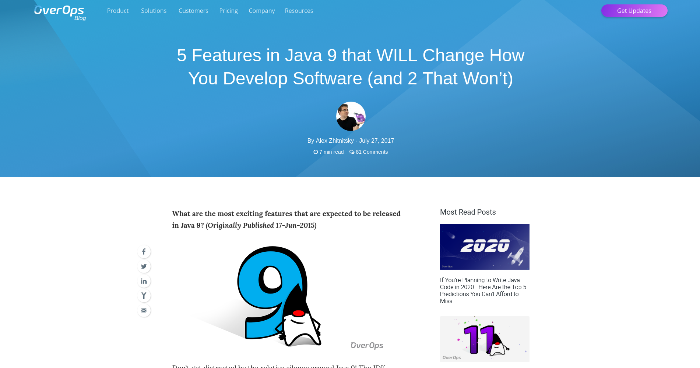
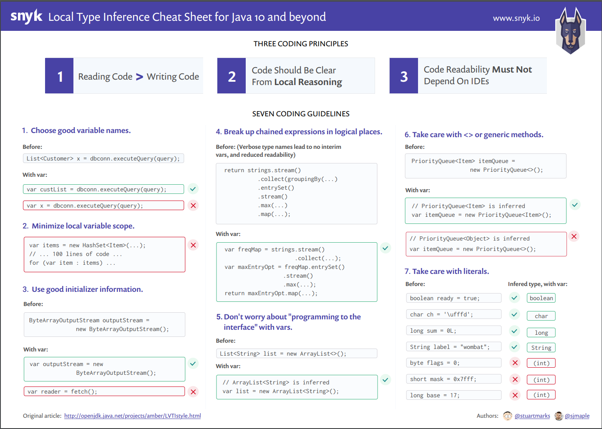
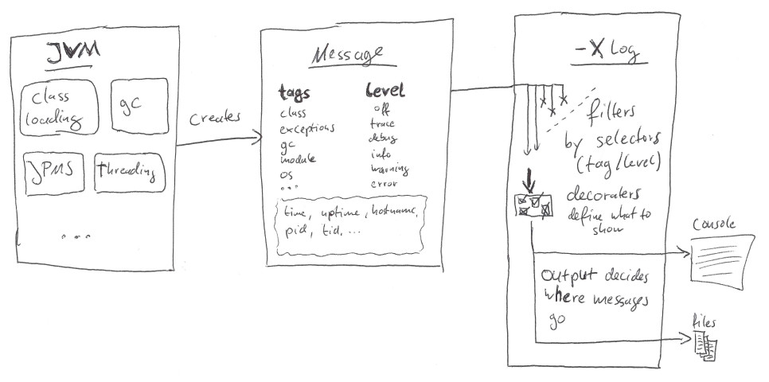

== Blogging 101

++++
<table class="toc">
	<tr><td>Setting Up A Blog</td></tr>
	<tr class="toc-current"><td>Creating Content</td></tr>
	<tr><td>Traffic</td></tr>
	<tr><td>Social Media</td></tr>
</table>
++++

=== What should I write?

Once you get started, +
you'll have too many ideas!

(Trust me.)

⇝ Keep a list!

=== To get started

Topics that *beg* for a blog post:

* errors/problems that took you +
  longer than 15 minutes to fix
* any design conversation that +
  takes longer than 15 minutes
* exploration of new technologies
* research into tech alternatives
* when you replace one techs/tools

Whenever "it depends", describe +
what it depends on for you!

=== Focus

Ideally, focus on "one topic":

* Java
* Persistence
* Java Persistence
* Web
* REST
* etc.

Improves reader experience +
and Google rank.

=== Formats

What formats exist?

* tutorials
* how-to guides
* explanations
* "Top Ten ...!"
* cheat sheets

*⇝ https://www.divio.com/blog/documentation/["What nobody tells you about documentation"]*

[state=empty,background-color=white]
=== !
image::images/documentation.png[background, size=contain]

[state=empty,background-color=white]
=== !

[state=empty,background-color=white]
=== !

=== Code snippets

Code snippets are important!

* develop full examples +
  (make sure they work as is)
* show essentials
* provide project with full examples +
  (e.g. on GitHub, GitLab)

Mention which versions you use.

=== Illustrations

If you can:

* draw explanatory diagrams
* have some one "professionalize" them +
  (or do it yourself)

Otherwise, include a picture that is mildly related.

[state=empty,background-color=white]
=== !

[state=empty,background-color=white]
=== !
image::images/unified-logging.png[background, size=contain]

[state=empty,background-color=black]
=== !
image::images/illustrations.png[background, size=contain]

=== Quality

Make sure your content has high quality:

* discuss and vet ideas +
  ("Would I want to read this?")
* verify code snippets
* technical review
* copy-editing

Don't deliver bad content!

=== Length

* readers have no patience!
* be short and to the point +
  (unlike me)
* 500 to 1500 words is common
* beyond that, think about splitting
* but: series are complicated

=== Time

Estimating time for writing is like +
estimating time for coding:

*A bad idea!*

My experience:

* 250-500 words/hour
* plus research
* plus external reviews
* plus illustration

Estimate at least one day per post!
