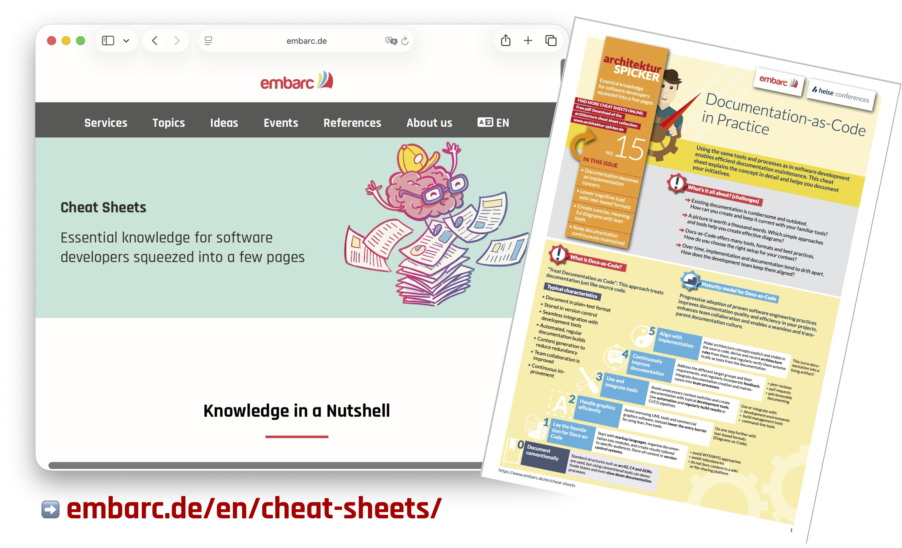

= Modern Java in Practice
:backend: revealjs
:revealjs_theme: nipa-night
:revealjsdir: ../_reveal.js/head
:revealjs_controls: false
:revealjs_progress: false
:revealjs_slideNumber: false
:revealjs_history: true
:revealjs_center: true
:revealjs_transition: fade
:revealjs_backgroundTransition: fade
:revealjs_parallaxBackgroundImage: images/modern-colors.jpg
:revealjs_parallaxBackgroundSize: 4500px 3000px
:revealjs_totalTime: 9000
:docinfo: shared
:docinfodir: ../_shared

:imagedir: images

include::../_shared/highlight.js.adoc[]

++++

<h2>The Features That Matter</h2>
++++

:guest-name: Falk Sippach
:guest-byline: sippsack.de (embarc)
:guest-url: https://www.sippsack.de/
:guest-photo: falk-sippach.jpg
:host-name: Devoxx BE
:host-url: https://devoxx.be/
:host-logo-url: images/logo-devoxx.png
include::../_shared/event-on-title-and-footer-guest.adoc[]

:title: Modern Java in Practice

// ######### //
// I N T R O //
// ######### //

// ⇝

////
TIMING:
	 5min NP/FS intro
	40min FS patterns
	10min NP performance
	15min FS/NP on-ramp
	 5min NP security
	 5min NP deprecations

	20min BREAK

	40min NP concurrency
	30min FS APIs
	10min NP tooling
////

:toc: pass:[ \
<table class="toc"> \
	<tr><td>Data-Oriented Programming</td></tr> \
	<tr><td>Faster Applications</td></tr> \
	<tr><td>On-Ramp and Fast Lane</td></tr> \
	<tr><td>Quantum Security</td></tr> \
	<tr><td>Removing the Cruft</td></tr> \
	<tr><td>Scalable <em>and</em> Maintainable</td></tr> \
	<tr><td>Stream Gatherers, Sequenced Collections, …</td></tr> \
	<tr><td>Flight Recorder and Other Tools</td></tr> \
</table> \
]
include::intro.adoc[]

:toc: pass:[ \
<table class="toc"> \
	<tr class="toc-current"><td>Data-Oriented Programming</td></tr> \
	<tr><td>Faster Applications</td></tr> \
	<tr><td>On-Ramp and Fast Lane</td></tr> \
	<tr><td>Quantum Security</td></tr> \
	<tr><td>Removing the Cruft</td></tr> \
	<tr><td>Scalable <em>and</em> Maintainable</td></tr> \
	<tr><td>Stream Gatherers, Sequenced Collections, …</td></tr> \
	<tr><td>Flight Recorder and Other Tools</td></tr> \
</table> \
]
include::pattern-matching.adoc[]

:toc: pass:[ \
<table class="toc"> \
	<tr><td>Data-Oriented Programming</td></tr> \
	<tr class="toc-current"><td>Faster Applications</td></tr> \
	<tr><td>On-Ramp and Fast Lane</td></tr> \
	<tr><td>Quantum Security</td></tr> \
	<tr><td>Removing the Cruft</td></tr> \
	<tr><td>Scalable <em>and</em> Maintainable</td></tr> \
	<tr><td>Stream Gatherers, Sequenced Collections, …</td></tr> \
	<tr><td>Flight Recorder and Other Tools</td></tr> \
</table> \
]
:toc-fakeout: pass:[ \
<table class="toc"> \
	<tr><td>Data-Oriented Programming</td></tr> \
	<tr><td>Faster Applications</td></tr> \
	<tr class="toc-current"><td>On-Ramp and Fast Lane</td></tr> \
	<tr><td>Quantum Security</td></tr> \
	<tr><td>Removing the Cruft</td></tr> \
	<tr><td>Scalable <em>and</em> Maintainable</td></tr> \
	<tr><td>Stream Gatherers, Sequenced Collections, …</td></tr> \
	<tr><td>Flight Recorder and Other Tools</td></tr> \
</table> \
]
include::performance.adoc[]

:toc: pass:[ \
<table class="toc"> \
	<tr><td>Data-Oriented Programming</td></tr> \
	<tr><td>Faster Applications</td></tr> \
	<tr class="toc-current"><td>On-Ramp and Fast Lane</td></tr> \
	<tr><td>Quantum Security</td></tr> \
	<tr><td>Removing the Cruft</td></tr> \
	<tr><td>Scalable <em>and</em> Maintainable</td></tr> \
	<tr><td>Stream Gatherers, Sequenced Collections, …</td></tr> \
	<tr><td>Flight Recorder and Other Tools</td></tr> \
</table> \
]
include::on-ramp.adoc[]

:toc: pass:[ \
<table class="toc"> \
	<tr><td>Data-Oriented Programming</td></tr> \
	<tr><td>Faster Applications</td></tr> \
	<tr><td>On-Ramp and Fast Lane</td></tr> \
	<tr class="toc-current"><td>Quantum Security</td></tr> \
	<tr><td>Removing the Cruft</td></tr> \
	<tr><td>Scalable <em>and</em> Maintainable</td></tr> \
	<tr><td>Stream Gatherers, Sequenced Collections, …</td></tr> \
	<tr><td>Flight Recorder and Other Tools</td></tr> \
</table> \
]
include::security.adoc[]

:toc: pass:[ \
<table class="toc"> \
	<tr><td>Data-Oriented Programming</td></tr> \
	<tr><td>Faster Applications</td></tr> \
	<tr><td>On-Ramp and Fast Lane</td></tr> \
	<tr><td>Quantum Security</td></tr> \
	<tr class="toc-current"><td>Removing the Cruft</td></tr> \
	<tr><td>Scalable <em>and</em> Maintainable</td></tr> \
	<tr><td>Stream Gatherers, Sequenced Collections, …</td></tr> \
	<tr><td>Flight Recorder and Other Tools</td></tr> \
</table> \
]
include::deprecations.adoc[]

[state="empty",background-color="#faf9f7"]
== !
image::images/javaone-2027.jpg[background, size=contain]

:toc: pass:[ \
<table class="toc"> \
	<tr><td>Data-Oriented Programming</td></tr> \
	<tr><td>Faster Applications</td></tr> \
	<tr><td>On-Ramp and Fast Lane</td></tr> \
	<tr><td>Quantum Security</td></tr> \
	<tr><td>Removing the Cruft</td></tr> \
	<tr class="toc-current"><td>Scalable <em>and</em> Maintainable</td></tr> \
	<tr><td>Stream Gatherers, Sequenced Collections, …</td></tr> \
	<tr><td>Flight Recorder and Other Tools</td></tr> \
</table> \
]
include::concurrency.adoc[]

:toc: pass:[ \
<table class="toc"> \
	<tr><td>Data-Oriented Programming</td></tr> \
	<tr><td>Faster Applications</td></tr> \
	<tr><td>On-Ramp and Fast Lane</td></tr> \
	<tr><td>Quantum Security</td></tr> \
	<tr><td>Removing the Cruft</td></tr> \
	<tr><td>Scalable <em>and</em> Maintainable</td></tr> \
	<tr class="toc-current"><td>Stream Gatherers, Sequenced Collections, …</td></tr> \
	<tr><td>Flight Recorder and Other Tools</td></tr> \
</table> \
]
include::apis.adoc[]

:toc: pass:[ \
<table class="toc"> \
	<tr><td>Data-Oriented Programming</td></tr> \
	<tr><td>Faster Applications</td></tr> \
	<tr><td>On-Ramp and Fast Lane</td></tr> \
	<tr><td>Quantum Security</td></tr> \
	<tr><td>Removing the Cruft</td></tr> \
	<tr><td>Scalable <em>and</em> Maintainable</td></tr> \
	<tr><td>Stream Gatherers, Sequenced Collections, …</td></tr> \
	<tr class="toc-current"><td>Flight Recorder and Other Tools</td></tr> \
</table> \
]
include::tooling.adoc[]

include::../_shared/about-slide.adoc[]

[state="empty",background-color="white"]
=== !

++++

++++

include::images/sources.adoc[]
