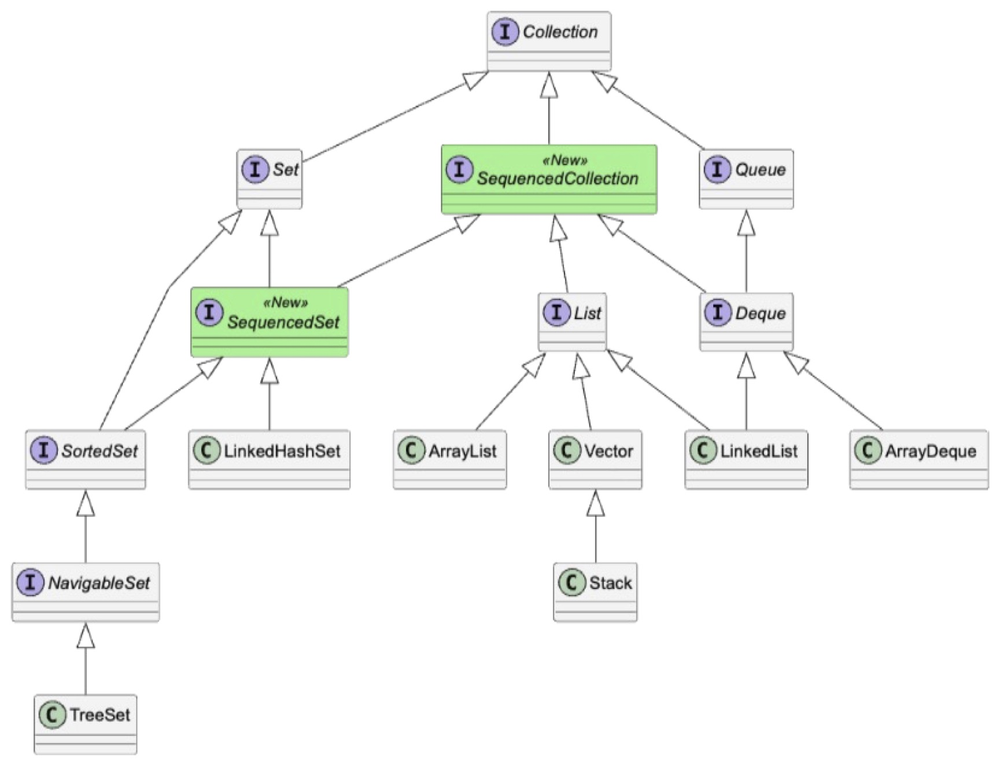
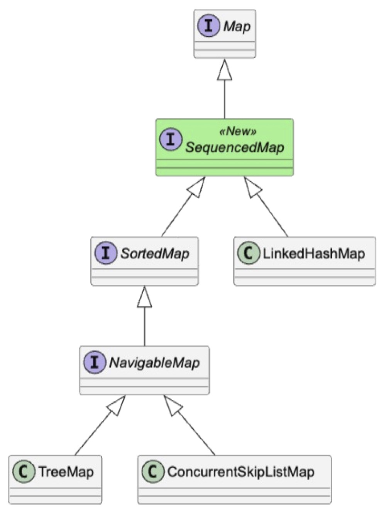
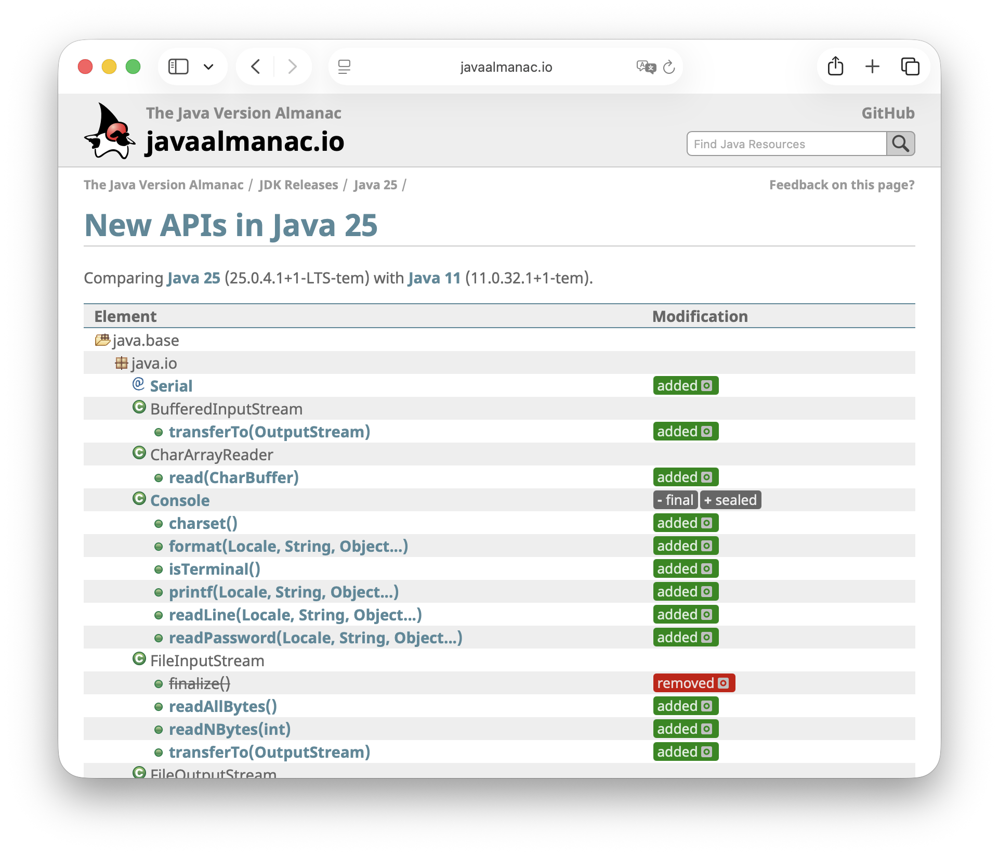

== {title}

{toc}

=== APIs that remove work

Four additions that improve everyday code:

[%step]
* model encounter order explicitly
* custom intermediate stream operations
* initialize constants only when needed
* opt in to HTTP/3

Not just more API surface. +
*Better abstractions for recurring problems.*

[NOTE.speaker]
--
This chapter is about APIs that remove code we used to write ourselves.
They are not connected by one language feature,
but they share a practical theme:
the platform now has better abstractions for recurring application problems.

We will look at encounter order, custom stream operations,
safe lazy initialization, and HTTP/3.
For each one, the question is the same:
what work can we stop doing after upgrading?
--

=== Sequenced Collections

*Order as a type-level contract*

[NOTE.speaker]
--
We will start with collections.
The practical problem is familiar:
many collection types have a defined encounter order,
but older APIs could not express that shared guarantee directly.

Sequenced Collections turn encounter order into an explicit contract
and give all ordered collections one vocabulary for both ends.
--

=== Collections with order

Ordered collections without a common ordered type:

[.small-note,cols="2,2,2",options="header"]
|===
| Type
| First
| Last

| `List`
| `get(0)`
| `get(size() - 1)`

| `Deque`
| `getFirst()`
| `getLast()`

| `SortedSet`
| `first()`
| `last()`

| `LinkedHashSet`
| `iterator().next()`
| 🤷
|===

Same concept. Inconsistent APIs.

[NOTE.speaker]
--
Java has always had several collections with a defined encounter order.
The problem was that this shared property was not represented by one shared type.

The code for the first and last element depended on the concrete interface.
For a linked hash set, getting the last element was particularly awkward.
The concept existed in our heads and in the documentation,
but not in the type system.
--

=== Three new interfaces

[cols="3,2",frame=none,grid=none]
|===
a|


a|

|===

[NOTE.speaker]
--
These three interfaces capture encounter order as a common property.
SequencedCollection covers ordered collections,
SequencedSet adds set semantics,
and SequencedMap applies the same idea to keys and entries.

The diagrams show where the interfaces were inserted
without breaking the existing collection hierarchy.

This matters most at API boundaries.
If callers may rely on encounter order,
the parameter or return type should say so directly.
--

=== Order in the type system

[source,java]
----
include::demos/Apis.java[tag=sequenced-type,indent=0]
----

Compared to:

* `Collection`: does not promise order
* `List`: also promises indexed access

[step=1]
Use the most general type that captures the contract.

[NOTE.speaker]
--
This method needs a first and a last session,
but it does not need indexes.
SequencedCollection expresses exactly that contract.

Collection would be too weak because it does not promise order.
List would be too strong because it also promises positional access.
Good interface design is often about choosing the weakest type
that still captures every guarantee the implementation needs.
--

=== Uniform end operations

[source,java,role=small-note]
----
include::demos/Apis.java[tag=sequenced-operations-body,indent=0]
----

Also:

`addFirst` · `addLast` · `removeFirst` · `removeLast`

[NOTE.speaker]
--
Once the value has a sequenced type,
the same vocabulary works across lists, deques, linked sets,
and the corresponding map views.

We can inspect both ends and traverse in reverse
without knowing the concrete implementation.
The mutating operations complete that vocabulary,
although not every implementation can support every mutation.
We will come back to that distinction in a moment.
--

=== Reversed means view

[source,java]
----
include::demos/Apis.java[tag=reversed-view,indent=0]
----

`reversed()`:

* does not copy
* preserves the collection semantics
* writes through to the backing collection

[NOTE.speaker]
--
The reversed result is a view, not a copy.
Creating it is therefore cheap,
and changes are visible in both directions.

Here, removing the first element of the reversed view
removes the last element of the original list.
That makes reverse traversal and end-based algorithms convenient,
but it also means we should not treat the result as an independent snapshot.
--

=== Not every operation works

What should this do?

[source,java]
----
SortedSet<String> letters = new TreeSet<>(
		List.of("B", "A", "C"));

letters.addLast("D");
----

++++
<ul>
<li class="fragment" data-fragment-index="1">always work &rarr; breaks sort order</li>
<li class="fragment" data-fragment-index="2">work sometimes &rarr; unpredictable</li>
<li class="fragment" data-fragment-index="3"><span class="fragment highlight-green" data-fragment-index="4">never work &rarr; <code style="color: inherit;">UnsupportedOperationException</code></span></li>
</ul>
++++

[NOTE.speaker]
--
A sorted set has an encounter order,
so it is a sequenced set.
But inserting an element specifically at the end
conflicts with its sorting rule.

The interface therefore exposes the uniform operation,
while an implementation may reject a mutation it cannot honor.
This follows the existing collections model:
capabilities such as order are expressed by types,
while optional mutations can throw UnsupportedOperationException.
--

=== When to use sequenced collections

Use them when:

* encounter order is part of your API
* clients need both ends
* clients need reverse traversal
* `List` would promise too much

[NOTE.speaker]
--
Sequenced Collections are most useful in our own public APIs,
where they replace documentation such as
"this collection preserves insertion order."

Do not replace every List mechanically.
Use a sequenced interface when encounter order and access to the ends matter,
but indexed access does not.
That communicates more accurately and gives implementations more freedom.
--

=== Stream Gatherers

*Custom intermediate stream operations*

[NOTE.speaker]
--
The next API addresses a different missing abstraction.
Streams have always supported reusable terminal operations through collectors,
but there was no equivalent extension point
for reusable intermediate operations.

Gatherers fill that gap
without changing the familiar lazy stream pipeline.
--

=== Missing stream operations

[cols="1,1",frame=none,grid=none]
|===
a|
++++
<div style="color: #17ff2e;">
<p><strong style="color: #fff;">Built in</strong></p>
<ul>
<li><code style="color: #17ff2e;">map</code></li>
<li><code style="color: #17ff2e;">filter</code></li>
<li><code style="color: #17ff2e;">flatMap</code></li>
<li><code style="color: #17ff2e;">distinct</code></li>
<li><code style="color: #17ff2e;">sorted</code></li>
</ul>
</div>
++++

a|
++++
<div class="fragment" data-fragment-index="1" style="color: #ff2c2d;">
<p><strong style="color: #fff;">Often needed</strong></p>
<ul>
<li>fixed or sliding windows</li>
<li>running totals</li>
<li>take-while-including</li>
<li>distinct-by-key</li>
<li>concurrent mapping</li>
</ul>
</div>
++++
|===

[step=2]
Streams have a strong but fixed vocabulary.

[NOTE.speaker]
--
Streams provide an excellent fixed set of intermediate operations.
But application code often needs operations that are stateful,
emit a different number of elements,
or do not fit map, filter, and flatMap.

Before Gatherers, we usually wrote a custom spliterator,
forced the logic into flatMap,
or left the stream pipeline and used an external library.
The missing piece was a standard extension point for intermediate operations.
--

=== Learn from collectors

[cols="2,2",options="header"]
|===
| Terminal operations
| Intermediate operations

| generalization: `Collector`
| generalization: `Gatherer`

| implementations: `Collectors`
| implementations: `Gatherers`

| extension point: `collect`
| extension point: `gather`
|===

[step=1]
Gatherers are to intermediate operations +
what collectors are to terminal operations.

[NOTE.speaker]
--
Collectors provide the model for the new design.
A Collector describes a reusable terminal operation,
Collectors contains standard implementations,
and collect connects it to a stream.

Gatherers mirror this structure for intermediate operations.
The abstraction is Gatherer,
the standard library offers Gatherers,
and the stream method is gather.
This analogy is the easiest way to place the API mentally.
--

=== Built-in: fixed windows

[source,java,role=small-note]
----
include::demos/Apis.java[tag=window-fixed,indent=0]
----

Turns one stream into batches of a fixed size.

The last window may contain fewer elements.

[NOTE.speaker]
--
The first built-in example groups adjacent stream elements
into fixed-size windows.
This is useful for batching database calls,
building pages, or processing records in chunks.

The operation stays lazy and inside the stream pipeline.
Notice that the final window is not discarded when it is incomplete;
the five input elements produce two pairs and one final single-element list.
--

=== Built-in: running totals

[source,java,role=small-note]
----
include::demos/Apis.java[tag=scan,indent=0]
----

Emits every intermediate accumulated value.

The result is a running total: [0 + 1, 1 + 2, 3 + 3, 6 + 4]

[NOTE.speaker]
--
Scan emits every intermediate accumulated value.
With addition, the result is a running total:
one, then three, then six, then ten.
--

=== More Built-In Gatherers:

Also:

* `windowSliding` (creates overlapping windows)
* `fold` (emits one aggregate)
* `mapConcurrent` (maps concurrently, preserves order)

[NOTE.speaker]
--
Fold is related but emits only the final accumulated result.
WindowSliding creates overlapping windows,
and mapConcurrent evaluates a mapping function concurrently
while preserving encounter order.
Start with these built-ins before designing a custom gatherer.
--

=== Custom Gatherer: anatomy

Integrator::
* accepts `(state, element, downstream)`
* updates the state
* emits zero or more results
* can signal that processing is done

Optional: **initializer** (creates state), **combiner** (enables parallel execution), **finisher** (can emit remaining results at the end)

[NOTE.speaker]
--
The integrator is the core of a gatherer.
For every input element it receives the current state,
the element, and a downstream object used to emit results.

The initializer creates state,
the combiner enables parallel execution,
and the finisher can emit remaining results at the end.
Most developers will consume gatherers more often than they implement them,
but this model explains what the abstraction can express.
--

=== Use a custom operation

[source,java]
----
include::demos/Apis.java[tag=use-distinct-by,indent=0]
----

[step=1]
Custom logic becomes a reusable, lazy +
intermediate stream operation.

[NOTE.speaker]
--
Once packaged as a gatherer,
the custom behavior looks like any other intermediate operation.
Here, the key is the string length,
so we keep the first three-character string and the first four-character string.

The important benefit is not this small example.
It is that tested domain logic becomes reusable,
remains lazy, and composes with the rest of the stream pipeline.
--
=== Define a custom operation

[source,java,role=small-note]
----
include::demos/Apis.java[tag=distinct-by,indent=0]
----

State: keys already seen. +
Output: the first element for each key.

[NOTE.speaker]
--
This custom gatherer implements distinct-by-key,
an operation that Stream does not provide directly.

The state is a set of keys already seen.
When a new key is added successfully,
the element is pushed downstream.
When the key already exists, the element is skipped.
Because this implementation is sequential,
we do not need to define how two partial states are combined.
--

=== Gatherers compose

```java
stream
	.gather(distinctBy(String::length))
	.gather(Gatherers.windowFixed(3))
	.gather(Gatherers.mapConcurrent(
			8, this::enrich))
	.toList();
```

Each gatherer can:

* keep state
* emit a different number of elements
* short-circuit
* participate in parallel evaluation

[NOTE.speaker]
--
Gatherers can be chained just like built-in stream operations.
This pipeline keeps one element per length,
groups the remaining elements into windows,
and enriches those windows concurrently.

Different gatherers can keep state, expand or reduce the stream,
and stop processing early.
Parallel evaluation requires a suitable combiner,
so it is a capability of the implementation rather than an automatic property.
--

=== Gatherers: reach for built-ins first

Start with:

* `windowFixed` / `windowSliding`
* `scan` / `fold`
* `mapConcurrent`

Write a custom gatherer only when +
the operation is reusable and belongs in the pipeline.

[NOTE.speaker]
--
The practical adoption path is conservative:
first use the standard gatherers,
then create a custom one only for an operation
that is reusable and conceptually belongs in a pipeline.

Do not turn every loop into a gatherer.
A local loop is often clearer.
The extension point pays off when it creates a named abstraction
that several pipelines can reuse.
--

=== Lazy Constants

*Safe, JVM-supported lazy initialization*

[NOTE.speaker]
--
Our third topic is lazy initialization.
The goal sounds simple:
compute an expensive value only when it is first needed.

Doing that correctly across threads has traditionally required
careful synchronization and publication.
Lazy Constants move that protocol into the platform
and make the resulting value visible to JVM optimizations.
--

=== Why initialize lazily?

Defer work when:

* initialization is expensive
* the value may never be used
* later initialization produces a better result

Tradeoffs:

* more runtime complexity
* latency moves to the first access
* failures happen later

[NOTE.speaker]
--
Lazy initialization is useful when creating a value is expensive
and some executions never need it.
It can also improve correctness when initialization should observe
state that is only available later.

But laziness moves work and failures to the first access.
That can make latency and error timing less predictable.
We should therefore use it deliberately,
not as a default replacement for ordinary eager initialization.
--

=== Lazy fields are hard

[source,java,role=small-note]
----
private volatile RecommendationModel model;

private RecommendationModel model() {
	var model = this.model;
	if (model == null) {
		synchronized (this) {
			model = this.model;
			if (model == null)
				this.model = model =
					RecommendationModel.load();
		}
	}
	return model;
}
----

Correct, thread-safe, and easy to get wrong.

[NOTE.speaker]
--
This is the familiar double-checked-locking pattern.
It needs a volatile field, a local copy, synchronization,
and a second check inside the critical section.

The code can be correct,
but it is disproportionate to the simple intent:
compute one value when it is first requested and publish it safely.
Small deviations can introduce duplicate work or unsafe publication.
This is exactly the kind of concurrency protocol the platform should own.
--

=== One stable lazy value

[source,java]
----
include::demos/Apis.java[tag=lazy-constant,indent=0]
----

A `LazyConstant`:

* computes on first `get`
* initializes successfully at most once
* is an actual constant to the JVM
* enables constant-folding optimizations

[NOTE.speaker]
--
LazyConstant turns that protocol into a small API.
We provide a supplier once and call get when the value is needed.
Successful initialization happens at most once
and is safely published to every thread.

The JVM also knows that the value becomes stable after initialization.
That is stronger than a conventional mutable field
and enables optimizations such as constant folding after the value is known.
--

=== Failure semantics

The initializer:

* must not return `null`
* may throw
* is retried by the next `get` after failure
* triggers `IllegalStateException` on cycles

`LazyConstant`:

* has no cancellation or timeout
* compares by identity

[NOTE.speaker]
--
The failure behavior is intentionally precise.
If initialization throws,
the LazyConstant remains uninitialized,
and a later get tries again.
Returning null is not allowed.

Cycles are detected and reported instead of deadlocking silently.
There is no cancellation or timeout,
so long-running initialization still belongs to application-level orchestration.
LazyConstant is about safe publication and stable identity,
not a general asynchronous computation framework.
--

=== Lazy lists

[source,java]
----
include::demos/Apis.java[tag=lazy-list,indent=0]
----

Each element is computed from its index +
at most once successfully.

[NOTE.speaker]
--
The API extends the idea to collections.
A lazy list has a fixed size and computes each element from its index.
Accessing one element does not require creating all the others.

Each successful element computation is cached independently.
This is useful for large virtual collections
whose elements are expensive and only sparsely accessed.
The collection itself is unmodifiable.
--

=== Lazy maps and sets

[source,java,role=small-note]
----
include::demos/Apis.java[tag=lazy-map-set,indent=0]
----

Each element is computed at most once successfully.

[step=1]
The collections are unmodifiable, +
but operations such as `equals` may evaluate all elements.

[NOTE.speaker]
--
A lazy map starts with a fixed key set
and computes a value when a key is accessed.
A lazy set starts with candidate elements
and evaluates a predicate to decide membership.

The laziness is observable through cost, not through mutation:
these collections are unmodifiable.
Operations such as equals, hashCode, or full iteration
may force every remaining computation,
so callers still need to understand the access pattern.
--

=== HTTP/3

*Modern transport, familiar client API*

[NOTE.speaker]
--
The API keeps the programming model
but modernizes the transport underneath it.

Java's existing HTTP client now supports HTTP/3 over QUIC.
Applications opt in through the same client and request builders,
while request bodies, response handlers, and asynchronous composition stay unchanged.
--

=== Java's HTTP client

[source,java]
----
var client = HttpClient.newHttpClient();

var request = HttpRequest.newBuilder(
		URI.create("https://dev.java"))
	.build();

var response = client.send(
		request,
		BodyHandlers.ofString());
----

Modern client:

* synchronous and asynchronous
* HTTP/1.1 and HTTP/2
* WebSocket support

[NOTE.speaker]
--
Java's modern HTTP client supports synchronous and asynchronous calls,
HTTP/1.1, HTTP/2, and WebSockets
without an external client library.

HTTP/3 extends this same API.
The request and response programming model does not change;
what changes is how the connection is established and negotiated.
--

=== Opt in to HTTP/3

[source,java]
----
include::demos/Apis.java[tag=http3-client,indent=0]
----

[step=1]
The client preference applies to all its requests.

[NOTE.speaker]
--
HTTP/3 support is deliberately opt-in.
Setting the version on the client establishes the default preference
for requests sent by that client.

Existing request building, body handlers,
synchronous sends, and asynchronous sends continue to work.
The small API change hides a substantial transport implementation underneath.
--

=== Override a single request

[source,java]
----
include::demos/Apis.java[tag=http3-request,indent=0]
----

The request can override the client's preference.

[step=1]
No changes to sending the request or handling the response.

[NOTE.speaker]
--
The version can also be selected for one request.
That request-level setting overrides the client's default.

This is useful while adopting HTTP/3 incrementally,
for example when only selected endpoints are known to support it.
The returned response reports the protocol version that was actually used,
which is important because most strategies allow fallback.
--

=== Why negotiation changes

[cols="1,1",options="header"]
|===
| HTTP/1.1 and HTTP/2
| HTTP/3

| TCP
| QUIC over UDP

| TLS layered on top
| TLS 1.3 integrated

| connection can upgrade from /1.1 to /2
| cannot upgrade a TCP connection to QUIC
|===

[step=1]
The client must discover or attempt HTTP/3.

[NOTE.speaker]
--
HTTP/2 can be negotiated over a TCP connection
that begins as HTTP/1.1.
HTTP/3 cannot use that upgrade path
because it runs over QUIC on UDP with TLS 1.3 integrated.

The client therefore needs a different strategy:
attempt QUIC directly,
race it against a TCP connection,
or first learn support through an Alt-Svc response.
That transport difference explains the available configuration choices.
--

=== Choosing a strategy

[.small-note,cols="2,2,2",options="header"]
|===
| Start with
| If unavailable
| Tradeoff

| HTTP/3
| fall back after timeout
| delays first request

| HTTP/2 and HTTP/3
| use first connection
| may create unused connection

| HTTP/2
| use /3 after `Alt-Svc`
| first request is not /3

| HTTP/3 only
| fail
| requires known support
|===

HTTP/3 is opt-in, not the default.

[NOTE.speaker]
--
There is no single best negotiation strategy.
Starting with HTTP/3 prefers the modern protocol
but can delay the first request when UDP is blocked.
Racing connections reduces that delay at the cost of extra connection work.

Alt-Svc is conservative:
the first request uses HTTP/2 or HTTP/1.1,
and later requests can use HTTP/3 after the server advertises it.
HTTP/3-only mode is appropriate when fallback would hide a deployment problem.
--

=== API summary

[.small-note,cols="2,1,1,3",options="header"]
|===
| API
| Status
| JEP
| Developer value

| Sequenced Collections
| Java 21
| https://openjdk.org/jeps/431[JEP 431]
| express encounter order in types

| Stream Gatherers
| Java 24
| https://openjdk.org/jeps/485[JEP 485]
| create reusable intermediate operations

| HTTP/3
| Java 26
| https://openjdk.org/jeps/517[JEP 517]
| modern transport with minimal code changes

| Lazy Constants
| Java 27 preview
| https://openjdk.org/jeps/531[JEP 531]
| safe lazy initialization with constant semantics
|===

*Upgrade first. Then simplify code with the new abstractions.*

[NOTE.speaker]
--
These APIs matter because they let us delete infrastructure code.
Sequenced Collections put encounter order into types.
Gatherers make reusable intermediate stream operations possible.
HTTP/3 reuses the existing client model for a new transport.
Lazy Constants replace a delicate concurrency protocol with a focused API.

The practical sequence is simple:
upgrade the runtime first,
then revisit code where these abstractions replace documentation,
custom utilities, or synchronization.
--

=== Oh, and one more thing ...

[source,shell]
----
$ jwebserver -p 8080 -d dist
URL http://127.0.0.1:8080/
----

* Ships with the JDK -- no setup or dependency required
* Perfect for local previews and quick demos -- not for production

[NOTE.speaker]
--
Here is one final small API pearl.
The JDK includes a simple static web server,
so previewing generated documentation or a small web application
does not require installing another tool.

Point it at a directory, choose a port, and open the displayed URL.
It deliberately stays simple:
this is for local development and quick demos,
not a production web server.
There is also a programmatic `SimpleFileServer` API
when a command-line tool is not enough.
--

[state=empty,background-color=white]
=== !

