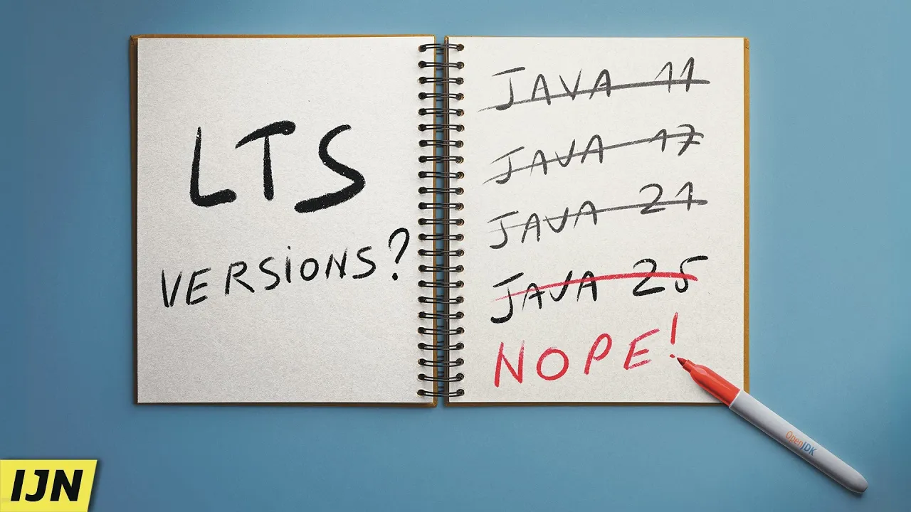

== A bit different

*JDK 27* was released in September: +
https://jdk.java.net/27[jdk.java.net/27]

*This session*:

* goes over Java 18 to 28
* sometimes deep, sometimes wide

Ask *questions* at any time!

=== Table of Content

{toc}

=== !
image::images/java-21-no-lts.jpg[]

🎥 https://www.youtube.com/watch?v=3bfR22iv8Pc[Java 21 is no LTS Version]

=== !

🎥 https://www.youtube.com/watch?v=x6-kyQCYhNo[Java 25 is ALSO no LTS Version]

=== This & More

*Slides* at https://slides.nipafx.dev/java-17+[slides.nipafx.dev/java-17+] (⇝ hit "?")

Links:

* 📝 https://www.heise.de/en/news/Java-27-Security-Runtime-and-Maturing-APIs-11461028.html[Java 27: Security, Runtime, and Maturing APIs]
* 🎥 https://youtube.com/java[youtube.com/java]
* 🎧 https://inside.java[inside.java]
* 📝 https://dev.java[dev.java]

=== Show of hands

Which Java versions +
do you run in production?