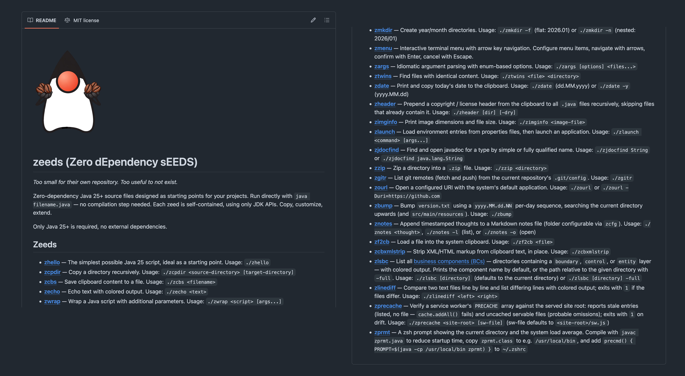

== {title}

{toc}

// TODO: on-ramp for beginners

=== The fast lane

Automate with Java!

* create a folder `java-scripts`
* add it to your path
* write scripts

=== Java scripts

To create a script:

* create a file with suitable name +
  (does not have to be `*.java`)
* make it executable with `chmod +x`
* run it from anywhere

=== Hello, World

```sh
$ cat `which hello`
> #!/usr/bin/env -S java --source 25
> void main() {
>	IO.println("Hello, scripts!");
> }
$ hello
> Hello, scripts!
```

=== Terminal Interaction

```java
void main() {
	var name = IO.readln("Please enter your name: ");
	IO.println("Nice to meet you, " + name);
}
```

```sh
# on JDK 25
$ java Main.java
> Please enter your name: Nicolai
> Nice to meet you, Nicolai
```

=== Local Data

```java
var transactions = Path.of("transactions.csv");
for (var line : Files.readAllLines(transactions)) {
	// ...
}

var analysis = "...";
var file = Path.of("analysis.txt");
Files.writeString(file, analysis);
```

=== Remote Data

```java
var client = HttpClient.newHttpClient();
var request = HttpRequest
		.newBuilder(URI.create("http://example.org/"))
		.build();
var body = client
		.send(request, BodyHandlers.ofString())
		.body();
```

=== Parsing Data

Java has out-of-the-box support for:

* XML
* JSON (preview in JDK 28)

😬

=== Dependencies

Third-party tools are needed for dependencies, +
e.g. https://www.jbang.dev/[jbang] or https://github.com/codejive/java-jpm[jpm]:

```sh
$ jpm install com.github.lalyos:jfiglet:0.0.9
Artifacts new: 1, updated: 0, deleted: 0
```

An on-board solution would be great!

=== Share functionality

Tha Java launcher can launch more complex projects:

```
java-scripts
 ├─ Hello.java
 ├─ Helper.java
 ├─ Goodbye.java
 └─ lib
     └─ library.jar
```

Run with:

```
java -cp 'lib/*' Hello.java
```

But _not_ from script files with a shebang. 😕

=== Share functionality

Workaround:

* use `.java` names for all sources
* create simple scripts for execution

```sh
$ cat `which hello`
> #!/usr/bin/bash
> java /absolute/path/to/Hello.java -cp 'lib/*' "$@"
$ hello
> Hello, scripts!
```

=== Scriptify

```java
void main(String[] args) throws Exception {
	var source = args[0];
	var script = source
		.substring(0, source.length() - 5)
		.toLowerCase();
	Files.writeString(
		Path.of(script),
		"java %s \"$@\"".formatted(
			Path.of(source).toAbsolutePath()));
	new ProcessBuilder("chmod", "+x", script)
		.start()
		.waitFor();
}
```

=== Ideas

Looking for ideas?

Adam Bien has a lot, e.g. https://github.com/adamBien/zeeds[zeeds].

[state="empty",background-color="#212830"]
=== !


// TODO: summary
