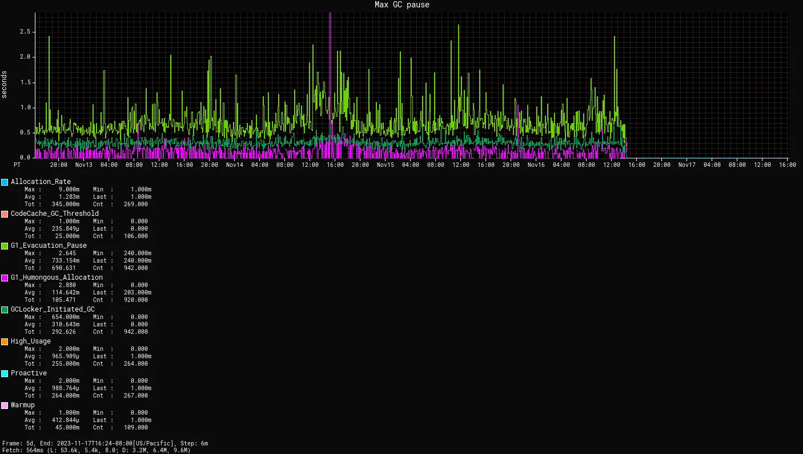

== {title}

{toc}

=== Improving performance

How do you improve performance +
of your Java application?

[%step]
Update to the latest Java version.

=== {title}

{toc-fakeout}

=== {title}

{toc}

=== Object headers

On 64bit hardware:

```
95-64 .........................HHHHHHH
63-32 HHHHHHHHHHHHHHHHHHHHHHHH.AAAA.TT
31- 0 CCCCCCCCCCCCCCCCCCCCCCCCCCCCCCCC
```

* `A`: GC age
* `C`: class word (compressed)
* `H`: hash code
* `T`: tag bits

(This is the simple case.)

=== Object overhead

This incurs overhead:

* objects tend to be small +
  (many workloads average 256-512 bits)
* header size is noticable +
  (15-30% on such workloads)

⇝ This is worth optimizing.

=== Compact object headers

New layout:

```
63-32 CCCCCCCCCCCCCCCCCCCCCCHHHHHHHHHH
31- 0 HHHHHHHHHHHHHHHHHHHHHVVVVAAAASTT
```

* `A`: GC age
* `C`: class word
* `H`: hash code
* `S`: self-forwarding
* `T`: tag bits
* `V`: Valhalla bits

=== Compact object headers

Observations:

* reduces heap size by 5-30%
* can reduce garbage collections
* can improve _or (rarely) deteriorate_ +
  overall performance

Enable:

* JDK 25: `-XX:+UseCompactObjectHeaders`
* JDK 27: by default

=== Continuous improvements

Similar performance improvements:

* reduced virtual thread pinning
* ZGC across the board
* G1 across the board (now the true default)
* ongoing JIT improvements
* cryptographic intrinsics

And many, many more, e.g. for +
https://inside.java/2026/03/08/jfokus-java-performance-update/[JDK 21-25],
https://inside.java/2026/06/09/jdk-26-performance-improvements/[JDK 26],
and https://inside.java/2026/09/28/performance-update-jdk27/[JDK 27].

[state="empty",background-color="#0a0a0a"]
=== !


=== Need more?

Adopt new features:

* FFM API instead of JNI
* ZGC instead of G1
* vector API for media/matrix math
* AOTCache for faster startup and warmup

=== AOT caching

Project Leyden introduces _AOTCache_:

* observe JVM
* capture decisions in AOTCache
* use as "initial state" during future run
* fall back to live observation/optimization +
  if necessary and possible

=== AOT cache

Cache content:

* class data (loaded and linked)
* method profiles
* native code

What does that get us?

[state="empty",background-color="white"]
=== !
image::images/leyden-speedup-code-cache-projects.png[background, size=contain]

[state="empty",background-color="white"]
=== !
image::images/leyden-speedup-code-cache-time.png[background, size=contain]

=== AOT workflow

```sh
# training run (⇝ AOTCache)
$ java -XX:AOTCacheOutput=app.aot
       -cp app.jar com.example.App ...
# production run (AOTCache ⇝ performance)
$ java -XX:AOTCache=app.aot
       -cp app.jar com.example.App ...
```

=== AOT limitations

* for code compilation: AArch64 or x64
* training vs production:
** same JDK release / architecture / OS
** for code compilation: same CPU features & GC
** consistent class path
** consistent module options
* limited use of JVMTI agents

Otherwise, unsuitable portions are ignored.

=== Summary

A newer JDK is a faster JDK!

Beyond that:

* explore GC options
* consider specific APIs like FFM
* AOT for faster launches