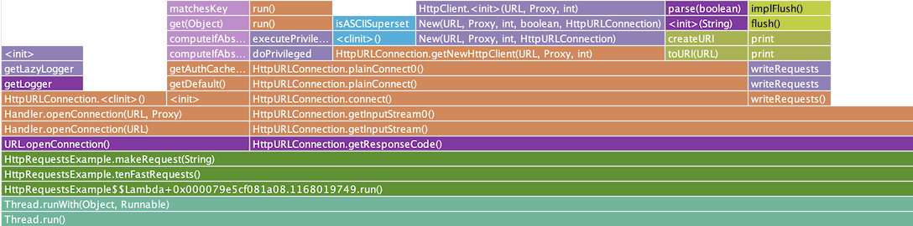
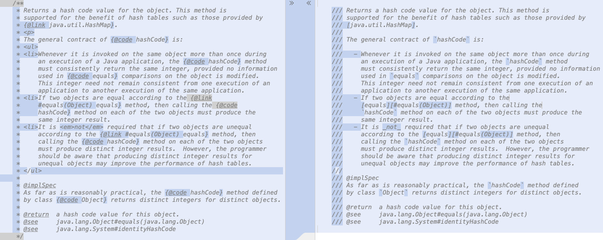
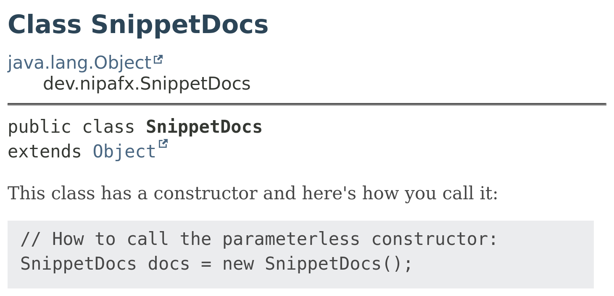

== {title}

{toc}

=== Detective work

Do you sometimes need to know…

* … whether your app calls deprecated code?
* … whether your serialization works as intended?
* … the initial security properties?
* … who's the most frequent caller of a method?
* … how much CPU time your methods are spending?

Then the JDK Flight Recorder (JFR) is your friend! +
(And these are just the latest features.)

=== JFR crash course

> JFR is a tool for collecting diagnostic and profiling data about a running Java application.
> It is integrated into the JVM and causes almost no performance overhead [~1% with default settings].
> JFR collects data [in the form of events] about the JVM as well as the Java application running on it.

=== JFR crash course

JFR is used in two steps:

* run the application and create a recording
* analyze the recording

=== Recording

To start a recording with default settings:

* launch with `-XX:StartFlightRecording`
* run `jcmd $pid JFR.start`

Arguments can be used to configure:

* event settings
* data retention
* when to write to disk
* and more

=== Analysis

To analyze a recording:

* open it in JDK Mission Control
* show as text with `jfr view`
* use `jfr print` to transform +
  to XML for JSON for other tools

Let's see some examples!

=== Method tracing

```
$ java -XX:StartFlightRecording:
	jdk.MethodTrace#filter=java.util.HashMap::resize,
	filename=recording.jfr
	...
$ jfr print
	--events jdk.MethodTrace --stack-depth 20
	recording.jfr
> jdk.MethodTrace {
>     startTime = 00:39:26.379 (2025-03-05)
>     duration = 0.00113 ms
>     method = java.util.HashMap.resize()
>     eventThread = "main" (javaThreadId = 3)
>     stackTrace = [
>       ...
>     ]
> }
```

=== Method timing

```
$ java -XX:StartFlightRecording:
	method-timing=::<clinit>,
	filename=clinit.jfr
	...
$ jfr view method-timing clinit.jfr
> 
>                                  Method Timing
> 
> Timed Method                 Invocations Avg Time
> ---------------------------- ----------- --------
> HBShaper.<clinit>()                    1 32.50 ms
> GraphicsEnvironment$LocalGE.<clinit>() 1 32.40 ms
> DemoFonts.<clinit>()                   1 21.20 ms
> TempFileHelper.<clinit>()              1 17.10 ms
> SecurityProviderConstants.<clinit>()   1  9.86 ms
```

=== CPU time profiling

```
$ java -XX:StartFlightRecording=
	jdk.CPUTimeSample#enabled=true,
	filename=profile.jfr
	...
```

JMC can create a flame graph...

[state="empty",background-color="white"]
=== !


=== JDK JFR events

JDK comes with almost 200 built-in events:

* threading and contention, e.g.: +
  `jdk.VirtualThreadPinned`, `jdk.JavaMonitorWait`
* allocation, memory, and GC, e.g.: +
  `jdk.ObjectAllocationSample`, `jdk.GCHeapMemoryUsage`
* file and network I/O, e.g.: `jdk.FileRead`, `jdk.SocketWrite`
* security, e.g.: +
  `jdk.InitialSystemProperty`, `jdk.TLSHandshake`
* and more

Run `jfr metadata` for a full list.

////
=== Custom JFR events

You can also create your own events:

```java
@Name("my.org.Rollback")
@Label("Transaction Rollback")
@Description("Transaction could not complete properly")
@Category({ "Ordering", "Transactions", "Failure" })
public class RollbackEvent extends jdk.jfr.Event {

	@Label("Order ID")
	@Description("The order ID")
	public long orderID;

	@Label("Error Message")
	public String errorMessage;

}
```

=== Custom JFR events

Using your event:

```java
public void rollbackTransaction() {
	var rollbackEvent = new RollbackEvent();
	rollbackEvent.begin();
	try {
		// roll back transaction
	} catch (SQLException ex) {
		rollbackEvent.end();
		rollbackEvent.orderID = ...;
		rollbackEvent.errorMessage = "...";
		rollbackEvent.commit();
	} finally {
		rollbackEvent.end();
	}
}
```
////

=== JavaDoc

> The Features That Matter

Well...

=== Markdown

Markdown is more pleasant to read and write:

* neither `<p>` nor `</p>`
* code snippts/blocks are simple
* lists are simple
* tables are less terrible
* embedding HTML is straightforward

Markdown is widely used and known.

=== Markdown in JavaDoc

Java now allows Markdown JavaDoc:

* each line starts with `///`
* CommonMark 0.30
* links to program elements use extended +
  reference link syntax: `[text][element]`
* JavaDoc tags work as usual

[state="empty",background-color="white"]
=== !


=== Code snippets

You can pull code snippets from source files, +
which you can compile and even test.

```java
class SnippetDocsDemo {

	@Test
	void constructorDemo() {
		// @start region="constructor"
		// How to call the parameterless constructor:
		SnippetDocs docs = new SnippetDocs();
		// @end

		// assert something meaningful
	}

}
```

=== Code snippets

```java
/**
 * This class has a constructor. Here's how you call it:
 * {@snippet class="SnippetDocsDemo" region="constructor"}
 */
public class SnippetDocs { ... }
```



=== Other improvements

Other tools that saw improvements:

* `javac`
* `java`
* `jar`
* `jlink`
* `jpackage`
* `jdeps`
* `jcmd`
* `javap`
* `jshell`

=== Versions

JDK 21: ::

* `JFR view`
* JavaDoc snippets
* `jwebserver`

JDK 25: ::

* JFR method timing & tracing, +
  CPU-time profiling, cooperative sampling
* Markdown in JavaDoc

JDK 27: ::

* JFR in-process data redaction

=== Summary

All tools are continuously improved, +
but specifically:

* JFR
* JavaDoc
