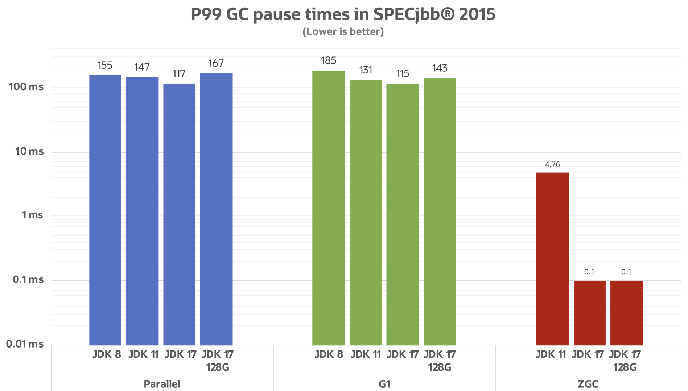
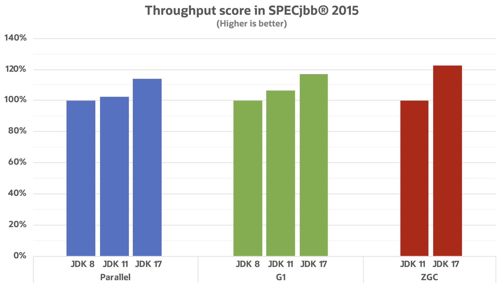
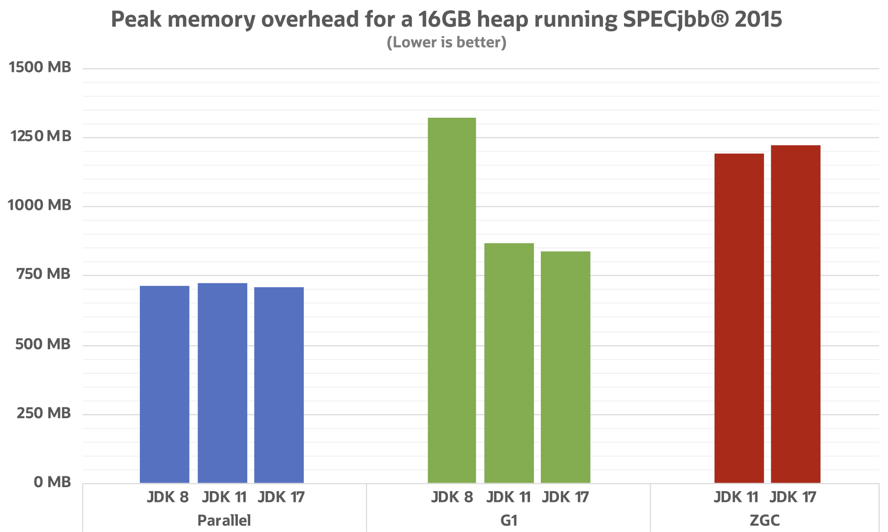

= Java After Eleven
:backend: revealjs
:revealjs_theme: nipa-oracle
:revealjsdir: ../_reveal.js
:revealjs_controls: false
:revealjs_progress: false
:revealjs_slideNumber: false
:revealjs_history: true
:revealjs_center: true
:revealjs_transition: fade
:revealjs_backgroundTransition: fade
:revealjs_parallaxBackgroundImage: images/bg-javaone-2022.jpg
:revealjs_parallaxBackgroundSize: 4000px 2250px
:docinfo: shared
:docinfodir: ../_shared

include::../_shared/highlight.js.adoc[]

:host-name: JavaOne
:host-url: https://oracle.com/javaone
:host-logo-url: images/logo-javaone.png
// :host-logo-style: background-color: #212121; border-width: 0;
:host-twitter-name: @JavaOne
:host-twitter-url: https://twitter.com/javaone
include::../_shared/event-on-title-and-footer.adoc[]


// ######### //
// I N T R O //
// ######### //

// ⇝

[state=empty,background-color=white]
== !


== Lots to talk about

The plan for today:

// * start with a *Java 8* code base
* start with a *Java 11* code base
* take it all the way to *Java 19* +
  (and beyond)
* be amazed by how much changes

This talk is:

* a showcase, not a tutorial
* not a complete list
* created with the lavish help +
  of the people in https://twitch.tv/nipafx[Twitch] chat

=== Links

* slides at https://slides.nipafx.dev/[slides.nipafx.dev]
* code at https://github.com/nipafx[github.com/nipafx]
** demo code base: https://github.com/nipafx/java-after-eight[/java-after-eight]
** more Java 9+ features: https://github.com/nipafx/demo-java-x[/demo-java-x]

// Tweet questions with https://twitter.com/hashtag/JavaNext?src=hash[#JavaNext].
// I'll answer—live!

////

== Java 8

* released 03/2014
* free support by Oracle *ended 01/2019*
* free support by Red Hat *until 06/2023*
* more free and commercial support available

=== It's a great release...

* solid feature set
* good performance
* very stable
* occasional backports
* great support

=== ...but it's getting dated

Java 8 misses out on most recent developments:

* many new language features
* many new and improved APIs
* many new JVM features
* improved performance +
  (in certain cases)

=== Time to upgrade

Let me show you how much +
you're missing out on +
if you're still on Java 8.

////

== Java 11

* released 09/2018
* free support by Oracle *ended 01/2019*
* free community support *until 10/2024*
* more free and commercial support available

=== It's a great release...

* first "modern" Java release with LTS
* solid feature set
* stable
* great support

=== ...but better things are waiting

Java 11 misses out on many recent developments:

* thrilling new language features
* some improved APIs
* a few new JVM features
* improved performance

=== Curious?

Let me show you how much +
you're missing out on +
if you're (still?) on Java 11.


== Code

Code, code, code, code

(https://github.com/nipafx/java-after-eight[code base])

////

== Java 9

* released 09/2017
* support *ended 01/2018*

=== What we've seen

* module system | `module-info.java`
* collection factories | `List::of`
* new process API | `ProcessHandle::pid`
* new version API | `Version::major`
* improved streams | `Stream::dropWhile`
* improved `Optional` | `Optional::or`

=== What we haven't seen

* `try` with effectively final resource
* private interface methods
* stack walking API
* unified logging
* multi-release JARs
* app/runtime images | `jlink`


== Java 10

* released 03/2018
* support *ended 07/2018*

=== What we've seen

* local-variable type inference | `var tags`
* more collection factories | `Map::copyOf`
* more collectors | `Collectors::toUnmodifiableList`

=== What we haven't seen

* application class-data sharing


== Java 11

* released 09/2018
* free support by Oracle *ended 01/2019*
* free support by Red Hat *until 10/2024*
* commercial support available

=== What we've seen

* improved whitespace handling | `String::strip`
* easier optionality | `Optional::isEmpty`
* uniform array creation | `toArray(String[]::new)`
* better `Path` creation | `Path::of`
* better `Predicate` negation | `Predicate::not`

=== What we haven't seen

* reactive HTTP/2 API | ↴
+
```java
HttpRequest request = HttpRequest.newBuilder()
    .GET()
    .uri(URI.create("https://nipafx.dev"))
    .header("Accept-Language", "en-US,en;q=0.5")
    .build();
```
* more `String` improvements | `String::lines`
* easier IO | `Files::readString`
* Java scripts | `java SourceFile.java`

////

== Java 12

*What we've seen:*

* more powerful collections | `Collectors::teeing`
* better async error handling | ↴ +
  `CompletableFuture::exceptionallyCompose`

=== Java 12

*What we haven't seen:*

* transforming Strings | ↴ +
  `String.transform(Function<String, R>)`
* social media number format | ↴ +
  `NumberFormat::getCompactNumberInstance`
* easy file comparison | `Files::mismatch`
* included JDK CDS archive


== Java 13

*What we haven't seen:*

* automatic application CDS archive


== Java 14

*What we've seen:*

* switch expressions | ↴
+
```java
boolean bool = switch (ternaryBool) {
	case TRUE -> true;
	case FALSE -> false;
	case FILE_NOT_FOUND -> throw
			new FileNotFoundException("🤬");
};
```
* helpful NPE messages

=== Java 14

*What we haven't seen:*

* JFR event streaming


== Java 15

*What we've seen:*

* text blocks | ↴
+
```java
var recommendation = """
		{
			"title": '$TITLE',
			"recommendations": $RECS
		}
	""";
```
* obvious `String` formatting | `String::format`

=== Java 15

*What we haven't seen:*

* hidden classes


== Java 16

*What we've seen:*

* records | `record Title(String text)`
* type patterns | `o instanceof Article a`
* `Stream::toList`

=== Java 16

*What we haven't seen:*

* improvements to Stream and HTTP/2 client
* Unix domain socket support
* OS-specific installers | `jpackage`


== Java 17

*What we've seen:*

* sealed clases | `sealed class ... permits`
* enhanced pseudo-random number generator API | ↴ +
  `RandomGenerator` and `RandomGeneratorFactory`

=== Java 17

*What we haven't seen:*

* always-strict floating-point semantics

=== Java 17

*What we've seen a bit:*

* better performance characteristics

All following diagrams come +
from https://twitter.com/kstefanj[Stefan Johansson]'s post +
https://kstefanj.github.io/2021/11/24/gc-progress-8-17.html[_GC progress from JDK 8 to JDK 17_].

[state="empty",background-color=white,background-transition=none]
=== !


[state="empty",background-color=white,background-transition=none]
=== !


[state="empty",background-color=white,background-transition=none]
=== !


[state="empty",background-color=white,background-transition=none]
=== !


[state="empty",background-color=white,background-transition=none]
=== !



== Java 18

*What we've seen:*

* JavaDoc code snippets (https://nipafx.dev/javadoc-snippets-maven/[better])
* jwebserver
* UTF-8 by default

=== Java 18

*What we haven't seen:*

* Internet resolution SPI


== Java 19

Previews galore!

////
* pattern matching for `switch` & record patterns
* virtual threads & structured concurrency
* foreign function & memory API
* vector API
////


== Java Next

*What we've seen:*

* pattern matching in `switch` | ↴
+
```java
return switch (post) {
	case Article article -> article.repository();
	case Video video -> video.repository();
	default -> Optional.empty();
};
```
* record patterns | ↴
+
```java
case Article(var repository) -> repository;
```

== Java Next

*What we've seen:*

* virtual threads + structured concurrency | ↴
+
```java
try (var scope = new StructuredTaskScope
		.ShutdownOnFailure()) {
	// ...

	scope.join();
	scope.throwIfFailed();
} catch (/* ... */) {
	// ...
}
```

=== Java Next

*What we haven't seen*

* vector API | http://openjdk.java.net/projects/panama/[Project Panama]
* foreign code and memory | http://openjdk.java.net/projects/panama/[Project Panama]
* value and primitive classes | http://openjdk.java.net/projects/valhalla/[Project Valhalla]


== Java 11 to 19+

// Java 8 to...
// * stronger encapsulation and better services | modules
// * safer code | processes, versions, whitespace, etc.
* more expressive code | LOC: 2061 📉 1663
* faster code | run time: ~ 1.1 s 📉 ~ 0.9 s
* better JVM | GCs, packaging, monitoring, etc.
* better tooling | JFR, JavaDoc, jwebserver, etc.

*Sure you don't want to upgrade?*


include::../_shared/about-slide.adoc[]

include::images/sources.adoc[]
