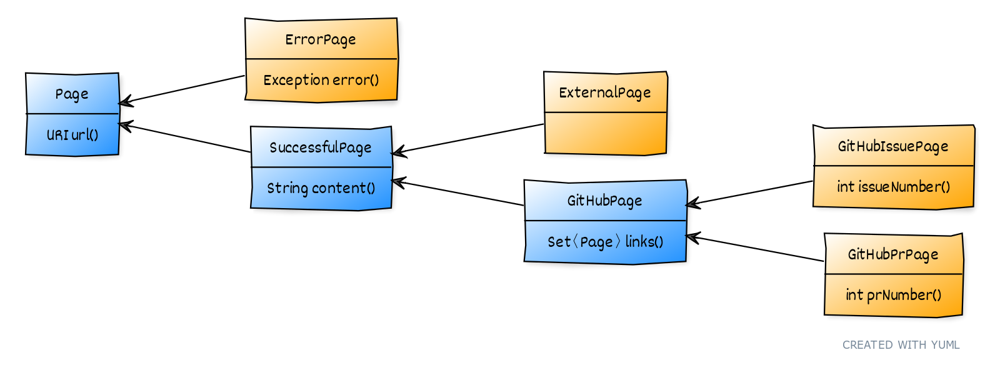

== Pattern Matching and Beyond

++++
<table class="toc">
	<tr><td>Data-Oriented Programming</td></tr>
	<tr class="toc-current"><td>A Lengthy Example</td></tr>
	<tr><td>Project Amber's Arc</td></tr>
</table>
++++

=== Crawling GitHub

Starting with a seed URL:

. connect to URL
. identify kind of page
. identify interesting section
. identify outgoing links
. for each link, start at 1.

(Code on https://github.com/nipafx/modern-java-demo[github.com/nipafx/modern-java-demo].)

=== Crawling GitHub

That logic is implemented in:

```java
public class PageTreeFactory {

	public static Page loadPageTree(/*...*/) {
		// [...]
	}

}
```

What does `Page` look like?

=== Requirements

Pages:

* all pages have a `url`
* unresolved pages have an `error`
* resolved pages have `content`
* GitHub pages have:
** outgoing `links`
** `issueNumber` or `prNumber`

=== Requirements

Operations:

* evaluate statistics
* create pretty string

=== A Possible Implementation

A single `Page` class with this API:

```java
public URL url();
public Exception error();
public String content();
public int issueNumber();
public int prNumber();
public Set<Page> links();

public Stats evaluateStatistics();
public String toPrettyString();
```

=== A Possible Implementation

Problems:

* page "type" is implicit
* legal combination of fields is unclear
* clients must "divine" the type
* disparate operations on same class

=== A Better Implementation

Data-oriented programming:

* makes all data explicit and "obviously correct"
* separates operations from data
* models systems as production line

=== Applying DOP

> Model data immutably and transparently.

Records fit perfectly:

```java
record ExternalPage(URI url, String content) { }
```

=== Ensuring Immutability

Records are shallowly immutable, +
but field types may not be.

⇝ Fix that during construction.

=== Applying DOP

> Model the data, the whole data, +
> and nothing but the data.

There are four kinds of pages:

* error page
* external page
* GitHub issue page
* GitHub PR page

⇝ Use four records to model them!

=== Modeling The Data

```java
public record ErrorPage(
	URI url, Exception ex) { }

public record ExternalPage(
	URI url, String content) { }

public record GitHubIssuePage(
	URI url, String content,
	int issueNumber, Set<Page> links) { }

public record GitHubPrPage(
	URI url, String content,
	int prNumber, Set<Page> links) { }
```

=== Modeling The Data

There are additional relations between them:

* a page (load) is either successful or not
* a successful page is either external or GitHub
* a GitHub page is either for a PR or an issue

⇝ Use sealed types to model the alternatives!

=== Modeling Alternatives

```java
public sealed interface Page
		permits ErrorPage, SuccessfulPage {
	URI url();
}

public sealed interface SuccessfulPage
		extends Page permits ExternalPage, GitHubPage {
	String content();
}

public sealed interface GitHubPage
		extends SuccessfulPage
		permits GitHubIssuePage, GitHubPrPage {
	Set<Page> links();
}
```

[state=empty,background-color=white]
=== !


////
yuml.me - https://yuml.me/nipafx/edit/github-crawler

[Page|URI url() {bg:dodgerblue}]
[ErrorPage|Exception error() {bg:orange}]
[SuccessfulPage|String content() {bg:dodgerblue}]
[GitHubPage|Set〈Page〉 links() {bg:dodgerblue}]
[GitHubIssuePage|int issueNumber() {bg:orange}]
[GitHubPrPage|int prNumber() {bg:orange}]

[Page]<-[ErrorPage]
[Page]<-[SuccessfulPage]
[SuccessfulPage]<-[GitHubPage]
[GitHubPage]<-[GitHubIssuePage]
[GitHubPage]<-[GitHubPrPage]
////

=== Applying DOP

> Make illegal states unrepresentable.

Many are already, e.g.:

* with `error` and with `content`
* with `issueNumber` and `prNumber`
* with `isseNumber` or `prNumber` but no `links`

⇝ Reject other illegal states in constructors.

=== Where Are We?

* page "type" is explicit in Java's type
* only legal combination of fields are possible
* API is more self-documenting
* code is easier to test

But where did the operations go?

=== Operations On Data

> Separate operations from data.

⇝ Record methods should be limited to derived quantities.

```java
public Stats evaluateStatistics();
public String toPrettyString();
```

This actually applies to our operations.

[step=1]
But what if it didn't? 😁

=== Operations On Data

Pattern matching on sealed types is perfect +
to apply polymorphic operations to data!

And records eschew encapsulation, +
so everything is accessible.

=== Gathering Statistics

In class `Statistician`:

```java
private void evaluatePage(Page page) {
	// `numberOf...` are fields
	switch (page) {
		case GitHubIssuePage issue -> numberOfIssues++;
		case GitHubPrPage pr -> numberOfPrs++;
		case ExternalPage ext -> numberOfExternals++;
		case ErrorPage err -> numberOfErrors++;
	}
}
```

=== Creating A Pretty String

In class `Pretty`:

```java
private static String createPrettyString(Page page) {
	return switch (page) {
		case GitHubIssuePage issue
			-> "🐈 ISSUE #" + issue.issueNumber();
		case GitHubPrPage pr
			-> "🐙 PR #" + pr.prNumber();
		case ExternalPage ext
			-> "💤 EXTERNAL: " + ext.url().getHost();
		case ErrorPage err
			-> "💥 ERROR: " + err.url().getHost();
	};
}
```

⇝ Simpler access with record/deconstruction patterns.

=== Deconstructing Data

Use deconstruction patterns:

```java
public static String createPrettyString(Page page) {
	return switch (page) {
		case GitHubIssuePage(
				var url, var content,
				int issueNumber, var links)
			-> "🐈 ISSUE #" + issueNumber;
		case ErrorPage(var url, var ex)
			-> "💥 ERROR: " + url.getHost();
		// ...
	};
}
```

⇝ Even simpler access with unnamed patterns.

=== Deconstructing Data

Use record and unnamed patterns for simple access:

```java
private static String createPrettyString(Page page) {
	return switch (page) {
		case GitHubIssuePage(_, _, int issueNumber, _)
			-> "🐈 ISSUE #" + issueNumber;
		case GitHubPrPage(_, _, int prNumber, _)
			-> "🐙 PR #" + prNumber;
		case ExternalPage(var url, _)
			-> "💤 EXTERNAL: " + url.getHost();
		case ErrorPage(var url, _)
			-> "💥 ERROR: " + url.getHost();
	};
}
```

=== Operations On Data

Looks good?

"Isn't switching over types icky?"

Yes, but why?

[step=1]
⇝ It fails unpredicatbly when new types are added.

=== Extending Operations On Data

This approach behaves much better:

* let's add `GitHubCommitPage implements GitHubPage`
* follow the compile errors!

=== Follow the errors

Starting point:

```java
record GitHubCommitPage(/*…*/) implements GitHubPage {

	// ...

}
```

Compile error because supertype is sealed.

⇝ Go to the sealed supertype.

=== Follow the errors

Next stop: the sealed supertype

⇝ Permit the new subtype!

```java
public sealed interface GitHubPage
		extends SuccessfulPage
		permits GitHubIssuePage, GitHubPrPage,
				GitHubCommitPage {
	// [...]
}
```

=== Follow the errors

Next stop: all switches that are no longer exhaustive.

```java
private static String createPrettyString(Page page) {
	return switch (page) {
		case GitHubIssuePage issue -> // ...
		case GitHubPrPage pr -> // ...
		case ExternalPage external -> // ...
		case ErrorPage error -> // ...
		// missing case: GitHubCommitPage
	};
}
```

⇝ Handle the new subtype!

=== Fix the errors

```java
private static String createPrettyString(Page page) {
	return switch (page) {
		case GitHubIssuePage issue -> // ...
		case GitHubPrPage pr -> // ...
		case GitHubCommitPage page -> // ...
		case ExternalPage external -> // ...
		case ErrorPage error -> // ...
	};
}
```

=== Operations On Data

To keep operations maintainable:

* switch over sealed types
* enumerate all possible types +
  (even if you need to ignore some)
* avoid `default` branch

⇝ Compile error when new type is added.

=== Where Are We?

* operations separate from data
* adding new operations is easy
* adding new data types is more work, +
  but supported by the compiler

⇝ Like the visitor pattern, but less painful.

=== Functional Programming?!

* immutable data structures
* methods (functions?) that operate on them

Isn't this just functional programming?!

[%step]
Kind of.

=== DOP vs FP

**Functional programming:**

> Everything is a function

⇝ Focus on creating and composing functions.

---

**Data-oriented programming:**

> Model data as data.

⇝ Focus on correctly modeling the data.

=== DOP vs OOP

**OOP is not dead (again):**

* valuable for complex entities or rich libraries
* use whenever encapsulation is needed
* still a good default on high level

**DOP --  consider when:**

* mainly handling outside data
* working with simple or ad-hoc data
* data and behavior should be separated

=== Data-Oriented Programming

Use Java's strong typing to model data as data:

* use classes to represent data, particularly:
** data as data with records
** alternatives with sealed classes
* use methods (separately) to model behavior, particularly:
** exhaustive `switch` without `default`
** pattern matching to destructure polymorphic data

=== More

On data-oriented programming:

* 📝 https://inside.java/2024/05/23/dop-v1-1-introduction/[Data-Oriented Programming in Java - Version 1.1]
* 📝 https://www.infoq.com/articles/data-oriented-programming-java/[Data Oriented Programming in Java]
* 🎥 https://www.youtube.com/watch?v=QrwFrm1R8OY[Java 21 Brings Full Pattern Matching]
* 🎥 https://www.youtube.com/watch?v=5qYJYGvVLg8[Data-Oriented Programming]
* 📝 https://openjdk.org/projects/amber/design-notes/patterns/pattern-match-object-model[Pattern Matching in the Java Object Model]
* 🧑‍💻 https://github.com/nipafx/modern-java-demo[GitHub crawler]
