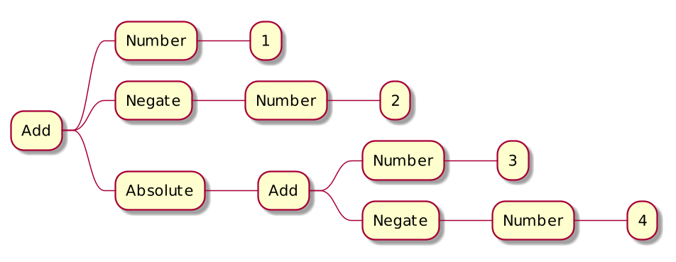

== Project Amber
image::images/amber.jpg[background, size=cover]

> Smaller, productivity-oriented Java language features

Profile:

* https://openjdk.java.net/projects/amber/[project] /
https://wiki.openjdk.java.net/display/amber/Main[wiki] /
https://mail.openjdk.java.net/mailman/listinfo/amber-dev[mailing list]
* launched March 2017
* led by Brian Goetz

=== Motivation

Some downsides of Java:

* can be cumbersome
* tends to require boilerplate
* due to situational lack of expressiveness

Amber wants to improve that situation!

=== Delivered

* local-variable type inference with `var`
  https://openjdk.java.net/jeps/286[⑩]
* switch expressions
  https://openjdk.java.net/jeps/361[⑭]
* text blocks
  https://openjdk.java.net/jeps/378[⑮]
* type pattern matching
  https://openjdk.java.net/jeps/394[⑯]
* records
  https://openjdk.java.net/jeps/395[⑯]
* sealed classes
  https://openjdk.java.net/jeps/409[⑰]

=== Delivered

Pattern matching:

* switch expressions
* type pattern matching
* sealed classes

Misc:

* `var`
* text blocks
* records

=== Pattern matching example

Evaluating simple arithmetic expressions.

`1 + (-2) + |3 + (-4)|`

```java
interface Node { }
record Number(long number) implements Node { }
record Negate(Node node) implements Node { }
record Absolute(Node node) implements Node { }
record Add(List<Node> summands) implements Node { }
```

=== Pattern matching example

Evaluating simple arithmetic expressions.

`1 + (-2) + |3 + (-4)|`



=== Polymorphism

Canonical way to apply operations +
to a type hierarchy:

Polymorphism

=== Polymorphic solution


```java
interface Node {
	long evaluate();
}

record Number(long number) implements Node {
	long evaluate() {
		return number;
	}
}

record Negate(Node node) implements Node {
	long evaluate() {
		return -node.evaluate();
	}
}
```

=== Polymorphic solution


```java
record Absolute(Node node) implements Node {
	long evaluate() {
		long result = node.evaluate();
		return result < 0 ? -result : result;
	}
}

record Add(List<Node> summands) implements Node {
	long evaluate() {
		return summands.stream()
			.mapToLong(Node::evaluate)
			.sum();
	}
}
```

=== Domain overload

Should you implement `evaluate` this way? +
Probably.

But what about:

* `Resources estimateResourceUsage()`
* `Strategy createComputationStrategy()`
* `Invoice createInvoice(User user)`
* `String prettyPrint()` (like https://github.com/Thihup/joel/commit/b49c9e7636ce409f9f875c4652fcaa905022dd62#diff-6a9248b7be98141e7c76af3955e11eb074d9cd88211aaf4be0d85c1453cc7649[here])
* `void draw(Direction d, Style s, Canvas c)`

⇝ Central abstractions can be overburdened.

=== Visitor pattern

Separating a hierarchy from operations +
is a case for https://nipafx.dev/java-visitor-pattern-pointless/[the visitor pattern].

Alternative: pattern matching over sealed types.

=== Pattern matching solution

Seal type hierarchy:

```java
interface Node
	permits Number, Negate, Absolute, Add { }

record Number(long number) implements Node { }
record Negate(Node node) implements Node { }
record Absolute(Node node) implements Node { }
record Add(List<Node> summands) implements Node { }
```

=== Pattern matching solution

* use type patterns in switch (https://openjdk.java.net/jeps/420[JEP 420] / 2nd preview in 18)
* use deconstruction patterns (https://openjdk.java.net/jeps/405[JEP 405] / not targeted)

```java
long evaluate(Node node) {
	return switch (node) {
		case Number(long no) -> no;
		case Negate(var n) -> -evaluate(n);
		case Absolute(var n) && evaluate(n) < 0
			-> -evaluate(n);
		case Absolute(var n) -> evaluate(n);
		case Add(var summands) -> summands.stream()
			.mapToLong(this::evaluate)
			.sum();
	};
}
```

=== Another use case

When parsing outside data, +
types are often general +
(think `JsonNode`).

Consider pattern matching +
to tease apart the data.

=== Other Amber endeavors

Possible future changes:

* template strings (https://openjdk.java.net/projects/amber/design-notes/templated-strings[white paper])
* concise method bodies (https://openjdk.java.net/jeps/8209434[JEP draft])
* serialization revamp (https://openjdk.java.net/projects/amber/design-notes/towards-better-serialization[white paper])

////
=== Template strings

TODO

=== Concise method bodies

[source,java]
----
class ListWrapper<E> implements List<E> {

    private List<E> list;

    public int size() -> list.size();
    public T get(int index) -> list.get(index);
	public int indexOf(E el) = list::indexOf;

}
----

*Yeah:*

* simple methods get simple code
* fewer (empty) lines

=== Death to serialization!

Serialization is hell:

* complicates every JDK feature
* repeated security vulnerabilities
* uses "invisible" mechanisms

The JDK team wants to get rid of it!

=== Serializing records

Replacement may look as follows:

* only works with records
* deconstructs a record graph
* passes data to serialization engine
* one engine per format: +
  XML, JSON, YAML, ...

=== New serialization

*Yeah:*

* records are a great fit for serialization
* new mechanism uses (de)constructors
* superior maintainability
////

=== Project Amber

* makes Java more expressive
* reduces amount of code
* makes us more productive

=== Timeline

My personal (!) guesses (!!):

* 2023:
** patterns in switch finalized
** deconstruction patterns preview
** template strings preview
* 2024:
** more patterns preview

=== Deeper Dives

* 📝 https://openjdk.java.net/projects/amber/design-notes/patterns/pattern-match-object-model[Pattern Matching in the Java Object Model]
* 🎥 https://www.youtube.com/watch?v=qul2B8iPC-o[Java Language Futures: All Aboard Project Amber] +
  (Nov 2017)
* 🎥 https://www.youtube.com/watch?v=hDV6G1MbUH8[Java Language Futures: Late 2021 Edition] (Sep 2021)
* 🎥 https://www.youtube.com/watch?v=UlFFKkq6fyU[Pattern Matching in Java (17)] (Sep 2021)
* 🎥 https://www.youtube.com/watch?v=a8OdwUiSnXw[State of Pattern Matching with Brian Goetz] (Feb 2022)
