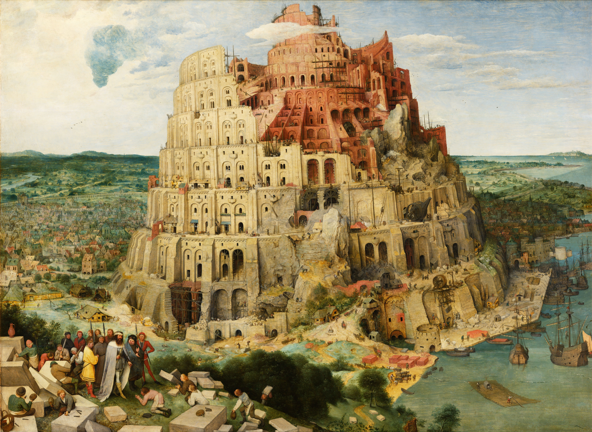

== Project Babylon


> Extend the reach of Java to foreign programming models such as SQL, differentiable programming, machine learning models, and GPUs

Profile:

* https://openjdk.org/projects/babylon/[project] /
https://mail.openjdk.org/mailman/listinfo/babylon-dev[mailing list] /
https://github.com/openjdk/babylon[code base]
* launched January 2024
* led by Paul Sandoz

=== Motivation

Java is adjacent to other programmable systems:

* GPUs and FPGAs
* SQL databases
* differentiable functions

Allow programming them with Java code.

=== Approach

Don't adapt to each realm in a separate project.

Instead:

* make Java code accessible
* provide API to read and transform it
* let ecosystem provide adaptions

=== Code Reflection

Babylons's central mechanism is _code reflection_:

* enhancement of "regular" reflection
* reaches down _into_ methods/lambdas
* symbolic representation of (Java) code

These are called _code models_.

=== NIH?

Abstract syntax tree:

* constructed during compilation
* closely aligned with Java grammar
* too much syntactic info

Bytecode:

* created by compiler
* specified by JVM Specification
* too little important info

=== Code Models

> The code model design is heavily influenced by the design of data structures used by many modern compilers to represent code.
> These data structures are commonly referred to as Intermediate Representations (IRs).
> The design is further influenced by Multi-Level Intermediate Representation (MLIR), a sub-project of the LLVM Compiler Infrastructure project.

=== Code Models

Identify code (e.g. with annotation):

```java
@CodeReflection
static double sub(double a, double b) {
   return a - b;
}
```

Then:

* compiler creates code model
* stored in class files
* accessible via reflection API
* can be transformed by Java code

=== Transforming Code Models

"Direct" GPU programming:

* transform to GPU kernels (OpenCL C or CUDA C)
* compile with GPU-specific toolchain

Triton-style:

* offer class `Triton` with static methods
* transform to Triton code model
* compile with Triton toolchain

=== Triton

```java
@CodeReflection
static void add_kernel2(
		Ptr x, Ptr y, Ptr result, int n, int size) {
    var pid = Triton.programId(0);
    var block_start = pid * size;
    var range = Triton.arange(0, size);
    var offsets = Triton.add(block_start, range);
    var mask = Triton.compare(
		offsets, n, Triton.CompareKind.LessThan);
    var x = Triton.load(Triton.add(x, offsets), mask);
    var y = Triton.load(Triton.add(y, offsets), mask);
    var output = Triton.add(x, y);
    Triton.store(
		Triton.add(result, offsets), output, mask);
}
```

=== Project Babylon

* introduces code reflection & code models
* allows their transformation
* expands Java to foreign programming models
* spearheads Java-on-GPU efforts (HAT)

=== Timeline

🤷🏾‍♂️

=== Deeper Dives

* 📝 https://openjdk.org/projects/babylon/articles/code-models[Code Models]
* 📝 https://inside.java/2024/10/23/java-and-ai/[Accelerating Java on Parallel Architectures] (Oct 2024)
* 🎥 https://www.youtube.com/watch?v=hBffN0xW784[Java for AI] (Oct 2025)
* 🎥 https://www.youtube.com/watch?v=DaMgGyfTSSw[Writing GPU-Ready AI Models in Pure Java] (Oct 2025)
* 🎥 https://www.youtube.com/watch?v=4grpNophot0[ONNX Based Generative AI LLMs in Java] (Nov 2025)