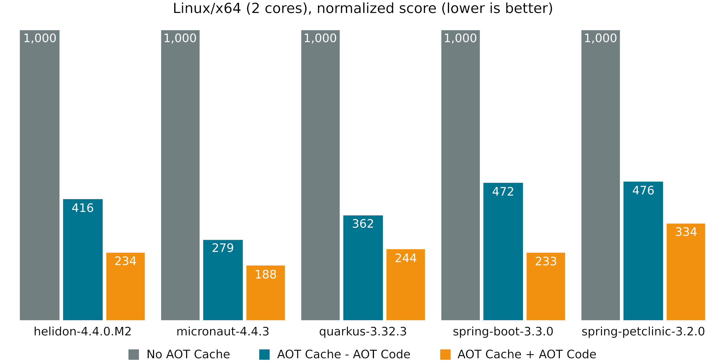
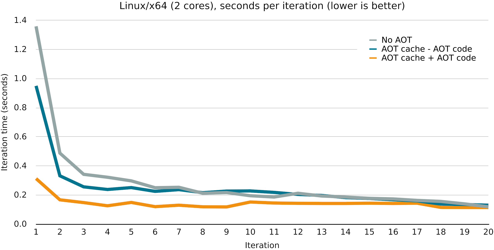

== Project Leyden


> Faster startup, shorter time to peak performance, smaller footprint

Profile:

* https://openjdk.org/projects/leyden/[project] /
https://mail.openjdk.org/mailman/listinfo/leyden-dev[mailing list] /
https://jdk.java.net/leyden[early access builds]
* launched May 2022
* led by Mark Reinhold and John Rose

=== Motivation

Java has really good peak performance, +
but also tends to have:

* slow startup time
* slow warmup time

=== Startup & Warmup

Early work by the runtime:

* class loading
* callsite linkage
* constant pool resolution
* interpretation
* profile gathering
* JIT compilation (C1, C2)

Can we shift this work?

=== Shifting Computation

Java already shifts computation:

* compile-time constant folding
* class loading
* garbage collection
* out-of-order execution
* ...

Let's shift more computation ahead of time!

[state=empty,background-color="white"]
=== !


=== Dynamic Java

Early work depends on:

* class/module path content
* command line options, +
  particularly module options
* run-time hardware and behavior

Only known during execution.

How to AOT everything?

[state=empty]
=== !


[state=empty]
=== !


=== Enter AOTCache

Leyden introduces _AOTCache_:

* observe JVM
* capture decisions in AOTCache +
  (expansion of _CDS Archive_)
* use as "initial state" during future run
* fall back to live observation/optimization +
  if necessary and possible

=== AOT workflow

```sh
# training run (⇝ profile)
$ java -XX:AOTMode=record
       -XX:AOTConfiguration=app.aotconf
       -cp app.jar com.example.App ...
# assembly phase (profile ⇝ AOTCache)
$ java -XX:AOTMode=create
       -XX:AOTConfiguration=app.aotconf
       -XX:AOTCache=app.aot
       -cp app.jar
# production run (AOTCache ⇝ performance)
$ java -XX:AOTCache=app.aot
       -cp app.jar com.example.App ...
```

=== AOT workflow

Shortcut for most cases:

```sh
# training run (⇝ AOTCache)
$ java -XX:AOTCacheOutput=app.aot
       -cp app.jar com.example.App ...
# production run (AOTCache ⇝ performance)
$ java -XX:AOTCache=app.aot
       -cp app.jar com.example.App ...
```

(Open to further improvements.)

=== Class loading & linking

> Improve startup time by making the classes of an application instantly available, in a loaded and linked state, when the HotSpot JVM starts.

Spring PetClinic benchmarks:

* up to ~40% startup time reduction
* AOT cache size of ~130 MB

=== Method profiling

> Improve warmup time by making method-execution profiles from a previous run of an application instantly available, when the HotSpot Java Virtual Machine starts.

Benchmark of a 100_000x loop over a simple stream:

* ~20% run time reduction
* AOT cache size increased by ~2.5%

=== Streaming cached objects

> Making it possible to load cached Java objects sequentially into memory from a neutral, GC-agnostic format.

* allows use of any garbage collector
* does not block when initializing heap
* takes longer for warm starts and +
  requires a CPU core

(Note: The cache contains _no_ application instances.)

=== Code Compilation

> Improve startup and warmup time by making optimized native code for an application instantly available when the HotSpot JVM starts.

Benchmarks with `javac`:

* ~15% startup time reduction
* ~75% fewer warmup iterations

[state="empty",background-color="white"]
=== !


[state="empty",background-color="white"]
=== !


=== AOT limitations

* for code compilation: AArch64 or x64
* training vs production:
** same JDK release / architecture / OS
** for code compilation: same CPU features & GC
** consistent class path
** consistent module options
* limited use of JVMTI agents

Otherwise, unsuitable portions are ignored.

=== AOT everything

Leyden's EA AOTs more:

* constant resolution
* dynamic proxies
* reflection data
* unfound classes

Benchmarks show ~70% startup time reduction.

=== Project Leyden

* improves Java's overall footprint
* focusses on startup/warmup time +
  by caching early JVM work
* may explore stricter constraints +
  for more aggressive optimization

=== Timeline

JDK 25:

* AOT class loading & linking (https://openjdk.org/jeps/483[JEP 483])
* AOT method profiling (https://openjdk.org/jeps/515[JEP 515])

JDK 26:

* AOT with any GC (https://openjdk.org/jeps/516[JEP 516])

JDK 28:

* AOT code compilation (https://openjdk.org/jeps/544[JEP 544])

=== Current work

* expand AOTCache
* allow tradeoff between +
  portability and peak performance
* iterative training
* better inspectability of training data

=== Deeper Dives

* 📝 https://openjdk.org/projects/leyden/notes/05-training-runs[Thoughts on Training Runs] (Sep 2024)
* 📝 https://openjdk.org/projects/leyden/notes/02-shift-and-constrain[Selectively Shifting and Constraining Computation] +
  (Oct 2022)
* 🎥 https://www.youtube.com/watch?v=z9XgILeSwzk[A Preview of What's Coming in Project Leyden] (Oct 2024)
* 🎥 https://www.youtube.com/watch?v=NlJK5BKXtHI[Project Leyden: Capturing Lightning in a Bottle] (Feb 2024)
* 🎥 https://www.youtube.com/watch?v=OOPSU4LnKg0[Project Leyden Update #JVMLS] (Aug 2024)
