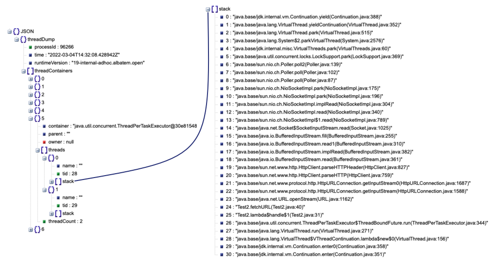

== Project Loom
image::images/loom.jpg[background, size=cover]

> JVM features and APIs for supporting easy-to-use, high-throughput, lightweight concurrency and new programming models

Profile:

* http://openjdk.java.net/projects/loom/[project] /
https://wiki.openjdk.java.net/display/loom/Main[wiki] /
http://mail.openjdk.java.net/mailman/listinfo/loom-dev[mailing list] /
http://jdk.java.net/loom[early access builds]
* launched January 2018
* led by Ron Pressler

=== Motivation

Imagine a hypothetical HTTP request:

. interpret request
. query database (_blocks_)
. process data for response

Resource utilization:

* good for 1. and 3.
* really bad for 2.

How to implement that request?

=== Synchronous

Align application's unit of concurrency (request)  +
with Java's unit of concurrency (thread):

* use thread per request
* simple to write, debug, profile
* blocks threads on certain calls
* limited number of _platform_ threads +
  ⇝ bad resource utilization +
  ⇝ low throughput

[NOTE.speaker]
--
* common CPU load: 5-30%
--

=== Asynchronous

Only use threads for actual computations:

* use non-blocking APIs +
  (with futures / reactive streams)
* harder to write, challenging to debug/profile
* incompatible with synchronous code
* shares platform threads +
  ⇝ great resource utilization +
  ⇝ high throughput

=== Motivation

Resolve the conflict between:

* simplicity
* throughput

=== Enter virtual threads!

A _virtual_ thread:

* is a regular `Thread`
* low memory footprint ([k]bytes)
* small switching cost
* scheduled by the Java runtime
* requires no OS thread when waiting

=== Virtual thread management

The runtime manages virtual threads:

* runs them on a pool of _carrier threads_
* makes them _yield_ on blocking calls +
(*frees the carrier thread!*)
* _continues_ them when calls return

=== Virtual thread example

Remember the hypothetical request:

. interpret request
. query database (_blocks_)
. process data for response

In a virtual thread:

[%step]
* runtime submits task to carrier thread pool
* when 2. blocks, virtual thread yields
* runtime hands carrier thread back to pool
* when 2. unblocks, runtime resubmits task
* virtual thread continues with 3.

=== Example

```java
try (var executor = Executors
		.newVirtualThreadPerTaskExecutor()) {
	IntStream
		.range(0, 1_000_000)
		.forEach(number -> {
			executor.submit(() -> {
				Thread.sleep(Duration.ofSeconds(1));
				return number;
			});
		});
} // executor.close() is called implicitly, and waits
```


[NOTE.speaker]
--
* all APIs are in flux
--

=== Example

```java
void handle(Request request, Response response)
		throws InterruptedException {
    try (var executor = Executors
			.newVirtualThreadPerTaskExecutor()) {
        var futureA = executor.submit(this::taskA);
        var futureB = executor.submit(this::taskB);
        response.send(futureA.get() + futureB.get());
    } catch (ExecutionException ex) {
        response.fail(ex);
    }
}
```

=== Performance

Virtual threads aren't "faster threads": +
Each task takes the same time (same _latency_).

So why bother?

=== Parallelism vs concurrency

[options="header"]
|============================================
|                | Parallelism  | Concurrency
| *Task origin*  | solution     | problem
| *Control*      | developer    | environment
| *Resource use* | coordinated  | competitive
| *Metric*       | latency      | throughput
| *Abstraction*  | CPU cores    | tasks
| *# of threads* | # of cores   | # of tasks
|============================================

=== Performance

When workload is not CPU-bound:

* start waiting as early as possible
* for as many tasks as possible

⇝ Virtual threads increase _throughput_:

* when number of concurrent tasks is high
* when workload is not CPU-bound

[NOTE.speaker]
--
* maximize progress other systems can make.
* "high": more than a few thousand
--

=== Use Cases

Virtual threads are cheap and plentiful:

* no pooling necessary
* allows thread per task
* allows liberal creation +
  of threads for subtasks

⇝ Enables new concurrency programming models.

[NOTE.speaker]
--
* "thread per task" covers earlier example
* "thread per subtask" comes next
--

=== Structured concurrency

Structured programming:

* prescribes single entry point +
  and clearly defined exit points
* influenced languages and runtimes

Simlarly, structured concurrency prescribes:

> When the flow of execution splits into multiple concurrent flows, they rejoin in the same code block.

=== Structured concurrency

> When the flow of execution splits into multiple concurrent flows, they rejoin in the same code block.

⇝ Threads are short-lived:

* start when task begins
* end on completion

⇝ Enables parent-child/sibling relationships +
  and logical grouping of threads.

=== Unstructured concurrency

```java
void handle(Request request, Response response)
		throws InterruptedException {
    try (var executor = Executors
			.newVirtualThreadPerTaskExecutor()) {
		// what's the relationship between
		// this and the two spawned threads?
		// what happens when one of them fails?
        var futureA = executor.submit(this::taskA);
        var futureB = executor.submit(this::taskB);
		// what if we only need the faster one?
        response.send(futureA.get() + futureB.get());
    } catch (ExecutionException ex) {
        response.fail(ex);
    }
}
```

=== Structured concurrency

```java
void handle(Request request, Response response)
		throws InterruptedException {
	// define explicit success/error handling
    try (var scope = new StructuredTaskScope
							.ShutdownOnFailure()) {
        var futureA = scope.fork(this::taskA);
        var futureB = scope.fork(this::taskB);
		// wait explicitly until success criteria met
		scope.join();
		scope.throwIfFailed();

        response.send(futureA.get() + futureB.get());
    } catch (ExecutionException ex) {
        response.fail(ex);
    }
}
```

=== Structured concurrency

* forked tasks are children of the scope
* creates relationship between threads
* success/failure policy can be defined +
  across all children

[state=empty,background-color=white]
=== !


=== Project Loom

Virtual threads:

* code is simple to write, debug, profile
* high throughput
* new programing model

Structured concurrency:

* clearer concurrency code
* simpler failure/success policies
* better debugging

=== Timeline

Decided:

* virtual threads preview ⑲

My personal (!) guesses (!!):

JDK 19 (2022) / JDK 20 (2023)::
* structured concurrency API preview
2024::
* more structured concurrency APIs (?)

=== Deeper Dives

* 📝 https://openjdk.java.net/jeps/425[JEP 425: Virtual Threads]
* 📝 https://openjdk.java.net/jeps/428[JEP 428: Structured Concurrency]
* 📝 https://inside.java/2021/11/30/on-parallelism-and-concurrency/[On Parallelism and Concurrency]
* 📝 https://250bpm.com/blog:71/[Structured Concurrency]
* 📝 https://vorpus.org/blog/notes-on-structured-concurrency-or-go-statement-considered-harmful/[Notes on structured concurrency, or: ...]
* 🎥 https://www.youtube.com/watch?v=fq0OEX0XYR8[Modern, Scalable Concurrency for the Java Platform] +
  (Sep 2021)
* 🎥 https://www.youtube.com/watch?v=KG24inClY2M[State of Project Loom with Ron Pressler] (Jun 2021)
