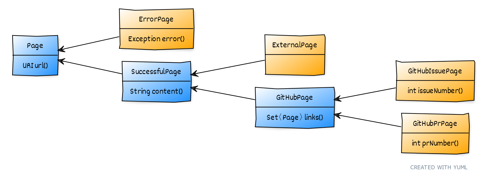
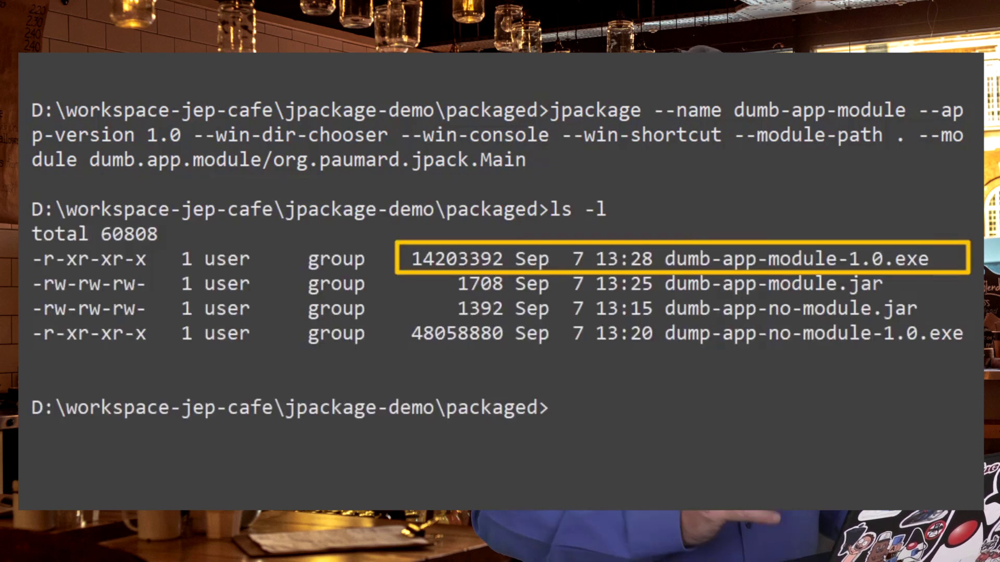
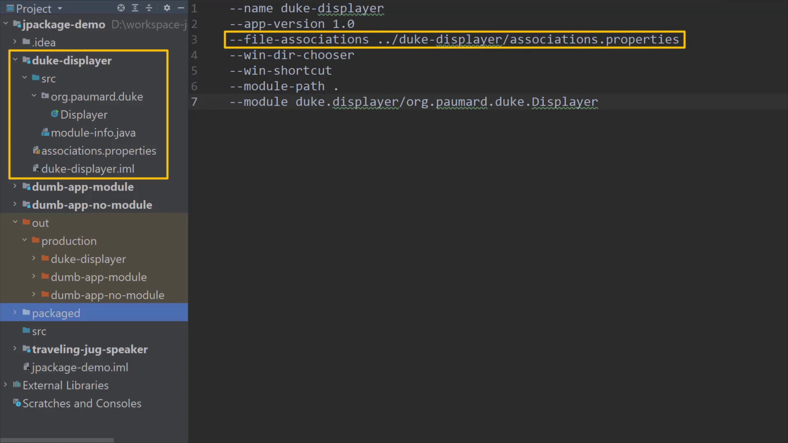
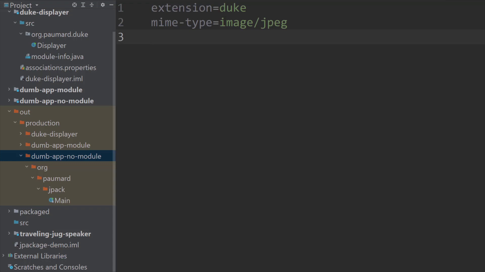

= Modern Java in{nbsp}Action
:backend: revealjs
:revealjs_theme: nipa-night
:revealjsdir: ../_reveal.js/head
:revealjs_controls: false
:revealjs_progress: false
:revealjs_slideNumber: false
:revealjs_history: true
:revealjs_center: true
:revealjs_transition: fade
:revealjs_backgroundTransition: fade
:revealjs_parallaxBackgroundImage: images/road-lights.jpg
:revealjs_parallaxBackgroundSize: 5632px 3168px
:revealjs_totalTime: 2700
:docinfo: shared
:docinfodir: ../_shared

:imagedir: images

include::../_shared/highlight.js.adoc[]

:host-name: VDZ
:host-logo-url: images/logo-voxxed-days-zuerich.png
:host-url: https://voxxeddays.com/zurich/
:host-logo-style: background-color: transparent; border-width: 0;
:host-twitter-name: @VoxxedZurich
:host-twitter-url: https://twitter.com/voxxedzurich
include::../_shared/event-on-title-and-footer.adoc[]


// ######### //
// I N T R O //
// ######### //

// ⇝

== Let's get started!

[%step]
* we'll implement a GitHub crawler
* we'll aggressively use, abuse, and overuse +
  modern Java features
* this is a showcase, not a tutorial +
  ⇝ go to https://youtube.com/@java[youtube.com/@java] for more
* code https://github.com/nipafx/modern-java-demo[github.com/nipafx/modern-java-demo]
* slides at https://slides.nipafx.dev/java-x-action[slides.nipafx.dev] +
  (hit "?" to get navigation help)
* ask questions at any time

=== Crawling GitHub

Starting with a seed URL:

. connect to URL
. identify kind of page
. identify interesting section
. identify outgoing links
. for each link, start at 1.

=== Crawling GitHub

Then:

. print statistics
. print page list
. show pages on localhost

=== Gameplan

Domain model:

* create with records and sealed interfaces
* operate on with pattern matching

Fetching pages:

* HTTP client to fetch from GitHub
* virtual threads via structured concurrency

=== Gameplan

Present results:

* format with text blocks and string templates
* host with simple file server

(And modules for reliability.)

== Code!

https://github.com/nipafx/modern-java-demo[github.com/nipafx/modern-java-demo]

== Review

=== What Java was _That_?!

JDK 22 EA with preview features!

Features that aren't final on JDK 21:

* unnamed patterns (final in 22: https://openjdk.org/jeps/456[JEP 456])
* string templates (https://mail.openjdk.org/pipermail/amber-spec-experts/2024-March/004010.html[revamp soon])
* `StructuredTaskScope`

=== Domain Model

```java
public sealed interface Page
		permits ErrorPage, SuccessfulPage {

	URI url();

}
```

=== Domain Model

```java
public record GitHubPrPage(
	URI url, String content, Set<Page> links, int number)
	implements GitHubPage {

	public GitHubPrPage {
		// argument validation
	}

	public GitHubPrPage(
			URI url, String content, int number) {
		this(url, content, new HashSet<>(), number);
	}

	// `equals` and `hashcode` based on `url`

}
```

[state=empty,background-color=white]
=== !


=== Operations

```java
public static String pageName(Page page) {
	return switch (page) {
		case ErrorPage(var url, _)
			-> "💥 ERROR: " + url.getHost();
		case ExternalPage(var url, _)
			-> "💤 EXTERNAL: " + url.getHost();
		case GitHubIssuePage(_, _, _, int number)
			-> "🐈 ISSUE #" + number;
		case GitHubPrPage(_, _, _, int number)
			-> "🐙 PR #" + number;
	};
}
```

=== HTTP Client

```java
// creation
var client = HttpClient.newHttpClient();

// use
var request = HttpRequest
	.newBuilder(url)
	.GET()
	.build();
return client
	.send(request, BodyHandlers.ofString())
	.body();
```

=== Structured Concurrency

```java
try (var scope =
		new StructuredTaskScope.ShutdownOnFailure()) {
	var futurePages = links.stream()
		.map(link -> scope.fork(
			() -> createPage(link, depth)))
		.toList();

	scope.join();
	scope.throwIfFailed();

	return futurePages.stream()
		.map(Subtask::get)
		.collect(toSet());
} catch (ExecutionException ex) {
	// [...]
}
```

=== String Templates

```java
var html = asHTML(RAW."""
	<!DOCTYPE html>
	<html lang="en">
		<head>
			<meta charset="utf-8">
			<title>\{Pretty.pageName(rootPage)}</title>
			<link rel="stylesheet" href="style.css">
		</head>
		<body>
			<div class="container">
				\{pageTreeHtml(rootPage)}
			</div>
		</body>
	</html>
	""");
```

=== Simple File Server

```java
SimpleFileServer.createFileServer(
		address,
		serverDir.toAbsolutePath(),
		OutputLevel.INFO)
	.start();
```

=== JPackage

Let's watch https://www.youtube.com/watch?v=-6q_MKtPL3o[Jose's exploration]...

[state=empty,background-color=#333]
=== !


[state=empty,background-color=#333,background-transition=none]
=== !


[state=empty,background-color=#333,background-transition=none]
=== !


[state=empty,background-color=#333,background-transition=none]
=== !


[state=empty,background-color=#333,background-transition=none]
=== !


[state=empty,background-color=#333,background-transition=none]
=== !


[state=empty,background-color=#333,background-transition=none]
=== !


=== Modern Java In Action

* great domain modeling with +
  records, sealed classes, pattenr matching
* easy, structured (and scalable) concurrency
* on-board HTTP client and string templates
* simple web server and packaging

// ######### //
// O U T R O //
// ######### //

include::../_shared/about-slide.adoc[]

include::images/sources.adoc[]
