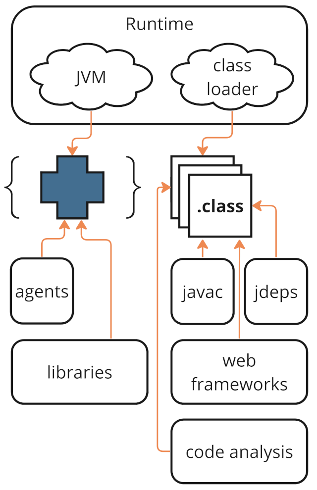
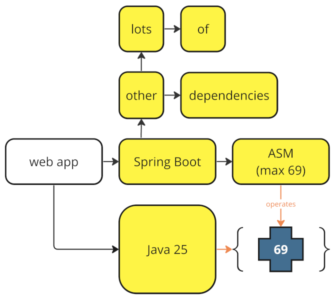
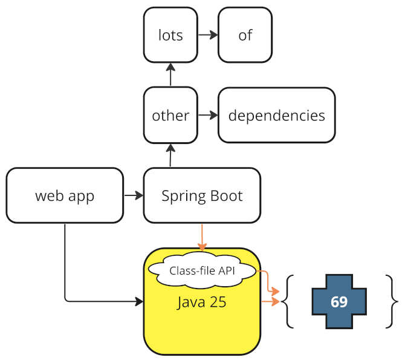

== {title}

{toc}

// Unlocking easier Java updates.

=== Bytecode Basics

Bytecode is instruction set for JVM:

* creating objects and arrays
* copying variable values or references +
  between stack and registers
* invoking methods
* computing arithmetic operations
* etc.

=== Bytecode Basics

Basic lifecycle:

* generated by javac
* stored in `.class` files
* loaded, parsed, verified by class loader
* executed by JVM

=== Bytecode Beyond Basics

In real life, much more happens:

* generated by frameworks at build time
* turned into machine code by JIT compiler +
  or Graal native image
* prefetched by AOTCache
* analyzed by jdeps, SpotBugs, etc.
* manipulated by agents and libraries

[state="empty",background-color="white"]
=== !

=== Bytecode Tools

Tooling:

* libraries don't manipulate bytecode themselves
* they use a few tools

Big player is ASM +
(direct or, e.g., via ByteBuddy or CGLIB).

=== Migration Pains

Updates:

* bytecode has a level (e.g. 65 for Java 21)
* tools can't work with a higher level +
  than they were built for

This can block updates!

E.g. when compiling your code with Java 25 (level 69)...

[state="empty",background-color="white"]
=== !

=== Migration Pains

This is the reason for:

> Before updating the JDK, +
> update all dependencies.

We want to move past that!

=== Class-File API

An API in Java that allows +
analyzing and manipulating bytecode:

* stable API in JDK
* always up-to-date

When JDK is updated:

* it may read new bytecodes
* but that's ok for most use cases

[state="empty",background-color="white"]
=== !

=== More

* 📝 https://openjdk.org/jeps/484[JEP 484]: Class-File API
* 🎥 https://www.youtube.com/watch?v=pcg-E_qyMOI[A Classfile API for the JDK] (Brian Goetz)
* 🎥 https://www.youtube.com/watch?v=bQ2Rwpyj_Ks[New Class-File API Will Make Java Updates Easier]
