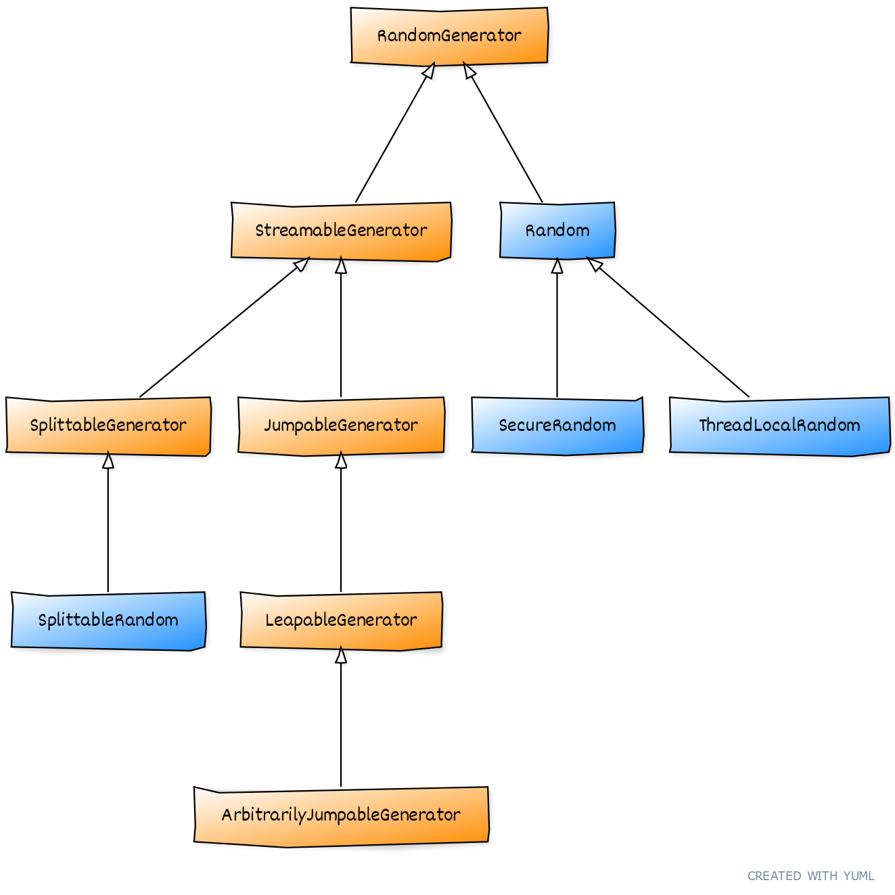

== {title}

{toc}

Better maintainability and future-proof algorithm selection.

=== Muddied API

The API before Java 17 was muddied:

* limited algorithms
* uneven, e.g. `nextLong​(long bound)`
* weird inheritance hierarchy

(The implementations weren't great, either.)

=== Weird Inheritance


=== RandomGenerator

New central abstraction: +
`RandomGenerator`.

* API is basically `Random` +
  plus missing methods
* no requirements for thread-safety +
  or cryptographic security

=== Detailed Subtypes

Subtypes specify how one generator +
can create another that is:

* statistically independent
* individually uniform

(Or some approximation thereof.)

=== Updates

Existing classes were updated:

* implement `RandomGenerator` or suitable subtype
* better implementation with less repetition

[state="empty",background-color=white]
=== !


=== Algorithms

https://docs.oracle.com/en/java/javase/17/docs/api/java.base/java/util/random/package-summary.html#algorithms[Current list] of pseudorandom number generators (PNRGs):


=== Algorithm Selection by Name

All interfaces have static factory method `of`:

```java
var name = "...";

var rg = RandomGenerator.of(name);
var jg = JumpableGenerator.of(name);
var lg = LeapableGenerator.of(name);
// ...
```

If algorithm of that name and type...

* exists ~> it is returned
* doesn't exist ~> `IllegalArgumentException`

=== Algorithm Evolution

Advances in PRNG development and analysis require flexibility:

* JDKs can contain more algorithms than listed above
* new algorithms can be added over time
* algorithms can be deprecated at any time
* algorithms can be removed in major versions

⇝ Selection by name is not robust.

=== Algorithm Selection by Properties

If you have no specific requirements:

```java
var generator = RandomGenerator.getDefault();
```

With requirements, use `RandomGeneratorFactory`.

=== RandomGeneratorFactory

Steps to select an algorithm by properties:

. call static method `all()` to get +
  `Stream<RandomGeneratorFactory>`
. use methods to filter by properties, e.g.:
* `isStreamable()`, `isSplittable()`, etc.
* `isStatistical()`, `isStochastic()`
* `isHardware()`
* `period()`, `stateBits()`
. call `create()` to create the generator

=== Algorithm Selection by Properties

```java
var generator = RandomGeneratorFactory.all()
	.filter(RandomGeneratorFactory::isJumpable)
	.filter(factory -> factory.stateBits() > 128)
	.findAny()
	.map(RandomGeneratorFactory::create)
//  if you need a `JumpableGenerator`:
//  .map(JumpableGenerator.class::cast)
	.orElseThrow();
```

=== New Random Generator API

Summary:

* interface `RandomGenerator` as central abstraction
* more detailed interfaces specify how to +
  create one generator from another
* existing classes implement suitable interfaces
* list of algorithms is extended and more flexible
* use `RandomGeneratorFactory` to select +
  algorithms based on properties
