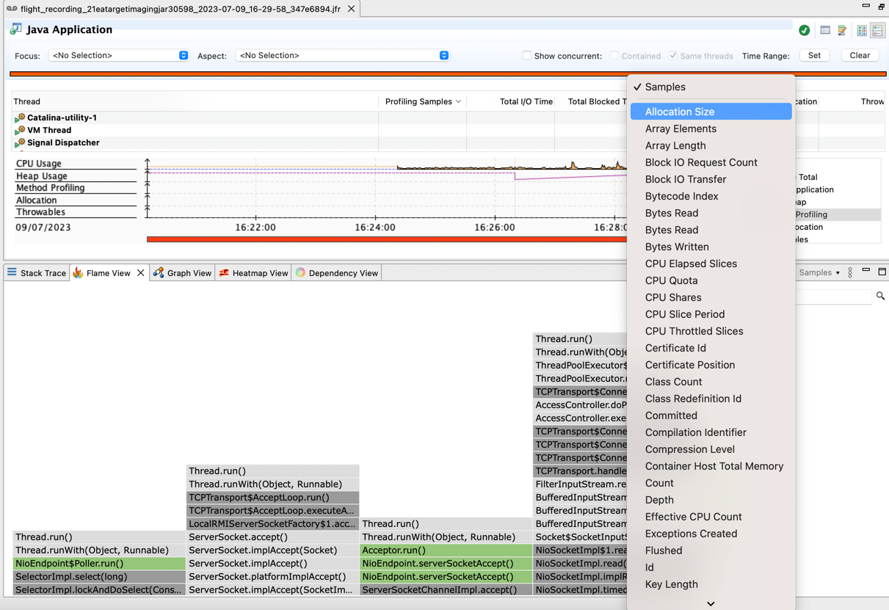

== Java 21 💣💥

{toc}

=== Monitoring Java applications

[cols="40h,~"]
|===
|Technology |Goal

|JDK Flight Recorder (JFR)
|Collects diagnostic and profiling data about a running Java application.

|JFR Event Streaming API
|API for the continuous consumption of JFR data on disk.

|JDK Mission Control (JMC)
|A set of tools for managing, monitoring, profiling, and troubleshooting Java applications.

|===


[NOTE.speaker]
--
* JDK Mission Control (JMC) is a set of tools for continuously collecting low level and detailed Java runtime information.
--

=== New jfr view command
* Start JFR a recording via `-XX:StartFlightRecording` or `jcmd`.

```
java -XX:StartFlightRecording -jar imaging.jar
```

[%step]
* Use the PID or jar name in the command

[%step]
NOTE: Use `jps` JDK tool to list all running Java processes.

[%step]
_[JFR view command -- https://bugs.openjdk.org/browse/JDK-8306704[JDK-8306704]]_

[state=empty,background-color=white]
=== !


[state=empty,background-color=white]
=== !
image::images/allocation-class.png[background, size=contain]

=== JDK Flight Recorder event for finalization

`jdk.FinalizerStatistics`

* Identifies classes at runtime that use finalizers.
* Enabled by default in `default.jfc` and `profile.jfc`.
* No event is sent if `java --finalization=disabled`.

[%step]
_[A finalization JFR event -- https://bugs.openjdk.org/browse/JDK-8266936[JDK-8266936]]_

=== JDK Flight Recorder event for finalization

Disable via

```
jfr configure jdk.FinalizerStatistics#enabled=false
```

[%step]
```
# or on launch
java -XX:StartFlightRecording:settings=none,
+jdk.FinalizerStatistics#enabled=false
```

[NOTE.speaker]
--
* A new JDK Flight Recorder Event, `jdk.FinalizerStatistics`, identifies classes at runtime that use finalizers. The event is enabled by default in the JDK (in the `default.jfc` and `profile.jfc` JFR configuration files). The event includes: the class that overrides `finalize()`, that class's `CodeSource`, the number of times the class's finalizer has run, and the number of objects still on the heap (not yet finalized)
--

=== Recording initial security properties with JFR

`jdk.InitialSecurityProperty` cryptographic event

* Enabled by default in `default.jfc` and `profile.jfc`.
* Captures details of initial security properties when loaded via the `java.security.Security` class.

[NOTE.speaker]
--
* Enabled by default, records details of initial security properties when loaded via the `java.security.Security` class.
--

=== Recording initial security properties with JFR

Disable via

```
jfr configure jdk.InitialSecurityProperty#enabled=false
```

[%step]
```
# or on launch
java -XX:StartFlightRecording:settings=none,
+jdk.InitialSecurityProperty#enabled=false
```

=== Recording details about security provider instance requests

`jdk.SecurityProviderService`


* Disabled by default in `default.jfc` and `profile.jfc`.
* Records info on `java.security.Provider.getService(...)` calls.

=== Recording details about security provider instance requests

Enable via

```
jfr configure jdk.SecurityProviderService#enabled=true
```

[%step]
```
# or on launch
java -XX:StartFlightRecording:settings=none,
+jdk.SecurityProviderService#enabled=true
```

=== Performance analysis and monitoring

* Rendering large graphs is possible with smart pruning.
* Aggregate Flame graph and Stack trace via *Samples*.
* Dependency view presents aggregation of events using hierarchical edge bundling.

[NOTE.speaker]
--
* Rendering large graphs is also possible with smart pruning. You can focus on the most impactful nodes (nodes are data points, for example, method calls). And in the Max Nodes drop-down, select the target number of nodes; the visualization will render maximum of that many nodes.
* Furthermore, you can aggregate the Flame graph and Stack trace by selecting the requiredattribute. In the Samples drop-down, select either Allocation Size, Sample Weight or TLAB Size.
* The chord diagram show packages arranged radially around a circle, with arcs connecting the data points to indicate dependencies.
--


[state=empty,background-color=white]
=== !
image::images/smart-pruning.png[background, size=contain]

[state=empty,background-color=white]
=== !


[state=empty,background-color=white]
=== !
image::images/chord.png[background, size=contain]


=== More

* https://dev.java/learn/jvm/jfr/[JDK Flight Recorder] tutorials
* https://inside.java/2023/05/14/stackwalker-02/[Stack Walker ep 2] on JFR
* https://inside.java/2023/06/04/sip079/[JDK Mission Control 8.3] Sip of Java
* https://inside.java/2023/11/27/sip090/[Finding CPU Load with JFR] Sip of Java
