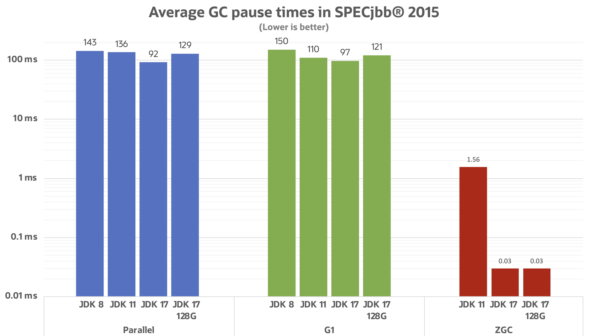
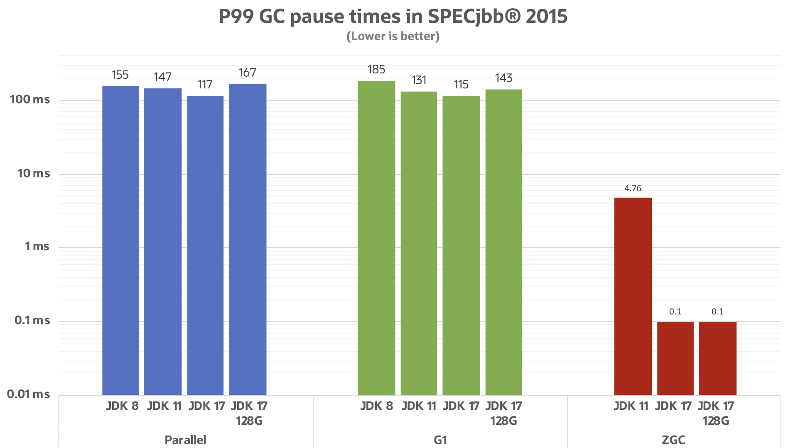
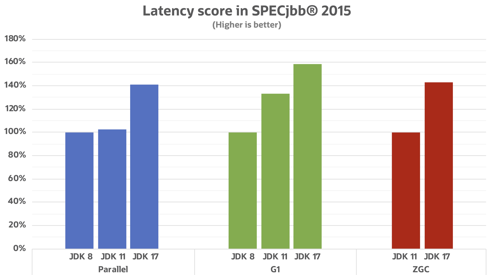
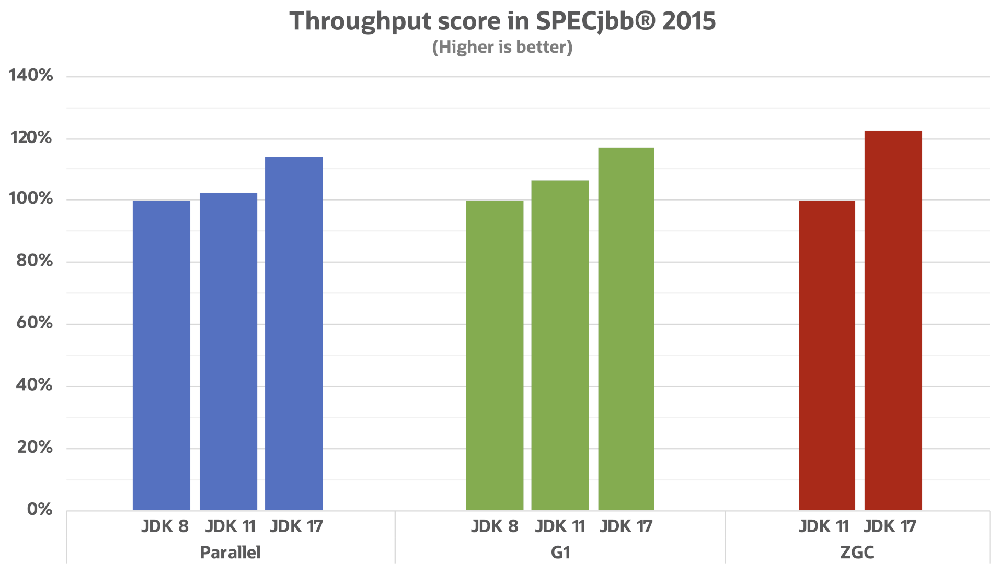
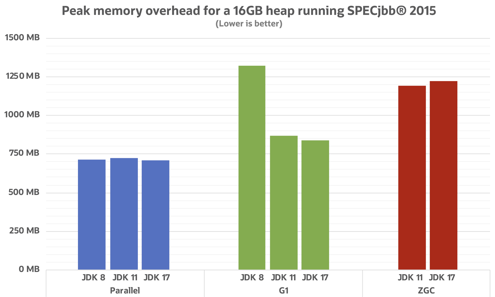

== {title}

{toc}

// Each Java version sees (incremental) GC improvements.

=== GC Improvements

All following diagrams come +
from https://twitter.com/kstefanj[Stefan Johansson]'s post +
https://kstefanj.github.io/2021/11/24/gc-progress-8-17.html[_GC progress from JDK 8 to JDK 17_].

[state="empty",background-color=white,background-transition=none]
=== !

[state="empty",background-color=white,background-transition=none]
=== !

[state="empty",background-color=white,background-transition=none]
=== !

[state="empty",background-color=white,background-transition=none]
=== !

[state="empty",background-color=white,background-transition=none]
=== !

