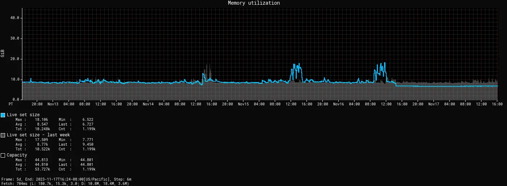
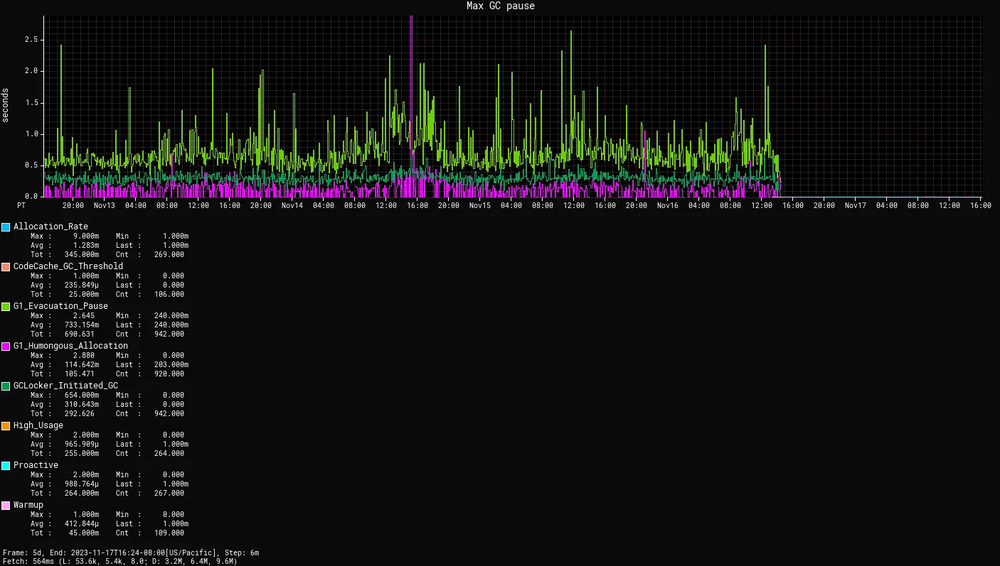

== {title}

{toc}

=== Generational ZGC

Compared to other GCs, ZGC:

* optimizes for ultra-low pause times
* can have higher memory footprint or higher CPU usage

In JDK 21, ZGC became _generational_.

=== Generational Hypothesis

* most objects die young
* those who don't, grow (very) old

GCs can make use of this by tracking +
_young_ and _old generations_.

ZGC didn't do this, but can do it now.

=== Reports

Netflix published https://netflixtechblog.com/bending-pause-times-to-your-will-with-generational-zgc-256629c9386b[a blog post] on their adoption.

Out of context graphs (vs. G1):

=== Reports

=== Default

Generational mode is:

* the default on JDK 23
* the only mode on JDK 24+

`-XX:+UseZGC`

(Default GC is still G1.)

=== More

_Garbage Collection in Java: Choosing the Correct Collector_ +
(Stefan Johansson) +
Thursday, 16:30-17:20 @ Room 10

* 📝 https://openjdk.org/jeps/439[JEP 439]: Generational ZGC
* 📝 https://openjdk.org/jeps/474[JEP 474]: ZGC: Generational Mode by Default
* 📝 https://openjdk.org/jeps/490[JEP 490]: ZGC: Remove the Non-Generational Mode
* 📝 https://netflixtechblog.com/bending-pause-times-to-your-will-with-generational-zgc-256629c9386b[Bending pause times to your will with Generational ZGC]
* 🎥 https://www.youtube.com/watch?v=YyXjC68l8mw[Generational ZGC and Beyond] (Aug 2023)
* 🎥 https://www.youtube.com/watch?v=U2Sx5lU0KM8[Java's Highly Scalable Low-Latency GC: ZGC] (Mar 2023)
