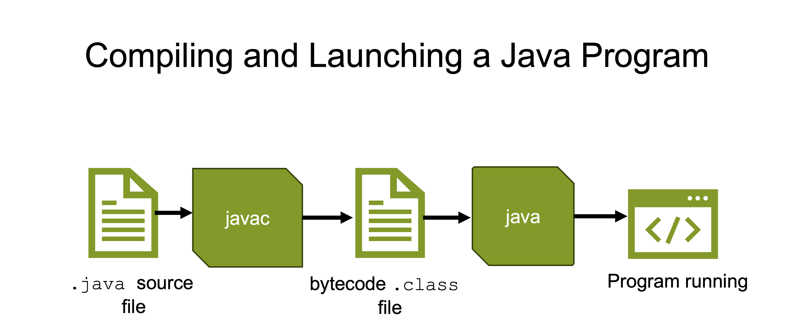
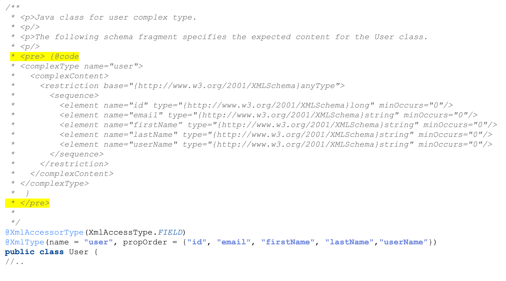
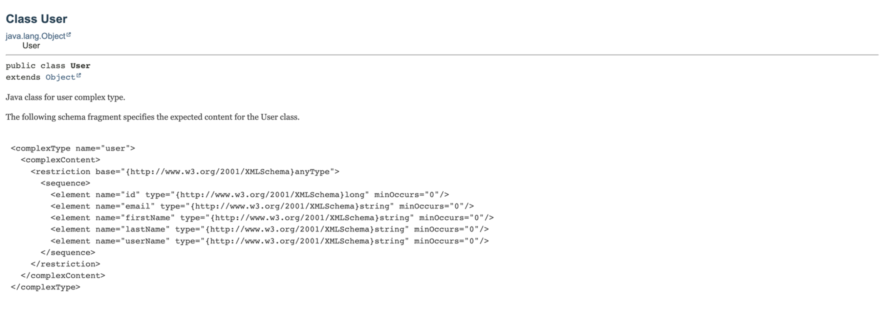
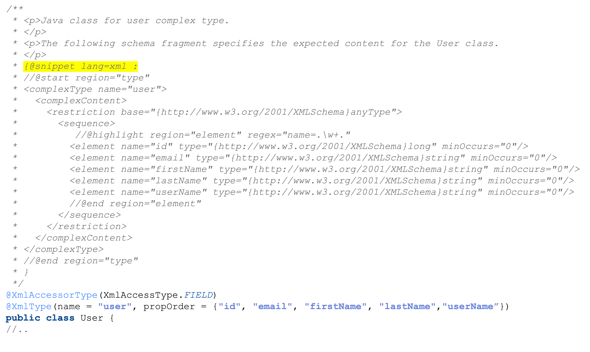
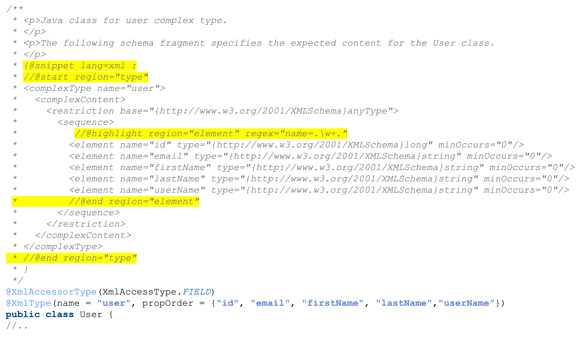
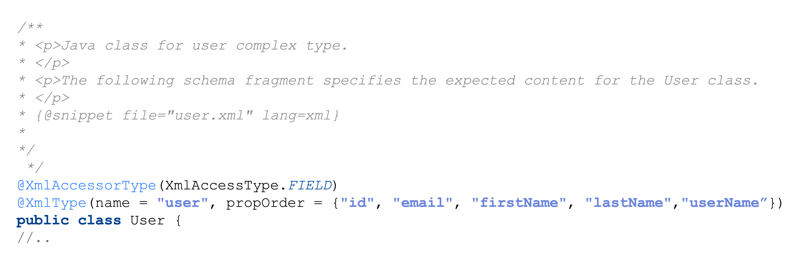
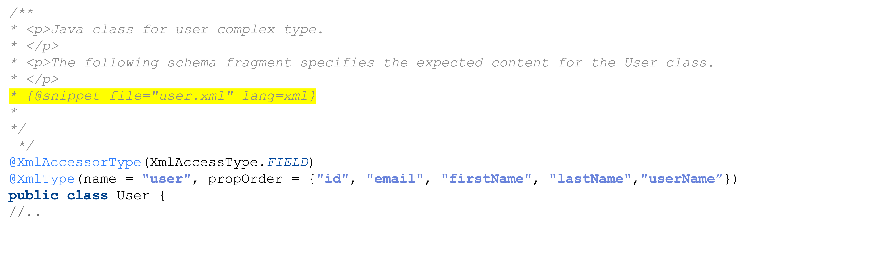

== Java 21 💣💥

{toc}

=== Fundamental tools of the JDK

The tools you use to create and build Java programs.

[state=empty,background-color=white]
=== !


=== Standard compiler optimizations

[%step]
* Literal constants are folded.
* String concatenation is folded.
* Constant fields are inlined.
* Dead code branches are eliminated.


[%step]
These do not require any flag and are part +
of the compiler specification before JDK 17.


=== String concatenation strategy

Before JDK 19

[%step]
```java
public class Example {
    public static void main(String[] args) {
        StringBuilder sb = new StringBuilder("foo");
        System.err.println("" + sb + sb.append("bar"));
    }
}
```

[%step]
```java
// prints foobarfoobar
```

=== String concatenation strategy

After JDK 19, string concatenation evaluates each argument and eagerly converts it to a string, in left-to-right order.

[%step]
```java
public class Example {
    public static void main(String[] args) {
        StringBuilder sb = new StringBuilder("foo");
        System.err.println("" + sb + sb.append("bar"));
    }
}
```

[%step]
```java
// prints foofoobar
```

[%step]
_[Indy String Concat Changes Order of Operations -- https://bugs.openjdk.org/browse/JDK-8273914[JDK-8273914]]_

=== Warnings on lossy conversions

Evaluation error when compiling:


```java
public class Example {
    public static void main(String[] args) {
        long value = 5L;
		long b = value + 0.1 * 3L;
    }
}
```

[%step]
```java
// incompatible types: possible lossy conversion
// from double to long
```

=== Warnings on lossy conversions

Before JDK 20, no error is produced when compiling:

[%step]
```java
public class Example {
    public static void main(String[] args) {
        long b = 5L;
		long b += 0.1 * 3L;
    }
}
```

[NOTE.speaker]
--
* But when the same computation is done with an "+=" operator (or also with similar operators, like "-="), then this error does not occur.
--

=== Warnings on lossy conversions

After JDK 20, get a warning when compiling:


```
javac Example.java -Xlint:all

Example.java:4: warning:
[lossy-conversions] implicit cast from double
to long in compound assignment is possibly lossy
     b += 0.1 * 3L;
               ^
 1 warning
```

[%step]
_[Warn compound assignment is possibly lossy  -- https://bugs.openjdk.org/browse/JDK-8244681[JDK-8244681]]_

[NOTE.speaker]
--
* As of JDK 20, running `javac` with option `all` to enable all the warnings, flags such situations with a warning about type casts in compound assignments with possible lossy conversions
--

=== Warnings about possible this escapes

*DO NOT call overridable methods from a constructor!*

```java
public class LintExample {
	public LintExample() {
		System.out.println(this.hashCode());
	}

	public static void main(String[] args) {
		new LintExample();
	}
}
```

=== Warnings about possible this escapes

Before JDK 21,  `LintExample.java` compiles successfully

```java
javac LintExample.java -Xlint:all
```

=== Warnings about possible this escapes

After JDK 21,  the compiler has a new `-Xlint:this-escape` key:

```
javac LintExample.java -Xlint:[all|this-escape]

LintExample.java 3: warning:
[this-escape] possible 'this' escape before subclass
is fully initialized
    System.out.println(this.hashCode());                                      									^
 1 warning
```

[%step]
_[New lint check key  -- https://bugs.openjdk.org/browse/JDK-8015831[JDK-8015831]]_

=== Generate great API documentation
image::images/manual.png[background, size=cover]


=== Goals for API documentation

* Helps with product maintenance.
* Technical users can understand your APIs goals.
* Can increase awareness/adoption of your software.
* Third-party developers get started quickly by trying out API examples.


=== Words may come easy, yet examples require extra care.


=== Inserting fragments of source code in documentation

* Wrap code examples inside `<pre>` and `{@code ...}`
* Automatically escape special characters with `{@code ...}`
* Little control over indentation
* No code highlighting

[NOTE.speaker]
--
* Prior to JDK 18, you could include formatted multiple line fragments of source code in documentation using `<pre>` and `{@code ...}`.
--

[state="empty",background-color=white,background-transition=none]
=== !
image::images/pre-code-example.png[background, size=contain]

[state="empty",background-color=white,background-transition=none]
=== !


[state="empty",background-color=white,background-transition=none]
=== !


=== Simplify inclusion of code examples

* https://openjdk.org/jeps/413[JEP 413] introduced `{@snippet ...}` tag in JDK 18.
* A better presentation of the code examples via regions.
* Control code via `@highlight, @replace, @link` tags and regions.

[state="empty",background-color=white,background-transition=none]
=== !


[state="empty",background-color=white,background-transition=none]
=== !


[state="empty",background-color=white,background-transition=none]
=== !
image::images/snippet-javadoc-output.png[background, size=contain]

=== Simplify inclusion of code examples

* https://openjdk.org/jeps/413[JEP 413] introduced `{@snippet ...}` tag in JDK 18.
* A better presentation of the code examples via regions.
* Control code via `@highlight,@replace,@link` tags and regions.
* The tag accepts separate files that hold snippet content.

```
$ javadoc # other options..
    --snippet-path ./src/xml User.java
```

[state="empty",background-color=white,background-transition=none]
=== !


[state="empty",background-color=white,background-transition=none]
=== !


=== Benefit of interactive documentation

Configure the `--add-script <file>`  option of javadoc

[%step]
```
cat interact.js
alert("Get ready to move your fingers!");
```

[%step]
```
javadoc -d docs # other options..........
	--add-script interact.js User.java
```

[%step]
Use the option to add multiple scripts in your generated documentation.


[NOTE.speaker]
--
* When using `--add-script <file>` the specified file will be copied to the generated documentation
and a `<script>` element is added to every generated HTML page (except the pages that serve only to redirect to other pages).
--


=== More

* https://dev.java/learn/jvm/tools/core/[Core JDK tools] tutorials
* https://bugs.openjdk.org/browse/JDK-8275786[JDK-8275786] about adding scripts to generated documentation
* https://openjdk.org/jeps/413[JEP 413] about code snippets in documentation
* https://docs.oracle.com/en/java/javase/21/javadoc/programmers-guide-snippets.html[Programmer's Guide to Snippets]
