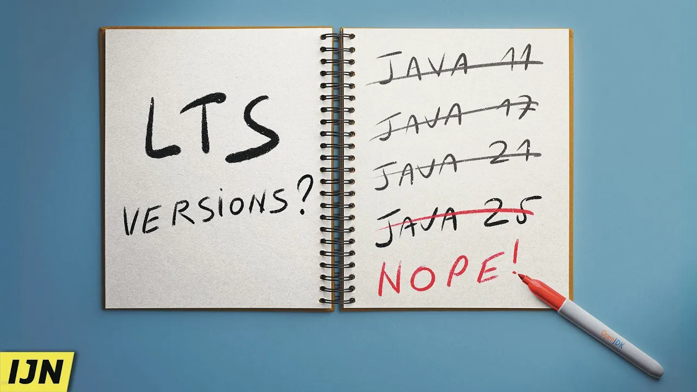
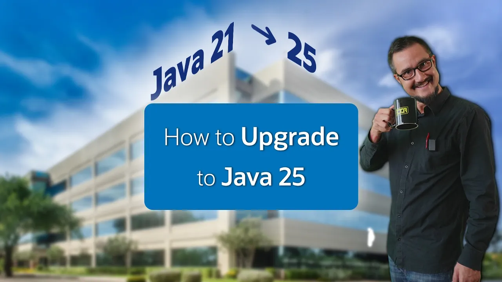

== {title}

++++
<table class="toc">
	<tr class="toc-current"><td>Java 22 to 25</td></tr>
	<tr><td style="padding-left: 2em;">Language Features</td></tr>
	<tr><td style="padding-left: 2em;">New APIs</td></tr>
	<tr><td style="padding-left: 2em;">Runtime Improvements</td></tr>
	<tr><td style="padding-left: 2em;">Better Tooling</td></tr>
	<tr><td>Java 26</td></tr>
	<tr><td>Deprecations & Removals</td></tr>
</table>
<!-- needed so the slide has the same height
     as the other summary title/toc slides -->

++++

=== !

🎥 https://www.youtube.com/watch?v=x6-kyQCYhNo[Java 25 is ALSO no LTS Version]

=== !

🎥 https://www.youtube.com/watch?v=9azNjz7s1Ck[How to Upgrade to Java 25]

:title: Java 21 to 25

:toc: pass:[ \
<table class="toc"> \
	<tr class="toc-current"><td>Java 22 to 25</td></tr> \
	<tr class="toc-current"><td style="padding-left: 2em;">Language Features</td></tr> \
	<tr><td style="padding-left: 2em;">New APIs</td></tr> \
	<tr><td style="padding-left: 2em;">Runtime Improvements</td></tr> \
	<tr><td style="padding-left: 2em;">Better Tooling</td></tr> \
	<tr><td>Java 26</td></tr> \
	<tr><td>Deprecations & Removals</td></tr> \
</table> \
]
include::summary_language.adoc[]

:toc: pass:[ \
<table class="toc"> \
	<tr class="toc-current"><td>Java 22 to 25</td></tr> \
	<tr><td style="padding-left: 2em;">Language Features</td></tr> \
	<tr class="toc-current"><td style="padding-left: 2em;">New APIs</td></tr> \
	<tr><td style="padding-left: 2em;">Runtime Improvements</td></tr> \
	<tr><td style="padding-left: 2em;">Better Tooling</td></tr> \
	<tr><td>Java 26</td></tr> \
	<tr><td>Deprecations & Removals</td></tr> \
</table> \
]
include::summary_apis.adoc[]

:toc: pass:[ \
<table class="toc"> \
	<tr class="toc-current"><td>Java 22 to 25</td></tr> \
	<tr><td style="padding-left: 2em;">Language Features</td></tr> \
	<tr><td style="padding-left: 2em;">New APIs</td></tr> \
	<tr class="toc-current"><td style="padding-left: 2em;">Runtime Improvements</td></tr> \
	<tr><td style="padding-left: 2em;">Better Tooling</td></tr> \
	<tr><td>Java 26</td></tr> \
	<tr><td>Deprecations & Removals</td></tr> \
</table> \
]
include::summary_runtime.adoc[]

:toc: pass:[ \
<table class="toc"> \
	<tr class="toc-current"><td>Java 22 to 25</td></tr> \
	<tr><td style="padding-left: 2em;">Language Features</td></tr> \
	<tr><td style="padding-left: 2em;">New APIs</td></tr> \
	<tr><td style="padding-left: 2em;">Runtime Improvements</td></tr> \
	<tr class="toc-current"><td style="padding-left: 2em;">Better Tooling</td></tr> \
	<tr><td>Java 26</td></tr> \
	<tr><td>Deprecations & Removals</td></tr> \
</table> \
]
include::summary_tooling.adoc[]

=== More

Specifically:

* 🎥 https://www.youtube.com/playlist?list=PLX8CzqL3ArzXJ2_0FIGleUisXuUm4AESE[Road to 25]

Generally:

* 📝 https://dev.java/[dev.java]
* 📝 https://inside.java/[inside.java]
* 📝 https://openjdk.org/jeps/0[JEP list]
* 🎥 https://youtube.com/java[youtube.com/java]
