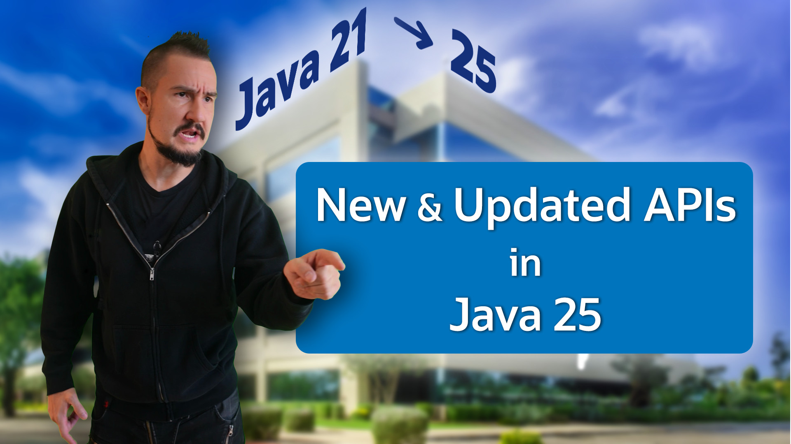

== {title}

{toc}

=== Stream Gatherers

Create custom stream operations:

```java
Stream.of("A", "C", "F", "B", "S")
	.gather(groups(2))
	.forEach(IO::println);

// [A, C]
// [F, B]
// [S]
```

=== Scoped Values

Simpler, more scalable, one-way alternative to `ThreadLocal`:

```java
static final ScopedValue<Integer> ANSWER =
	ScopedValue.newInstance();

void main() {
	ScopedValue //      ⬐ VALUE
		.where(ANSWER, 42)
		//  |<---------- SCOPE ----------->|
		.run(() -> IO.println(ANSWER.get())); // "42"

	// OUT OF SCOPE
	ANSWER.get(); // ⚡️ NoSuchElementException
}
```

=== Foreign-memory API

Interact with off-heap memory:

```java
// create `Arena` to manage off-heap memory lifetime
try (Arena offHeap = Arena.ofConfined()) {
	// [allocate off-heap memory to store pointers]
	// [do something with off-heap data]
	// [copy data back to heap]
} // off-heap memory is deallocated here
```

=== Foreign-function API

Interact with native libraries:

```java
// find foreign function on the C library path
Linker linker = Linker.nativeLinker();
SymbolLookup stdlib = linker.defaultLookup();
MethodHandle radixSort = linker
	.downcallHandle(stdlib.find("radixsort"), ...);
```

=== Class-file API

A modern, on-board bytecode manipulation API:

* allows frameworks and libraries +
  to drop dependency on ASM et al.
* removes a big reason for:

> +++<s>Update all dependencies before updating the JDK.</s>+++


=== Smaller API Additions

* `Console`: `Locale` overloads for +
  `format`, `printf`, `readLine`, `readPassword`
* `Console`: `isTerminal`
* `Reader`: `readLines`, `readAllAsString`
* `Math`, `StrictMath`: more exact overloads, +
  e.g. `unsignedMultiplyExact(int, int)`
* `Instant`: `until(Instant)`
* `ForkJoinPool`: `schedule...` and more
* `BodyHandlers`, `BodySubscribers`: `limiting`

=== !



🎥 https://www.youtube.com/watch?v=VCaDlCZJydI[All API Additions From Java 21 to 25]
