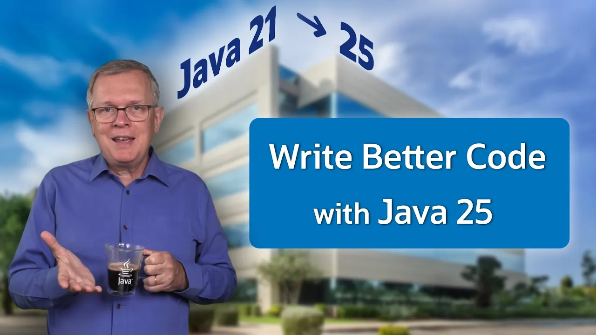

== {title}

{toc}

=== Flexible Constructor Bodies

```java
class ThreePartName extends Name {
	private final String middle;

	ThreePartName(String full) {
		// split "first middle last" on space
		var names = full.split(" ");
		// assign fields before `super`
		this.middle = names[1];
		// call `Name(String first, String last)`
		super(names[0], names[2]);
	}
}
```

=== Unnamed patterns

Use `_` to mark a (pattern) variable as unused, e.g.:

```java
BiConsumer<String, Double> = (s, _) -> // use `s`

Object obj = // ...
if (obj instanceof User(var name, _))
	// use `name`

switch (obj) {
	case User _ -> userCount++;
	case Admin _ -> adminCount++;
}
```

=== Module Imports

```java
import module $mod;
```

* imports public API of `$mod`
* your code does not need to be in a module

=== Simplified Main

Get started quicker:

```java
// entire source file
// implicit `import module java.base`
void main() {
    var name = IO.readln("Please enter your name: ");
    IO.println("Nice to meet you, " + name);
}
```

(Execute with: `java Main.java`)

=== !



🎥 https://www.youtube.com/watch?v=X0-TGhktFnE[All New Java Language Features Since Java 21]
