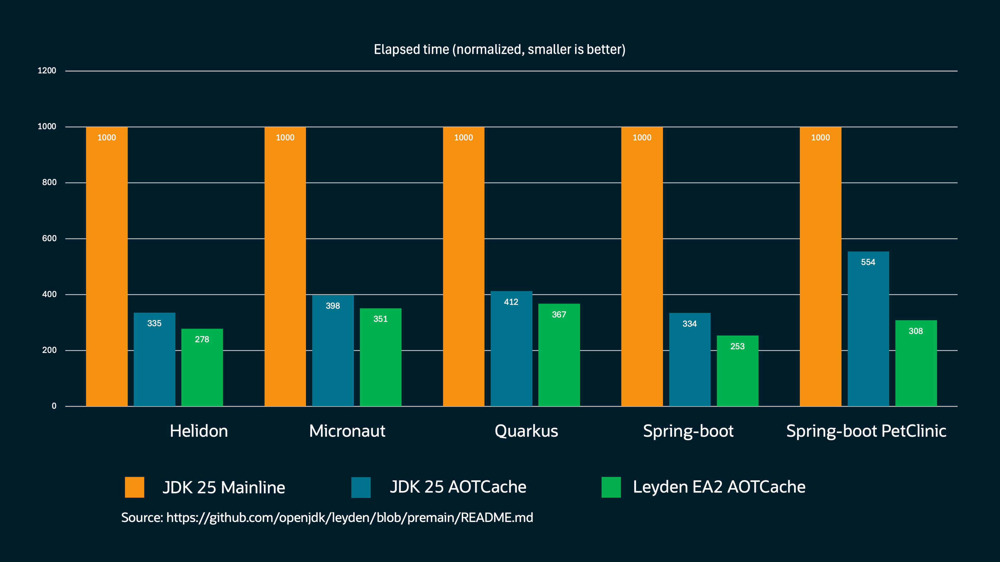
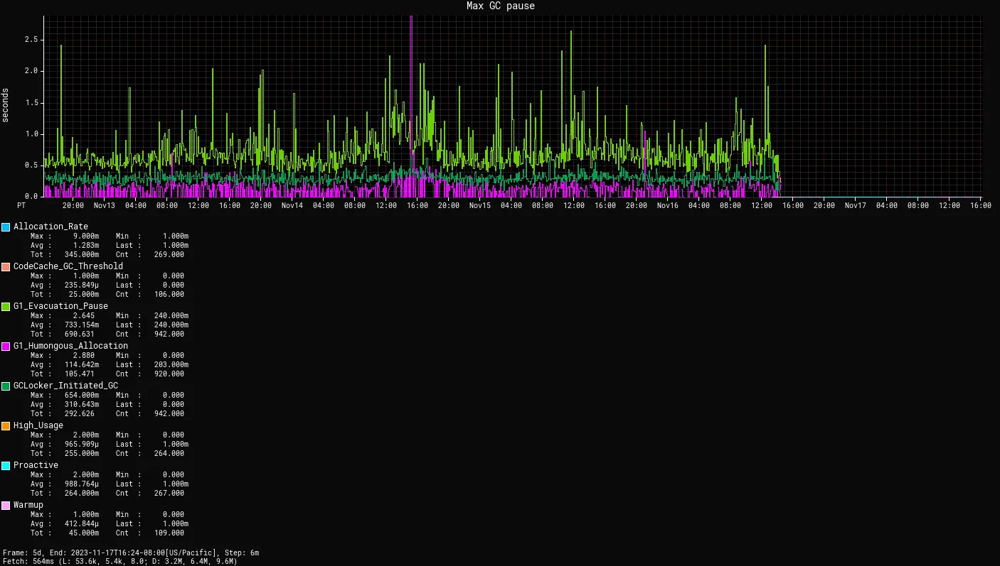

== {title}

{toc}

=== Multi-File Execution

Small programs can expand:

```
MyFirstJava
 ├─ Main.java
 ├─ Helper.java
 └─ Lib
     └─ library.jar
```

Run with:

```
java -cp 'Lib/*' Main.java
```

=== AOT computation

Reduce your applications' startup and warmup times +
with ahead-of-time computation:

```sh
# training run (⇝ AOTCache)
$ java -XX:AOTCacheOutput=app.aot
       -cp app.jar com.example.App ...
# production run (AOTCache ⇝ performance)
$ java -XX:AOTCache=app.aot
       -cp app.jar com.example.App ...
```

[state="empty",background-color="#011f2a"]
=== !


=== Compact object headers

Reduce object headers from (usually) 12 bytes to 8 bytes:

```
-XX:+UseCompactObjectHeaders
```

* reduces heap size by 5-30%
* can reduce garbage collections
* can improve _or deteriorate_ +
  overall performance

Report observations to https://mail.openjdk.org/mailman/listinfo/hotspot-dev[hotspot-dev].

=== Generational ZGC



=== Less virtual thread pinning

Virtual threads:

* execute on a platform thread
* usually unmount from PT when waiting
* pinning prevents that
* caused by native calls, class initialization, and +
  +++<s>object monitors (e.g. <code class="hljs java"><span class="hljs-keyword">synchronized</span></code>)</s>+++

Object monitors were reimplemented.

⇝ No more pinning for `synchronized`.

=== Performance improvements

Every Java release improves performance, e.g.:

* +10%/+5% critical/max jOPS in SPECjbb 2015
* +70-75% requests/s on Helidon

(JDK 25 vs 21)

=== Security enhancements

Many enhancements between Java 21 and 25:

* improved security configurations +
  (https://bugs.openjdk.org/browse/JDK-8051959[JDK-8051959], https://bugs.openjdk.org/browse/JDK-8281658[JDK-8281658], https://bugs.openjdk.org/browse/JDK-8311596[JDK-8311596], https://inside.java/2024/12/10/quality-heads-up/[file inclusion])
* quantum-resistant cryptography +
  (https://openjdk.org/jeps/486[JEP 486], https://openjdk.org/jeps/496[JEP 496], https://openjdk.org/jeps/497[JEP 497], https://openjdk.org/jeps/510[JEP 510])
* various improvements in cryptographic algorithms

=== !


🎥 https://www.youtube.com/watch?v=xeOuEqorY8g[How to Handle Security Changes in Java 25]

