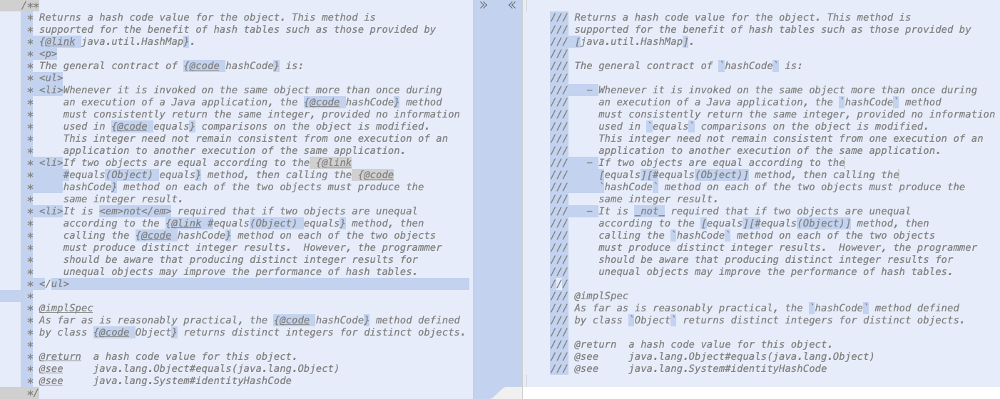

== {title}

{toc}

=== Writing JavaDoc

Writing simple JavaDoc is great!

Writing more complex documentation...

* where does `<p>` go?
* do we need `</p>`?
* code snippets/blocks are cumbersome
* lists are verbose
* tables are terrible
* ...

[%step]
I blame HTML!

=== Markdown

Markdown is more pleasant to write:

* neither `<p>` nor `</p>`
* code snippts/blocks are simple
* lists are simple
* tables are less terrible
* embedding HTML is straightforward

Markdown is widely used and known.

=== Markdown in JavaDoc

Java now allows Markdown JavaDoc:

* each line starts with `///`
* CommonMark 0.30
* links to program elements use extended +
  reference link syntax: `[text][element]`
* JavaDoc tags work as usual

[state="empty",background-color="white"]
=== !


=== Why /// ?

Wouldn't this be nice:

```java
/**md
 *
 * Markdown here...
 *
 */
```

=== Why /// ?

No - reason #1:

```java
/**md
 *
 * Here's a list:
 *
    * item #1
    * item #1
 *
 */
```

(The leading `*` in JavaDoc is optional.)

=== Why /// ?

No - reason #2:

```java
/**md
 *
 * ```java
 * /* a Java inline comment */
 * ```
 *
 */
```

(`/****` can't contain `*/`.)

=== Why /// ?

`///`:

* no such issues
* doesn't require new Java syntax +
  (`//` already "escapes" parsing)

=== Code

Inline code with `{empty}`backticks`{empty}`.

Code blocks with fences, e.g.:

	```java
	public void example() { }
	```

A language tag is set as a CSS class +
for JS-based highlighting in the frontend.

(Add a library with `javadoc --add-script ...`.)

=== Links

Use a simple reference link to directly link program elements:

```java
/// - the module [java.base/]
/// - the package [java.util]
/// - the class [String]
/// - the field [String#CASE_INSENSITIVE_ORDER]
/// - the method [String#chars()]
```

Output:

* the module https://docs.oracle.com/en/java/javase/23/docs/api/java.base/module-summary.html[`java.base`]
* the package https://docs.oracle.com/en/java/javase/23/docs/api/java.base/java/util/package-summary.html[`java.util`]
* ...

=== Links

Use full reference link to add text:

```java
/// - [the _java.base_ module][java.base/]
/// - [the `java.util` package][java.util]
/// - [the `String` class][String]
/// - [the `String#CASE_INSENSITIVE_ORDER` field][String#CASE_INSENSITIVE_ORDER]
/// - [the `String#chars()` method][String#chars()]
```

Output:

* https://docs.oracle.com/en/java/javase/23/docs/api/java.base/module-summary.html[the _java.base_ module]
* https://docs.oracle.com/en/java/javase/23/docs/api/java.base/java/util/package-summary.html[the `java.util` package]
* ...

=== Tables

Markdown tables:

* better than HTML tables
* still uncomfortable to create manually
* use something like https://www.tablesgenerator.com[tablesgenerator.com]

Advanced tables:

* for features unsupported in Markdown, +
  create HTML tables

=== Tags

JavaDoc tags work as expected:

* can be used in Markdown comments
* if they contain text, Markdown syntax works

```java
/// For more information on comments,
/// see {@jls 3.7 Comments}.
///
/// @implSpec this implementation does _nothing_
public void doSomething() { }
```

=== More

_Fast-Track JDK Tools for the Modern Software Developer_ +
(Ana-Maria Mihalceanu, José Paumard) +
Monday, 16:50-18:50 @ BOF 2

* 📝 https://openjdk.org/jeps/467[JEP 467]: Markdown Documentation Comments
* 🎥 https://www.youtube.com/watch?v=AvAIFq4fLPw[JavaDoc Hits the Markdown on Comments]
