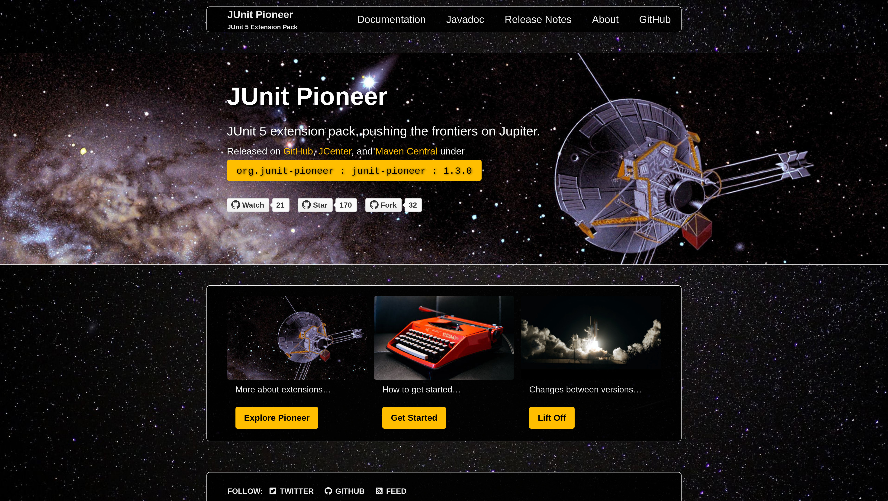

== Building

* quality control
* compatibility
* one-click releases
* website build

=== Build Pipeline

* build project with https://gradle.org/[Gradle] (https://gradle.org/kotlin/[Kotlin style])
* trigger build on commit with https://github.com/features/actions[GitHub Actions]
* kick off release build on GitHub
* trigger website build

=== Quality Control

Code style:

* we want a uniform code style
* we don't want to manually +
  discuss or enforce it

So we let https://github.com/diffplug/spotless[Spotless]
and https://github.com/checkstyle/checkstyle[Checkstyle] +
break the build on violations.

[state="empty",background-color="#0D1117"]
=== !
image::images/spotless-comments.jpg[background, size=contain]

=== Quality Control

Code quality:

* we want to avoid pitfalls and gotchas
* we want high test coverage
* we know better than any tool 😁

We use https://www.sonarqube.org/[SonarQube] +
to analyze and report.

[state="empty",background-color="#0D1117"]
=== !
image::images/sonarqube-comments.jpg[background, size=contain]

=== Version Control

Build against:

* range of operating systems
* range of Java versions
* as module and not
* range of JUnit versions

All with GitHub Actions.

=== Version Control

```sh
strategy:
  matrix:
    java: [ 11, 17, 18 ]
    junit-version: [ '5.8.2' ]
    modular: [true, false]
    os: [ubuntu, macos, windows]
```

=== One-Click Releases

https://github.blog/changelog/2020-07-06-github-actions-manual-triggers-with-workflow_dispatch/[Manually dispatched workflow] +
on GitHub Actions:

image::images/trigger-release.png[]

Kicks of Gradle release build.

=== One-Click Releases

The release build:

* takes manually entered version as input
* builds artifacts with Gradle
* publishes with `maven-publish` plugin
* uses https://github.com/shipkit[Shipkit] to:
** create Git tag
** create GitHub release with changelog

[state="empty",background-color="#0D1117"]
=== !
image::images/latest-release.png[background, size=contain]

=== Website build

Last step triggers website build:

* pulls in all projects
* builds website with docs
* pulls version(s) from files
* builds website with Jekyll

[state="empty",background-color="black"]
=== !


[state="empty",background-color="black"]
=== !
image::images/website-docs.jpg[background, size=contain]
