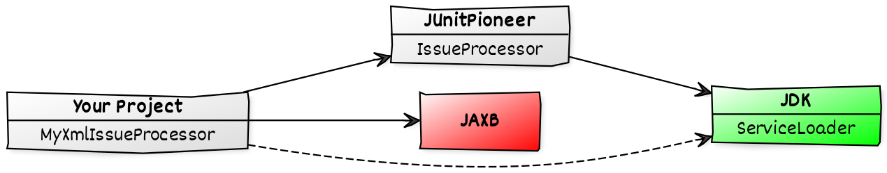

== Coding

* architecture
* dependency management
* how to test a test framework

=== Architecture

JUnit Pioneer has high-end architecture:

```sh
📦 org.junitpioneer
├─ 📦 internal  # our utilities - internal
├─ 📦 jupiter   # most of our extensions
│  ├─ 📦 issue  # issue impl - internal
│  └─ 📦 params # ext. re parameterized tests
└─ 📦 vintage   # ext. re to JUnit 4
```

We mirror Jupiter's packages:

* `org.junit.jupiter.api`
* `org.junit.jupiter.params`

=== Internal packages

Speaking of internal packages:

* we created two (e.g. for annotations)
* we don't want people to use them

How?

* ⚠️ one package is called `internal`
* ⚠️ package info says it's internal
* 🛑 we ship https://nipafx.dev/java-module-system-tutorial/[modular JAR] that +
  doesn't export these packages

////

=== More Architecture

To make navigation easier, +
we also have rules for:

* naming classes
* organizing top-level types +
  (e.g. repeatable annotations)
* how to use Jupiter's `Namespace`

No rocket science, but need to be upheld.

////

=== Dependency Management

Projects have enough problems +
with dependencies.

We don't want to add to that.

⇝ JUnit 5 should be our only +
runtime dependency.

=== In Practice

The `@Issue` extension:

* collects information about tests
* wants to create a report

But reports could be XML, JSON, etc.

* "need" dependencies for that
* probably not many users use `@Issue`

What now?

=== Resolution

Dependency inversion to the rescue +
(via Java's `ServiceLoader`):

* Pioneer declares interface `IssueProcessor`
* users implement it and register implementation
* Pioneer finds implementations and passes info



=== Tests²

How do you test a test framework?

* want to verify error behavior
* want to test behavior outside of tests +
  (e.g. report entry publication)

We often write tests that run _other_ tests +
and then evaluate their results.

=== Tests²

JUnit 5 has good support for that:

* we added a few usability methods
* we created our own assertions

```java
ExecutionResults results = executeTestMethod(
	MethodLevelInitializationFailureTestCase.class,
	"shouldFailMissingConfiguration");
assertThat(results)
	.hasSingleFailedTest()
	.withExceptionInstanceOf(/*...*/);
```

=== Tests²

Thread safety:

* all our extensions should be thread-safe
* to test that, we run our tests in parallel
* that's not always fun

We're mostly sure, we got this. 😬
