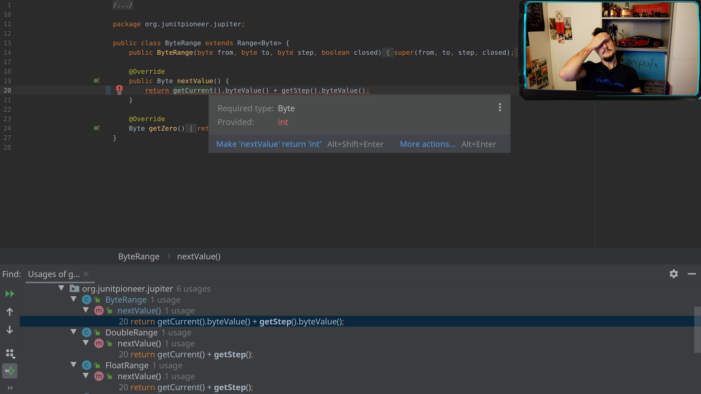
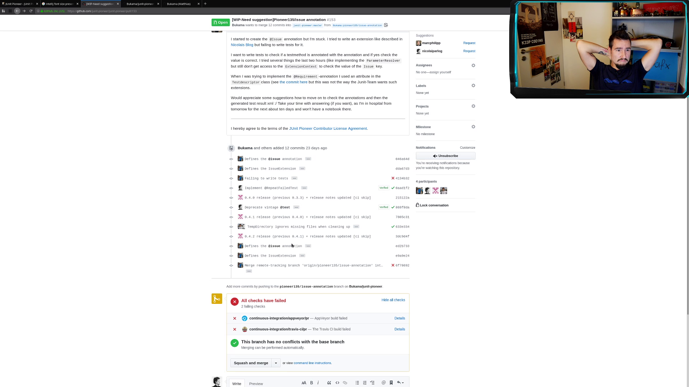
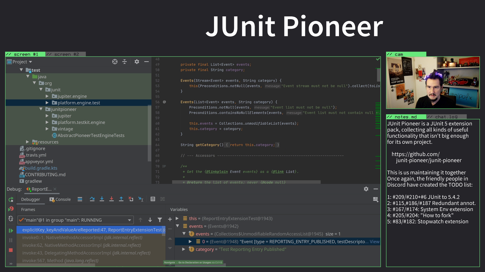

== JUnit Pioneer

Mission statement:

> JUnit Pioneer provides extensions for JUnit 5 and its Jupiter API.
> It does not limit itself to proven ideas with wide application but is purposely open to experiments.
> It aims to spin off successful and cohesive portions into sibling projects or back into the JUnit 5 code base.

=== JUnit Pioneer

We want to:

* provide helpful extensions
* be open to experimental ideas
* catch-all extensions that are too small +
  to be their own project

=== JUnit Pioneer

We are:

* Matthias Bünger -- Bishuemaster
* Mihály Verhás -- Chief Developer
* Nicolai Parlog -- Benevolent Dictator
* Simon Schottner -- Build Engineer

Plus about a dozen contribtors, +
some of them recurring.

=== JUnit Pioneer

We have:

* 4.7k lines of production code
* 5.9k lines of test code
* 26 releases, 5 since 1.0.0
* Java 8 as requirement
* Java 9-15 supported

=== How did we get here?

Sounds good? Not so fast!

* this is a hobby project
* life gets in the way
* for 3 years, little happened

[state="empty",background-color="#161b22"]
=== !
image::images/contributions.png[background, size=contain]

=== Experimentation

2016: ::
* JUnit 5 publishes first milestone builds
* Nicolai launches _JUnit Io_ for his +
  experiments with the extension API

> A melting pot for all kinds of extensions

Just a demo repo, no releases: +
⇝ 18 commits, 1.3k LOC, 300 LOX

// LOC 1348 / total 1647

=== Excitement

2017: ::
* JUnit 5 publishes release candidates +
  and in September 5.0.0
* https://github.com/smoyer64[Steve Moyer] plans to roll his own +
  experiments into a project
* Nicolai and Steve join forces and +
  rebrand _JUnit Io_ to _JUnit Pioneer_ +
  (first space craft to Jupiter)

Turning it into an actual project: +
⇝ 19 commits, -12 LOC 🤔, 430 LOX, 0 releases

// LOC 1336 / total 2077

=== 😴

September 2017 to April 2018: ::

* Steve is busy teaching
* Nicolai always has more projects than time

⇝ 0 commits, 0 LOC/X, 0 releases

=== Takeoff

May to November 2018: ::

* JUnit 5 team helps Nicolai
* Pioneer lifts off the ground

⇝ 31 commits,
870 LOC, 450 LOX, +
4 contributors,
4 releases

// LOC 2202 / total 3396

=== 😴😴

November 2018 to September 2019: ::
again, life gets in the way

⇝ 0 commits, 0 LOC/X, 0 releases

=== Cruise control

October 2019 to today: ::

* JUnit 5 team gives ultimatum
* magic happens 🧙‍♀️🦄✨
* Pioneer flies at steady pace

⇝ ~150 commits,
8.4k LOC, 1.9k LOX, +
3 maintainers, 15 contributors, +
22 releases

// end of March 2021:
// LOC 10.6k / total 13.7k

=== Wait, Magic?

[state="empty",background-color="#3B3C3F"]
=== !
image::images/stream-coding.png[background, size=contain]

[state="empty",background-color="#3B3C3F"]
=== !

[state="empty",background-color="black"]
=== !
image::images/stream-issues.png[background, size=contain]

[state="empty",background-color="black"]
=== !

[state="empty",background-color="#252429"]
=== !
image::images/stream-helmet-2.png[background, size=contain]

[state="empty",background-color="#252429"]
=== !
image::images/stream-pioneer-glasses.png[background, size=contain]

[state="empty",background-color="#252429"]
=== !

=== Twitch

2019::
* Nicolai discovers Twitch
* does a few https://twitch.tv/nipafx[live streams] in spring
* decides to https://nipafx.dev/schedule/[stream regularly] in December

2020::
* 30 JUnit Pioneer streams
* usually 3 to 5 hours

=== Twitch

Expected effects:

* commits Nicolai to ~10 h/month for Pioneer
* interests Java devs

=== Twitch

Unexpected effects:

* gives viewers insight into project
* viewers help in their areas of expertise
** in Twitch chat
** on GitHub
* viewers pick up small issues
* viewers become contributors
* contributors become maintainers

=== Twitch

Thanks to live-streaming, we became a small community.

In November 2020, we got together for donations:

* Twitch sub money + individual donations
* 570 EUR to Climate Action Fund and DKMS

When the pandemic is over, +
we'll finally meet for drinks.

🍺🍹🥛🥃

=== Twitch

Thanks to live-streaming, this one-man show, +
became a real project:

* in April 2020, Simon and Matthias +
  became maintainers
* in November 2020, Mihaly joined

A few contributors also stop by the stream +
(and always enjoy when Nicolai reviews their PRs).
