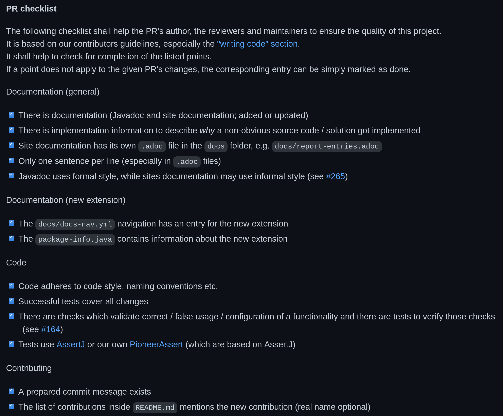

== Project Management

* communication & prioritization
* doing the dirty work
* fostering contributions
* managing expectations

=== Contributing Without Coding

Once a repo turns into a project, +
project management becomes essential.

There's plenty of ways of +
*contributing without coding*.

These contributions are often +
more important than code.

=== Contributing Without Coding

* curating issues
** creating, labeling, replying, closings
** prioritizing, organizing
* reviewing PRs
** technical merits
** completeness
* following up on uncomfortable tasks
* remembering/updating documentation

[state="empty",background-color="#0D1117"]
=== !
image::images/issue-update-docs.png[background, size=contain]

=== Dirty work

Coding is fun! Cleaning up (often) isn't.

As a maintainer:

* fix bugs first
* tackle the hard issues +
  (annotations, threading, merge conflicts)
* set up build pipeline, releases, +
  documentation, website, etc.

We created milestone https://github.com/junit-pioneer/junit-pioneer/milestone/6?closed=1[_Cleaner Pioneers_] for that.

=== Preparing 1.0

Spring 2020 we started thinking about 1.0, +
but Pioneer has no cohesive feature set.

⇝ there's no good point for 1.0

Instead, prepare everything for users and contributors.

⇝ _Cleaner Pioneers_ became _1.0_

[state="empty",background-color="#0D1117"]
=== !
image::images/cleaner-pioneers.png[background, size=contain]

=== Since Then

* Pioneer still has no cohesive feature set
* all must-dos are done (for the time being)

⇝ Milestone is wrong concept.

So now we use https://github.com/junit-pioneer/junit-pioneer/projects/3[a Kanban board] +
(via GitHub's _Projects_ feature).

[state="empty",background-color="#0D1117"]
=== !
image::images/exploring-io.png[background, size=contain]

=== Pull Requests

Noteworthy details about PRs:

* checklist
* approval
* squash & merge

[state="empty",background-color="#0D1117"]
=== !

=== Approving Pull Requests

Two maintainers need to approve a PR.

Lack of trust? +
No, sharing responsibility.

(More on that later.)

=== Squashing Commits

When a PR is ready to be merged:

* all commits are squashed into one
* commit message is carefully crafted
* that commit goes onto `main`

image::images/squash-merge.png[]

=== Squashing Commits

"But don't you loose the history?"

Yes!

* lets contributors use Git however they like
* keeps commit history clean
* leads to really good commit messages +
  (prepared as part of the PR)

[state="empty",background-color="#0D1117"]
=== !
image::images/commit-history.png[background, size=contain]

=== Fostering Contributions

[start=0]
. appreciation
. contribution guide
. explicit rules +
  (preferably simple)

=== Appreciation

We're appreciative:

* positive tone
* prioritize replies
* thank for contributions, +
  excuse delays
// * have a code of conduct
* list contributions

[state="empty",background-color="#0D1117"]
=== !
image::images/contributions-thanks.png[background, size=contain]

=== Contribution Guide

We have a (very long) `CONTRIBUTING.md`:

* describes all aspects in detail
* binds maintainers and contributors
* grew organically over time +
  (more in a few slides)

=== Contribution Guide

A partial table of contents:

* open source crash course (mosty links)
* code organization and style (more in next section)
* how to document: what goes where, style, etc.
* contribution workflow: branching, PRs, merging, etc.
* dependencies
* versioning
* communication

=== Simplicity

Some rules are intenionally strict +
to keep them simple and avoid discussions:

* always use AssertJ
* always use `Optional`
* always squash commits
* always apply naming rules

_Consistency is king, simplicity is King Kong._

=== Communication Guide

Various channels by decreasing importance:

. project website
. files (e.g. `CONTRIBUTING.md`)
. Git commit messages
. issues/PRs on GitHub
. _#junit-pioneer_ in Discord
. team calls
. Twitch streams

We always push communication up the list as far as possible.

=== Protecting Maintainers

> There's no expectation of availability!
> This applies to users opening issues, contributors providing PRs, and other maintainers - none of them can expect a maintainer to have time to reply to their request.

=== Sharing Responsibility

Struggle for newest maintainers:

* first open source project
* project pre-existed
* worried to break things

Solution:

* two maintainers sign off PRs
* Nicolai is the benevolent dictator

=== Benevolent Dictator

Nicolai has special...

* privilege -- can overrule anything
* duty -- should've prevented all mistakes

Writes Nicolai:

> I bare responsibility for all mistakes.
> (Moral responsibility, that is - legally, nobody has any responsibility. 😉)

=== Project Management

As you can see, quite a lof of +
project and team management.

Many ways to contribute without coding.
