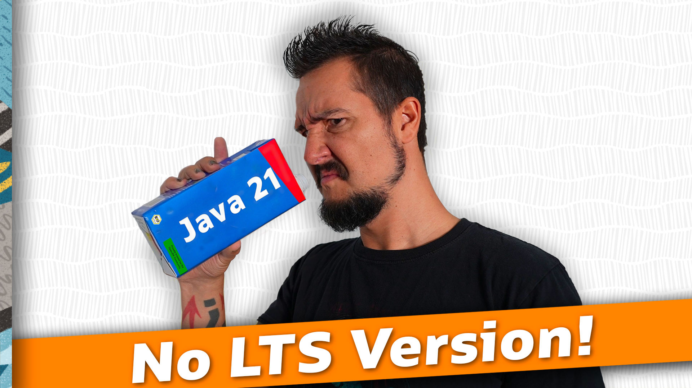

=== Our story begins in 1991

++++

++++

=== Then, in 1995

++++

++++

=== Flying high ⇝ 2004

++++

++++

=== Vale of tears ⇝ 2011

++++

++++

=== Which brings us to 2014

Java 8 gets released:

* lambda expressions
* streams, date/time, `Optional`

Begins Java's revival.

=== Revival ⇝ 2023

Too many improvements in Java 9-21 for the time we have!

Language:

* modules, `var`, text blocks, records, sealed types
* pattern matching with `instanceof` and `switch`

APIs:

* collection factories, sequenced collections
* PRNG, HTTP/2, `VarHandle`, `ProcessHandle`
* uncountable small additions

Runtime:

* virtual threads, compact strings
* big strides for G1 and ZGC
* performance gains across the board

Tooling:

* `jshell`, `jlink`, `jpackage`, `jwebserver`

=== Revival ⇝ 2023

Organizational changes:

* move to Git & GitHub
* mailing list update 🙈
* six-month release cadence
* two-year LTS cadence

=== !

Which reminds me...

🎥 https://www.youtube.com/watch?v=3bfR22iv8Pc[Java 21 is no LTS Version]

=== More

Going from Java 17 to 21:

* 🎥 https://www.youtube.com/watch?v=5jIkRqBuSBs[How to Upgrade to Java 21]
* 🎥 https://www.youtube.com/watch?v=5E0LU85EnTI[Java 21 new feature: Virtual Threads]
* 🎥 https://www.youtube.com/watch?v=LXWbyf8SUjI[Java 21 JVM & GC Improvements]
* 🎥 https://www.youtube.com/watch?v=nFJBVuaIsRg[Java 21 Tool Enhancements]
* 🎥 https://www.youtube.com/watch?v=4mPd2eL0wYQ[Java 21 API New Features]
* 🎥 https://www.youtube.com/watch?v=kSjdZZsHM04[Java 21 Security Updates]
* 🎥 https://www.youtube.com/watch?v=QrwFrm1R8OY[Java 21 Pattern Matching Tutorial]

=== {title}

++++
<table class="toc">
	<tr class="toc-current"><td>Past</td></tr>
	<tr><td style="padding-left: 2em;">Language Features</td></tr>
	<tr><td style="padding-left: 2em;">New APIs</td></tr>
	<tr><td style="padding-left: 2em;">Runtime Improvements</td></tr>
	<tr><td style="padding-left: 2em;">Better Tooling</td></tr>
	<tr><td>Present</td></tr>
	<tr><td>Future</td></tr>
</table>
<!-- needed so the slide has the same height
     as the other summary title/toc slides -->

++++

