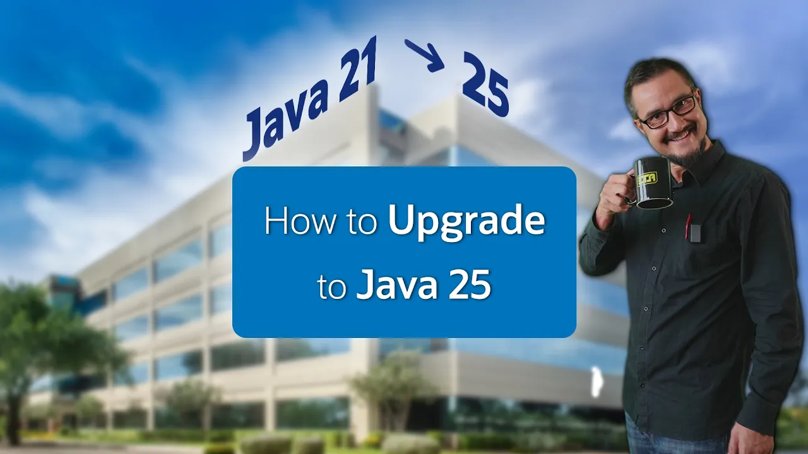

== {title}

++++
<table class="toc">
	<tr class="toc-current"><td>Past</td></tr>
	<tr><td>Present</td></tr>
	<tr><td>Future</td></tr>
</table>
<!-- needed so the slide has the same height
     as the other summary title/toc slides -->

++++

include::beforetimes.adoc[]

=== !
image::images/java-25-no-lts.webp[]

🎥 https://www.youtube.com/watch?v=x6-kyQCYhNo[Java 25 is ALSO no LTS Version]

=== !

🎥 https://www.youtube.com/watch?v=9azNjz7s1Ck[How to Upgrade to Java 25]

:toc: pass:[ \
<table class="toc"> \
	<tr class="toc-current"><td>Past</td></tr> \
	<tr class="toc-current"><td style="padding-left: 2em;">Language Features</td></tr> \
	<tr><td style="padding-left: 2em;">New APIs</td></tr> \
	<tr><td style="padding-left: 2em;">Runtime Improvements</td></tr> \
	<tr><td style="padding-left: 2em;">Better Tooling</td></tr> \
	<tr><td>Present</td></tr> \
	<tr><td>Future</td></tr> \
</table> \
]
include::past_language.adoc[]

:toc: pass:[ \
<table class="toc"> \
	<tr class="toc-current"><td>Past</td></tr> \
	<tr><td style="padding-left: 2em;">Language Features</td></tr> \
	<tr class="toc-current"><td style="padding-left: 2em;">New APIs</td></tr> \
	<tr><td style="padding-left: 2em;">Runtime Improvements</td></tr> \
	<tr><td style="padding-left: 2em;">Better Tooling</td></tr> \
	<tr><td>Present</td></tr> \
	<tr><td>Future</td></tr> \
</table> \
]
include::past_apis.adoc[]

:toc: pass:[ \
<table class="toc"> \
	<tr class="toc-current"><td>Past</td></tr> \
	<tr><td style="padding-left: 2em;">Language Features</td></tr> \
	<tr><td style="padding-left: 2em;">New APIs</td></tr> \
	<tr class="toc-current"><td style="padding-left: 2em;">Runtime Improvements</td></tr> \
	<tr><td style="padding-left: 2em;">Better Tooling</td></tr> \
	<tr><td>Present</td></tr> \
	<tr><td>Future</td></tr> \
</table> \
]
include::past_runtime.adoc[]

:toc: pass:[ \
<table class="toc"> \
	<tr class="toc-current"><td>Past</td></tr> \
	<tr><td style="padding-left: 2em;">Language Features</td></tr> \
	<tr><td style="padding-left: 2em;">New APIs</td></tr> \
	<tr><td style="padding-left: 2em;">Runtime Improvements</td></tr> \
	<tr class="toc-current"><td style="padding-left: 2em;">Better Tooling</td></tr> \
	<tr><td>Present</td></tr> \
	<tr><td>Future</td></tr> \
</table> \
]
include::past_tooling.adoc[]

=== More

Going from Java 21 to 25:

* 🎥 https://www.youtube.com/playlist?list=PLX8CzqL3ArzXJ2_0FIGleUisXuUm4AESE[Road to 25]

Generally:

* 📝 https://dev.java/[dev.java]
* 📝 https://inside.java/[inside.java]
* 📝 https://openjdk.org/jeps/0[JEP list]
* 🎥 https://youtube.com/java[youtube.com/java]
