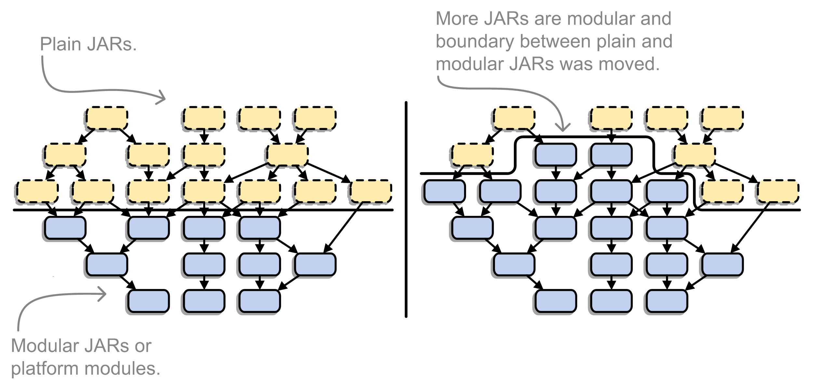
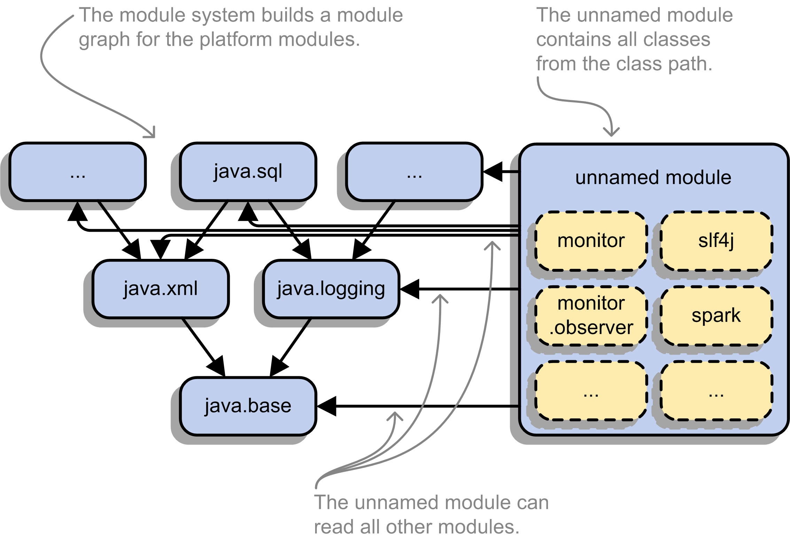
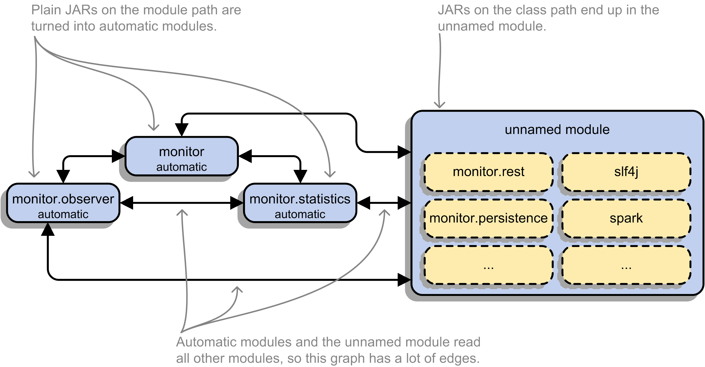
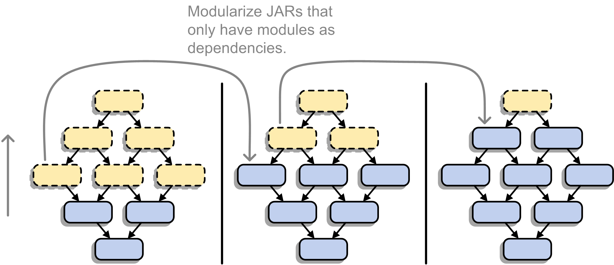
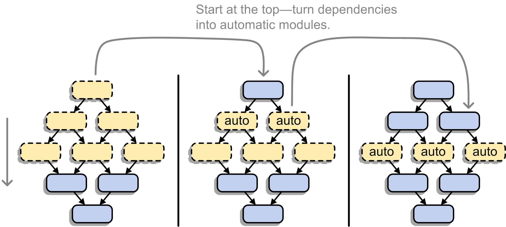
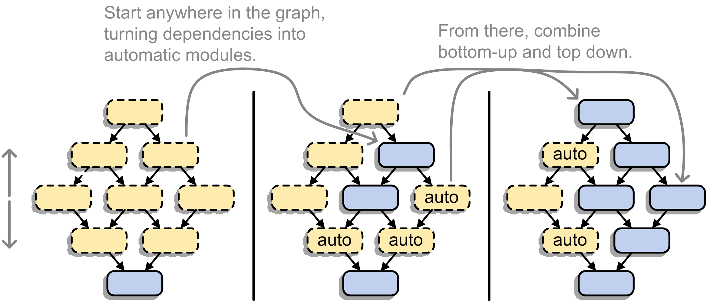

== Java modules in real life

{toc}

=== Incremental modularization

Why consider it?

* partial modularization gives you +
  partial benefits
* can avoid some roadblocks
* makes the process more relaxed

=== Incremental modularization

Why is it even an option?

* most module systems are "in or out"
* but modularized JDK and legacy JARs +
have to cooperate!
* there is a boundary between +
legacy and modules

Incremental modularization means +
moving that boundary.

[state=empty,background-color=white]
=== !

=== Enablers

Incremental modularization is enabled by two features:

* Unnamed Module(s)
* Automatic Modules

And the fact that module and class path coexist:

* modular JARs can be put on either
* "regular" JARs can be put on either

=== The unnamed module

Contains _all_ JARs on the class path +
(including modular JARs).

* has no name (surprise!)
* can read all modules
* exports all packages

Inside the unnamed module, +
"the chaos of the class path" lives on.

⇝ Why the class path "just works".

[state=empty,background-color=white]
=== !

=== No Access

* what if your code was modularized +
and your dependencies were not?
* proper modules can not depend on +
"the chaos on the class path"
* this is not possible:
+
[source,java]
----
module calendar {
	requires unnamed;
}
----

=== Automatic modules

One is created _for each_ "regular" JAR +
on the module path.

* name defined by manifest entry +
`AUTOMATIC-MODULE-NAME` or +
derived from JAR name
* can read all modules +
(including the unnamed module)
* exports all packages

[state=empty,background-color=white]
=== !

=== What goes where?

[cols="s,d,d", options="header"]
|===
|
|Class Path
|Module Path

|Regular JAR
|Unnamed Module
|Automatic Module

|Modular JAR
|Unnamed Module
|Explicit Module
|===

Unnamed or named module? +
The user decides, not the maintainer!

=== Modularization strategies

Three strategies emerge:

* bottom up
* top down
* inside out

=== Bottom up

Works best for projects *without* +
unmodularized dependencies.

* pick JAR at bottom of dependency tree
* turn it into a module
* put it and all dependencies on module path
* continue with siblings or parent

(Modular JARs still work on to the class path, +
so users are free to put them on any path.)

[state=empty,background-color=white]
=== !

=== Top down

Good approach for projects *with* +
unmodularized dependencies +

* pick JAR at top of dependency tree
* turn it into a module
* put it on the module path
* continue with children

Where to put dependencies?

=== Top down

Where to put dependencies?

* modularized dependencies:
** require direct ones
** put all on the module path
* unmodularized dependencies:
** require direct ones with automatic name
** put direct ones on the module path
** put others on the class path

[state=empty,background-color=white]
=== !

=== Top down

When dependencies get modularized:

* hopefully the name didn't change
* if they are already on the module path, +
nothing changes
* otherwise move them there
* check their dependencies

=== Top down

If you *publish* modules, be careful +
with automatic module names:

* automatic module name may +
  be based on JAR name
* file names can differ +
  across build environments
* module name can change +
  when project gets modularized

⇝ Such automatic module names are unstable.

=== Top down

Manifest entry:

* projects can publish module name +
  as manifest entry
* assumption is that it won't change +
  when project gets modularized
* that makes these names stable

⇝ It is *ok to publish* modules +
that depend on automatic modules +
whose names are *based on manifest entry*.

=== Inside out

Bottom up and top down can be combined:

* pick a JAR anyhwere in your dependency tree
* turn it into a module
* put it and all dependencies on module path
* place transitive dependencies as for top down
* continue with any other JAR

[state=empty,background-color=white]
=== !

=== Recommendations

In order of precedence:

. no unmodularized dependencies ⇝ bottom up
. bottom up or top down
. roadblocks ⇝ continue elsewhere (inside out)

Remember, partial modularization brings partial benefits!
