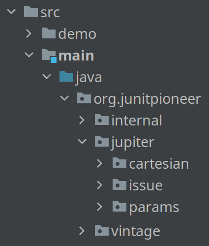

== Java Modules In Real Life

{toc}

=== Managing dependencies

Does this compile +
(when built with Maven)?

```xml
<dependency>
	<groupId>com.google.guava</groupId>
	<artifactId>guava</artifactId>
	<version>31.1-jre</version>
</dependency>
```

```java
import org.checkerframework.checker.units.qual.Prefix;
public class Transitive {
	private final Prefix prefix = Prefix.centi;
}
```

[%step]
Should it?

=== Managing dependencies

Now it doesn't +
(regardless of build tool):

```java
module com.example.main {
	requires com.google.common;
}
```

⇝ Modules make dependencies more explicit.

=== Self-contained applications

Explicit dependencies in action:

```sh
# create the image
$ jlink
    --module-path mods
    --add-modules com.example.main
    --output app-image

# list contained modules
$ app-image/bin/java --list-modules
> com.example.app
# other app modules
> java.base
# other java/jdk modules
```

⇝ Modules make it easy to create application images.

=== Defining APIs

Which packages can I use?



=== Defining APIs

Exactly these:

```java
module org.junitpioneer {
	exports org.junitpioneer.jupiter;
	exports org.junitpioneer.jupiter.cartesian;
	exports org.junitpioneer.jupiter.params;
	exports org.junitpioneer.vintage;
}
```

⇝ Modules clarify APIs.

⇝ Modules add module-internal accessibility. +
(enforced by compiler and runtime).

=== Project-internal APIs

How to stop projects integrating your code +
from using all your APIs?

[step=1]
```java
module com.example.lib {
	exports com.example.lib.internal
		to com.example.main;
}
```

[step=1]
⇝ Modules add project-internal accessibility. +
(enforced by compiler and runtime).

=== Illegal access errors

// https://github.com/spring-projects/spring-boot/issues/28293
* in _Spring LDAP:_
+
```bash
org.springframework.ldap...AbstractContextSource
⇝ com.sun.jndi.ldap.LdapCtxFactory
```
// https://github.com/google/error-prone/issues/2195
* in _Error Prone_:
+
```bash
com.google.errorprone.BaseErrorProneJavaCompiler
⇝ com.sun.tools.javac.api.BasicJavacTask
```
// https://github.com/veraPDF/veraPDF-library/issues/1197
* in _veraPDF-library_:
+
```bash
org.verapdf.gf.model.impl.external.GFPKCSDataObject
⇝ sun.security.pkcs.PKCS7
```

=== Illegal access

Dependencies on internals of...

* JDK
* frameworks
* libraries

\... are a risk.

⇝ Modules make these explicit +
(with errors or `--add-exports`) +
and incentivize fixing them.

=== Explicit services

Which services does a JAR use?

[step=1]
```java
module java.sql {
	uses java.sql.Driver;
}
```

[step=1]
⇝ Modules make consuming services explicit.

=== Simple services

No more files in `META-INF/services/` — instead:

```java
module com.example.sql {
	provides java.sql.Driver
		with com.example.sql.ExampleDriver;
}
```

⇝ Modules make providing services simpler.

=== New abstraction

What describes a project +
(and how to look it up):

* name ⇝ build tool
* API ⇝ 🤷🏾‍♂️
* dependencies ⇝ build tool
* services ⇝ `META-INF/services/`
* high-level documentation ⇝ 🤷🏼‍♀️

⇝ Modules express this in one file.

=== High-level documentation

Module declaration is a great place to document:

* central abstraction, contract, design
* unexpected dependencies
* unusual API
* allowance of reflective access
* service interactions

=== Evolving architecture

Module declarations:

* define and document a project
* are verified by compiler and runtime
* can be evaluated by other tools
* are obvious to review

[%step]
⇝ Modules are a living representation +
of a project's architecture.
