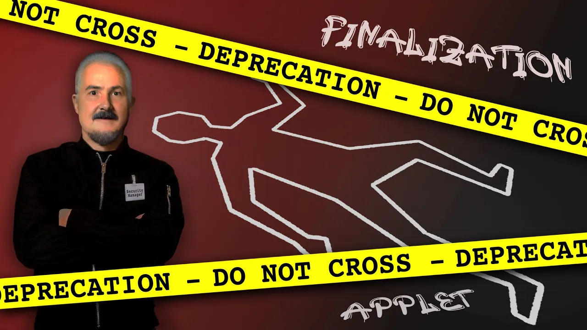

== From Idea to IDE

{toc}

=== Feature_final2.docx

Even final features aren't _final_!

=== Evolution

Considerations for feature evolution/removal:

* Does it hurt?
* Is it used?
* Can it be extended/improved?
* Would a change/removal hurt?

// UPDATE TO TODAY
=== Some Removals

Single underscore as variable name ⛔⑨: ::
* rarely used
* prevents very useful language feature
* easy to fix
Concurrent mark sweep GC ⛔⑭: ::
* maintenance cost
* lots of alternative GCs
* easy to fix
RMI Activation ⛔⑰: ::
* obsolete and disused

// UPDATE TO TODAY
=== Some Terminal Deprecations

Primitive wrapper constructors ⚠️⑯: ::
* prevent value types
* easy to fix

Applet API ⚠️⑰: ::
* unused and unusable

// Security manager ⚠️⑰: ::
// * very low adoption
// * easy to get wrong
// * maintenance cost
// * better mechanisms exist

Finalization ⚠️⑱: ::
* easy to get wrong
* performance & maintenance cost
* better mechanisms exist

=== !
[link=https://www.youtube.com/watch?v=3HnH6G_zcP0]

Prepare Your Code Bases For Future Java +
Inside Java Newscast #41

=== Evolution

Features are extremely stable +
but not immutable.

My guesstimates:

* rate of change: 0.5%
* survival rate: 99.95%
