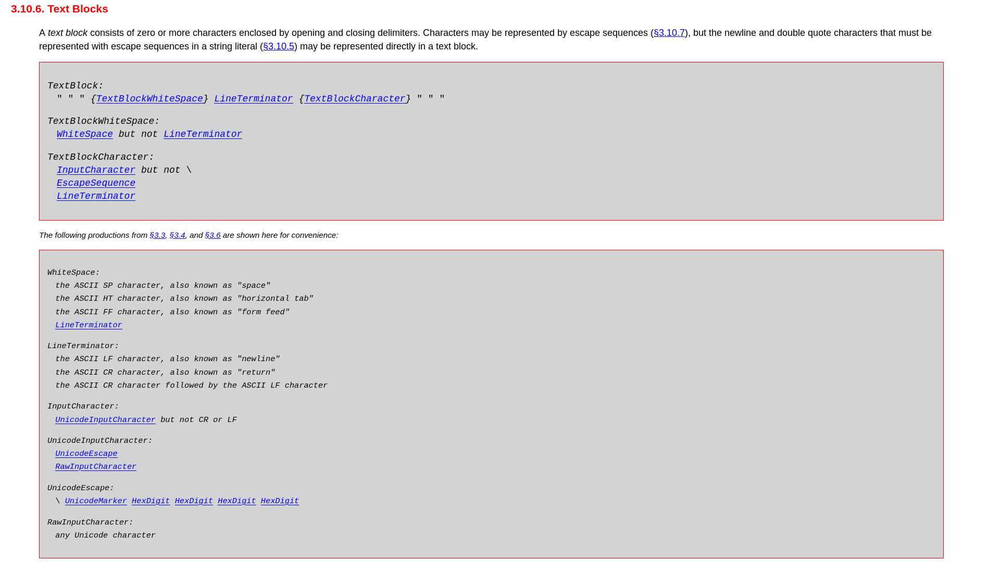
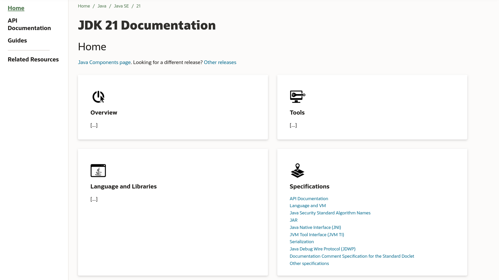

[state="empty"]
== !
image::images/text-blocks-ide.png[background, size=cover]

=== Text Blocks

> A text block is a multi-line string literal that avoids the need for most escape sequences, automatically formats the string in a predictable way, and gives the developer control over the format when desired.

* language feature added in Java 15
* triggered additions to `String`: +
  `formatted`,
  `indent`,
  `stripIndent`,
  `translateEscapes`

[state="empty",background-color="white"]
=== !

// UPDATE CURRENT RELEASE
[state="empty",background-color="white"]
=== !

// UPDATE
[state="empty",background-color="#2d333b"]
=== !
image::images/github-jdk.png[background, size=contain]

=== Hallmarks

Java features:

* come as syntax, VM capabilities, APIs +
  (or any combination)
* specified in JLS, JVMS, Javadoc, etc. & +
  implemented in openjdk/jdk
* fulfill clearly defined requirements
* fit in seamlessly & have good tool support

> Why did _this_ take so long?

=== Evolution

But where does a feature come from?

Long story:

[%step]
* starts with an idea
* refinement in explorations
* prototype and proposal
* preview feature
* finalized feature
