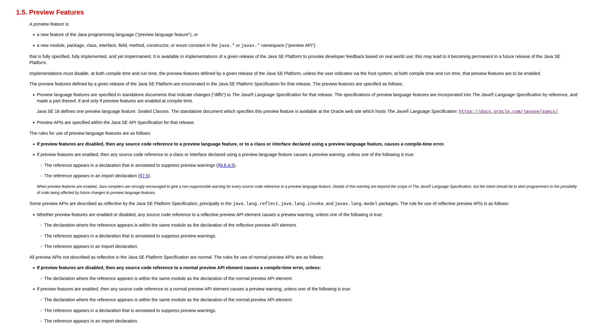
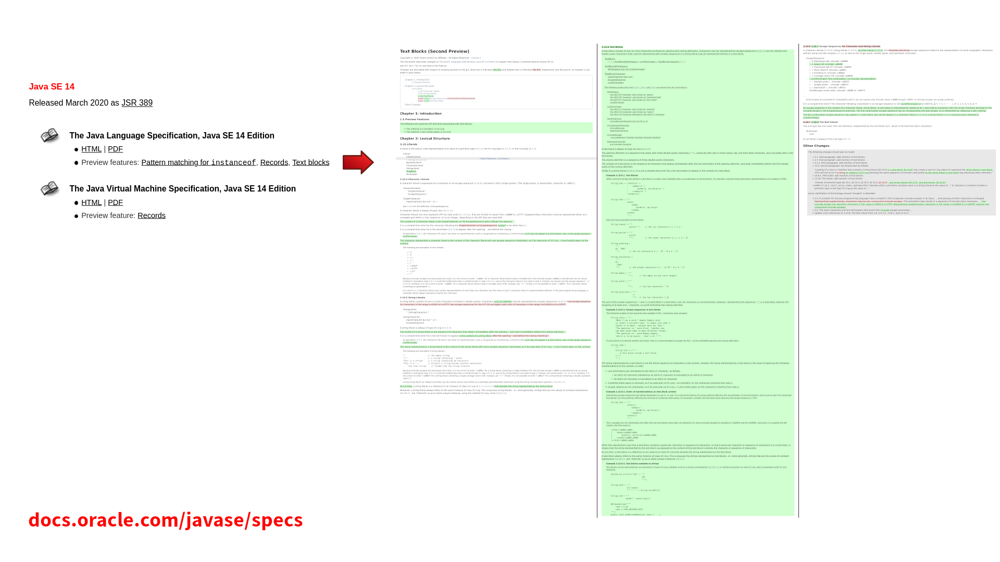

== From Idea to IDE

{toc}

// UPDATE CURRENT RELEASE
=== Previews in Java 20

* pattern matching for switch (https://openjdk.org/jeps/433[4th])
* foreign function & memory API (https://openjdk.org/jeps/434[2nd])
* virtual threads (https://openjdk.org/jeps/436[2nd])

=== Specification

The concept of preview features was:

* introduced by https://openjdk.org/jeps/12[JEP 12]
* refined by https://openjdk.org/jeps/8300604[a recent JEP draft]
// UPDATE CURRENT RELEASE
* specified by JLS (e.g., https://docs.oracle.com/javase/specs/jls/se19/html/jls-1.html#jls-1.5[for 19])

// UPDATE CURRENT RELEASE (maybe, it's not that important)
[state="empty",background-color="white"]
=== !


=== Artifacts

Required artifacts for preview features:

* specified in JLS:
** all preview features are mentioned
** JLS changes/diffs are linked

* implemented in openjdk/jdk, but:
** disabled by default
** by compiler and runtime

[state="empty",background-color="white"]
=== !


=== Enabling

Enabling:

* for compiler and runtime +
  with `--enable-preview`
* generates compiler warnings
* pins Java version

=== Example

```java
public class TextBlocks {

	public static void main(String[] args) {
		System.out.println("""
				Hello,
				text blocks!""");
	}

}
```

=== Enabling For Compilation

Compiling with Java 14:

```
$ javac TextBlocks.java
> TextBlocks.java:4: error: text blocks are a preview
> feature and are disabled by default.
>                 System.out.println("""
>                                    ^
>   (use --enable-preview to enable text blocks)
> 1 error

$ javac --enable-preview --release 14 TextBlocks.java
> Note: TextBlocks.java uses preview language features.
> Note: Recompile with -Xlint:preview for details.
```

=== Enabling For Execution

Running with Java 14:

```
$ java TextBlocks
> Error: LinkageError occurred while loading main class
> TextBlocks
>        java.lang.UnsupportedClassVersionError:
>        Preview features are not enabled for
>        TextBlocks (class file version 58.65535).
>        Try running with '--enable-preview'

$ java --enable-preview TextBlocks
> Hello,
> text blocks!
```

=== Version Pinning

Compiled with Java 14, launched with 15:

```
$ java --enable-preview TextBlocks
> Error: LinkageError occurred while loading main class
> TextBlocks
>        java.lang.UnsupportedClassVersionError:
>        TextBlocks (class file version 58.65535)
>        was compiled with preview features that are
>        unsupported. This version of the Java Runtime
>        only recognizes preview features for class
>        file version 59.65535

```

=== Goals & Considerations

Goals of preview features:

* prevent (accidental) use in production
* foster early IDE support
* user experimentation and reports
* review and refinement

Considerations:

* "Is it surfaced correctly?"
* "Are there unforeseen edge cases?"

=== Evolution

Preview features evolve a bit +
(particularly on the surface) +
and usually finalize.

My guesstimates:

* duration: 12-24 months
* rate of change: 5%
* rate of progression: 95%
