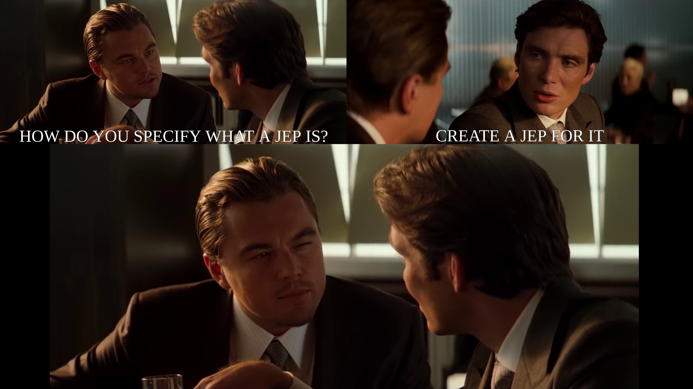
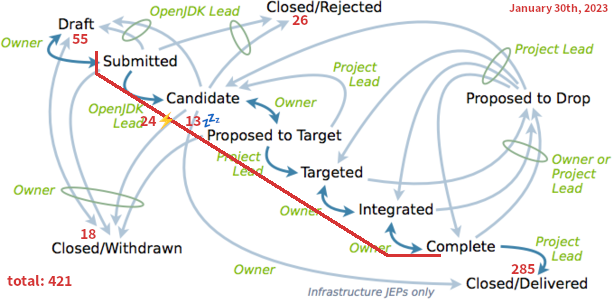

== From Idea to IDE

{toc}

// UPDATE TO TODAY
=== Some Current Proposals

Defined in _JDK Enhancement Proposals_ (_JEPs_) +
(essentally decision records):

* statements before `super()` (https://openjdk.org/jeps/447[JEP 447])
* compact object headers (https://openjdk.org/jeps/450[JEP 450])
* multi-file source programs (https://openjdk.org/jeps/458[JEP 458])

[state="empty",background-color="black"]
=== !

=== Specification

JEPs were introduced by https://openjdk.org/jeps/1[JEP 1] (in 2011).

It was superseded by https://cr.openjdk.org/~mr/jep/jep-2.0-02.html[JEP 2.0 draft] (in 2014).

[state="empty",background-color="white"]
=== !
image::images/jep-2.0-workflow.png[background, size=contain]

[NOTE.speaker]
--
* Draft: drafted, reviewed, revised, endorsed
* Submitted: ready to be evaluated for the JDK Roadmap
* Candidate: added to the JDK Roadmap
* Targeted: supposed to be released in that version
* Integrated: code/tests are integrated into openjdk/jdk
* Complete: functional/performance/conformance tests have been delivered; only bug fixes are expected
* Closed/Delivered: release shipped with JEP
* Closed/...: work stopped
--

=== JEP Filters

JEPs (as JBS issues) by states:

* https://bugs.openjdk.org/issues/?jql=project%20%3D%20JDK%20AND%20issuetype%20%3D%20JEP%20AND%20status%20%3D%20Draft[Draft JEPs]
* https://bugs.openjdk.org/issues/?jql=project%20%3D%20JDK%20AND%20issuetype%20%3D%20JEP%20AND%20status%20%3D%20Submitted[Submitted JEPs]
* https://bugs.openjdk.org/issues/?jql=project%20%3D%20JDK%20AND%20issuetype%20%3D%20JEP%20AND%20status%20%3D%20Candidate[Candidate JEPs]
* https://bugs.openjdk.org/issues/?jql=project%20%3D%20JDK%20AND%20issuetype%20%3D%20JEP%20AND%20status%20%3D%20Targeted[Targeted JEPs]
* https://bugs.openjdk.org/issues/?jql=project%20%3D%20JDK%20AND%20issuetype%20%3D%20JEP%20AND%20status%20%3D%20Integrated[Integrated JEPs]
* https://bugs.openjdk.org/issues/?jql=project%20%3D%20JDK%20AND%20issuetype%20%3D%20JEP%20AND%20status%20%3D%20Complete[Complete JEPs]
* https://bugs.openjdk.org/issues/?jql=project%20%3D%20JDK%20AND%20issuetype%20%3D%20JEP%20AND%20status%20%3D%20Closed%20AND%20resolution%20%3D%20Delivered[Closed/Delivered JEPs]

// UPDATE TO TODAY
=== JEP Progression (All)

(June 13th, 2023)

// total/drafted: https://bugs.openjdk.org/browse/JDK-8046112?jql=project%20%3D%20JDK%20AND%20issuetype%20%3D%20JEP%20ORDER%20BY%20created%20ASC%2C%20lastViewed%20DESC
* drafted: 437
* open:
// draft: https://bugs.openjdk.org/issues/?jql=project%20%3D%20JDK%20AND%20issuetype%20%3D%20JEP%20AND%20status%20%3D%20Draft
** draft: 51
// open & active: https://bugs.openjdk.org/issues/?jql=project%20%3D%20JDK%20AND%20issuetype%20%3D%20JEP%20AND%20status%20!%3D%20Closed%20AND%20status%20!%3D%20draft%20AND%20updated%20%3E%3D%20-156w%20ORDER%20BY%20created%20ASC
** candidate & active: 33
// open & dormant: https://bugs.openjdk.org/issues/?jql=project%20%3D%20JDK%20AND%20issuetype%20%3D%20JEP%20AND%20status%20!%3D%20Closed%20AND%20status%20!%3D%20draft%20AND%20updated%20%3C%20-156w%20ORDER%20BY%20created%20ASC
** candidate & dormant: 13
* closed:
// withdrawn: CSS class "withdrawn" in https://openjdk.org/jeps/0
** withdrawn: 18
// rejected stats in JBS is borked; instead subtract "withdrawn" from https://bugs.openjdk.org/issues/?jql=project%20%3D%20JDK%20AND%20issuetype%20%3D%20JEP%20AND%20status%20%3D%20Closed%20AND%20resolution%20in%20(Rejected%2C%20Withdrawn)%20ORDER%20BY%20created%20ASC%2C%20lastViewed%20DESC
** rejected: 31
// delivered: https://bugs.openjdk.org/issues/?jql=project%20%3D%20JDK%20AND%20issuetype%20%3D%20JEP%20AND%20status%20%3D%20Closed%20AND%20resolution%20%3D%20Delivered
** delivered: 291

// UPDATE TO TODAY
[state="empty",background-color="white"]
=== !

// UPDATE TO TODAY
=== JEP Progression (Closed)

// drafted: "delivered" + "rejected" + "withdrawn" (all above)
* drafted: 340
* withdrawn: 18
* rejected: 31
* delivered: 291 (85%)

// UPDATE TO TODAY
=== Artifacts

Proposals are defined by JEPs.

Often also come with implementations in +
project forks or feature branches of openjdk/jdk, e.g.:

* https://github.com/openjdk/valhalla[openjdk/valhalla]
* https://github.com/openjdk/amber/tree/super-init[openjdk/amber 🌳 super-init]

=== Goals & Considerations

Goals of JEPs:

* expose proposal to wider audience
* seek feedback on the proposed solution
* motivate, describe, archive proposals +
  with their contexts and consequences

Proposal considerations:

* "Is this the right way to do it?"

=== Evolution

Proposals evolve noticeably +
(particularly until _Candidate_) +
and most are delivered.

My guesstimates:

* duration: 6-36 months
* rate of change: 40%
* rate of progression: 85%
