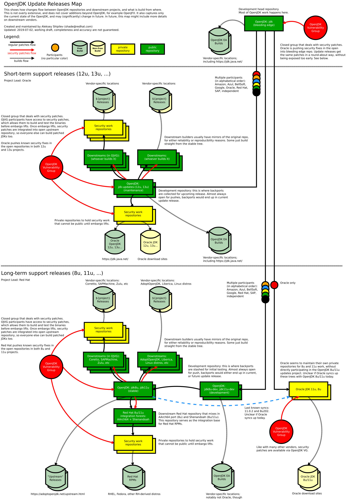

= One Step Closer
:backend: revealjs
:revealjs_theme: nipa-night
:revealjsdir: ../_reveal.js
:revealjs_controls: false
:revealjs_progress: false
:revealjs_slideNumber: false
:revealjs_history: true
:revealjs_center: true
:revealjs_transition: fade
:revealjs_backgroundTransition: fade
:revealjs_parallaxBackgroundImage: images/steps.jpg
:revealjs_parallaxBackgroundSize: 6000px 3000px
:docinfo: shared
:docinfodir: ../_shared

include::../_shared/highlight.js.adoc[]

++++
<h2>Cloning, Coding, And Building The JDK</h2>
++++

:host-name: JavaLand
:host-url: https://www.javaland.eu/de/home/
:host-logo-url: images/logo-javaland.jpg
// :host-logo-style: border-color: black;
:host-twitter-name: @JavaLandConf
:host-twitter-url: https://twitter.com/JavaLandConf
include::../_shared/event-on-title-and-footer.adoc[]

// ######### //
// I N T R O //
// ######### //

// ⇝

== Lots to talk about

The plan for today:

* get to know OpenJDK
* clone the JDK codebase
* set up a build and execute it
* make a few simple API changes
* build our hand-made JDK and use it

=== Caveats

* I don't actually know what I'm talking about
* this only covers my setup, ymmv
* this is a proof of concept, not a tutorial

=== Links

* slides at https://slides.nipafx.dev/[slides.nipafx.dev]
* OpenJDK at
** original repo: https://hg.openjdk.java.net/jdk/jdk[hg.openjdk.java.net/jdk/jdk]
** GitHub mirror: https://github.com/openjdk/jdk[github.com/openjdk/jdk]

== OpenJDK

It's a bird! +
It's a plane! +
It's OpenJDK!

// https://www.youtube.com/watch?v=ySvAs5ppkRw

OpenJDK is many things:

* we'll discuss the details later
* let's dig into the code first

== Code

Code, code, code, code

=== But why?!

* it's fun 😁
* removes magic from your project
* makes it easier to contribute

=== Contribute?

Contribute:

* now you know how to clone, build, edit
* check the https://bugs.openjdk.java.net/browse/JDK[bug database]
* http://openjdk.java.net/contribute/[contribute] your own features

Not every contribution has to be code:

* build your project against http://jdk.java.net/[OpenJDK EA builds]
* experiment with incubating features and APIs
* report experience/regressions to http://mail.openjdk.java.net/mailman/listinfo[mailing lists]

== OpenJDK

We've seen the OpenJDK code.

But what *is* OpenJDK?

Let's check http://openjdk.java.net/[openjdk.java.net]...

[state="empty",background-color=#f6f5f4]
=== !
image::images/openjdk.java.net.png[background, size=contain]

=== What is OpenJDK?

> *What is this?* The place to collaborate on an open-source implementation of the Java Platform, Standard Edition, and related projects.

Also:

> Major Linux distributions [...] offer OpenJDK as their default Java SE implementation.

🤔

=== What is OpenJDK?

Categorization of links on http://openjdk.java.net/[openjdk.java.net]:

[cols="3*.<",options="header"]
|===
| Community | Project | Code
a|

* http://openjdk.java.net/bylaws[bylaws]
* http://openjdk.java.net/census[members]
* http://openjdk.java.net/groups/[groups]

a|
* http://openjdk.java.net/projects/[projects]
* http://openjdk.java.net/jeps/0[JEP process]
* http://mail.openjdk.java.net/mailman/listinfo[mailing lists]
* http://openjdk.java.net/contribute/[contribution guidelines]
* http://openjdk.java.net/guide/[developer guide]

a|
* https://hg.openjdk.java.net/jdk/jdk[code base]
* http://openjdk.java.net/jtreg/[jtreg]
|===

=== What is OpenJDK?

It's complicated - OpenJDK is many things:

A community:: of companies and individuals with a stake in Java
A project:: that discusses, plans, and implements changes to the OpenJDK code base
A code base:: with Java's reference implementation that's the source of truth for most JDK distros out there

// TODO create a tree diagram with OpenJDK as root and distros as children/leaves
// Oracle, RedHat, Amazon, Liberica, ..., they all build from the OpenJDK code base

=== What is OpenJDK not?

*OpenJDK is no Java distribution!*

It doesn't ship binaries, but others do:

* Oracle on https://jdk.java.net/[jdk.java.net]
* AdoptOpenJDK on https://adoptopenjdk.net/[adoptopenjdk.net]

== OpenJDK as a code base

*How is the OpenJDK code base developed?*

That's complicated, too!

RedHat's Aleksey Shipilëv (https://twitter.com/shipilev[@shipilev]) +
made https://shipilev.net/jdk-updates/map/[a nice diagram].

// diagram for Shenandoah: http://cr.openjdk.java.net/~shade/shenandoah/shenandoah-changes-flow.png

[state="empty",background-color=white]
=== !

[transition=none,state="empty",background-color=white]
=== !
image::images/openjdk-update-lts-releases-map.png[background, size=contain]

=== OpenJDK clone army

There are many clones:

* we've seen the canonical repo
* every Java version has their clone
* every project has their clone
* every distribution has their clones

For ease of understanding, +
let's think of clones as branches.

=== OpenJDK development

*A new feature, simplified:*

* developed in "feature branch"
* merged into "master" when (nearly) finished

*A release, simplified:*

* "release branch" created 3 months prior
* only bug fixes merged to "release branch"

*A bug/security/etc fix, simplified:*

* usually developed in "master"
* merged into relevant release branches

=== OpenJDK development

Not _that_ complicated after all.

But what you would expect...

* from a large code base
* housing an important project
* gouverned by a diverse community

== Summary

* OpenJDK is a community / project / code base
* the code base is large, but no magic
* you can start working on it in an afternoon
* why not give it a try and contribute?

include::../_shared/about-slide.adoc[]

include::images/sources.adoc[]
