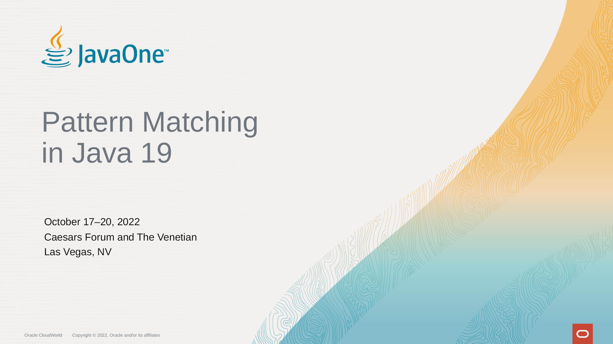

= Pattern Matching
:backend: revealjs
:revealjs_theme: nipa-oracle
:revealjsdir: ../_reveal.js
:revealjs_controls: false
:revealjs_progress: false
:revealjs_slideNumber: false
:revealjs_history: true
:revealjs_center: true
:revealjs_transition: fade
:revealjs_backgroundTransition: fade
:revealjs_parallaxBackgroundImage: images/bg-javaone-2022.jpg
:revealjs_parallaxBackgroundSize: 4000px 2250px
:docinfo: shared
:docinfodir: ../_shared

:imagedir: images

include::../_shared/highlight.js.adoc[]

++++
<h2>In Java (19)</h2>
++++

:host-name: JavaOne
:host-url: https://oracle.com/javaone
:host-logo-url: images/logo-javaone.png
// :host-logo-style: background-color: #212121; border-width: 0;
:host-twitter-name: @JavaOne
:host-twitter-url: https://twitter.com/javaone
include::../_shared/event-on-title-and-footer.adoc[]

// ######### //
// I N T R O //
// ######### //

// ⇝

[state=empty,background-color=white]
== !

== Data-Oriented Programming

++++
<table class="toc">
	<tr><td>What is DOP?</td></tr>
	<tr><td>A Lengthy Example</td></tr>
	<tr><td>That was DOP!</td></tr>
</table>
++++

Slides at https://slides.nipafx.dev/[slides.nipafx.dev].

=== Das Ist Alles Nur Geklaut 🎶

(This is all just snitched.)

Seminal article by Brian Goetz on InfoQ: +
https://www.infoq.com/articles/data-oriented-programming-java/[Data Oriented Programming in Java]

include::dop-intro.adoc[]

include::dop-example.adoc[]

include::dop-outro.adoc[]

include::../_shared/about-slide.adoc[]

include::images/sources.adoc[]
