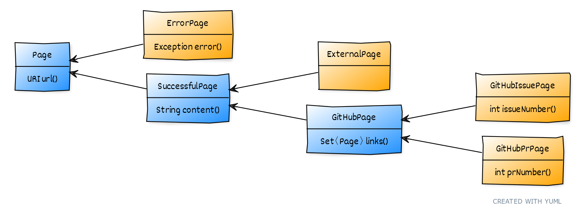

== Data-Oriented Programming

++++
<table class="toc">
	<tr><td>What is DOP?</td></tr>
	<tr class="toc-current"><td>A Lengthy Example</td></tr>
	<tr><td>That was DOP!</td></tr>
</table>
++++

=== Crawling GitHub

Starting with a seed URL:

. connect to URL
. identify kind of page
. identify interesting section
. identify outgoing links
. for each link, start at 1.

(Code on https://github.com/nipafx/loom-lab[github.com/nipafx/loom-lab].)

=== Crawling GitHub

That logic is implemented in:

```java
public class PageTreeFactory {

	public static Page loadPageTree(/*...*/) {
		// [...]
	}

}
```

What does `Page` look like?

=== Requirements

Pages:

* all pages have a `url`
* unresolved pages have an `error`
* resolved pages have `content`
* GitHub pages have:
** outgoing `links`
** `issueNumber` or `prNumber`

=== Requirements

Possible operations on pages +
(and their subtree):

* display as interactive graph
* compute graph properties
* categorize pages by topic
* analyze mood of interactions
* process payment for analyses

=== Requirements

Example operations going forward:

* evaluate statistics
* create pretty string

=== A Possible Implementation

A single `Page` class with this API:

```java
public URL url();
public Exception error();
public String content();
public int issueNumber();
public int prNumber();
public Set<Page> links();
public Stream<Page> subtree();

public Stats evaluateStatistics();
public String toPrettyString();
```

=== A Possible Implementation

Problems:

* page "type" is implicit
* legal combination of fields is unclear
* clients must "divine" the type
* disparate operations on same class

=== A Better Implementation

Data-oriented programming:

* makes all data explicit and "obviously correct"
* separates operations from data
* models systems as production line

=== Applying DOP

> Model data immutably and transparently.

We got a language construct that fits perfectly.

(Just in case: You can achieve this with regular classes, too.)

=== Detour: Records

_[Finalized in Java 16 -- https://openjdk.org/jeps/395[JEP 395]]_

> Transparent carriers for immutable data.

* compiler understands internals
* couples API to internals
* reduces verbosity _a lot_

=== Detour: Records

```java
record ExternalPage(URI url, String content) { }
```

* `ExternalPage` is final
* private final fields: `URI url` and `String content`
* constructor: `ExternalPage(URI url, String content)`
* accessors: `URI url()` and `String content()`
* `equals()`, `hashCode()`, `toString()` that use the two fields

All method/constructor bodies can be customized.

=== Ensuring Immutability

Records are shallowly immutable, +
but field types may not be.

⇝ Fix that during construction.

=== Ensuring Immutability

```java
public record GitHubPrPage(..., Set<Page> links) {

	// compact constructor
	GitHubPrPage {
		links = Set.copyOf(links);
	}

}
```

=== Applying DOP

> Model the data, the whole data, +
> and nothing but the data.

There are four kinds of pages:

* error page
* external page
* GitHub issue page
* GitHub PR page

⇝ Use four records to model them!

=== Modeling The Data

```java
public record ErrorPage(
	URI url, Exception ex) { }

public record ExternalPage(
	URI url, String content) { }

public record GitHubIssuePage(
	URI url, String content,
	int issueNumber, Set<Page> links) { }

public record GitHubPrPage(
	URI url, String content,
	int prNumber, Set<Page> links) { }
```

=== Modeling The Data

There are additional relations between them:

* a page (load) is either successful or not
* a successful page is either external or GitHub
* a GitHub page is either for a PR or an issue

⇝ Use sealed types to model the alternatives!

=== Detour: Sealed Types

_[Finalized in Java 17 -- https://openjdk.org/jeps/409[JEP 409]]_

Sealed types limit inheritance, +
by only allowing specific subtypes.

* communicates intention to developers
* allows compiler to check exhaustiveness

=== Detour: Sealed Types

```java
public sealed interface Page
		permits ErrorPage, SuccessfulPage {
	// ...
}
```

Only `ErrorPage` and `SuccessfulPage` +
can implement/extend `Page`.

⇝ `interface MyPage extends Page` doesn't compile

=== Modeling Alternatives

```java
public sealed interface Page
		permits ErrorPage, SuccessfulPage {
	URI url();
}

public sealed interface SuccessfulPage
		extends Page permits ExternalPage, GitHubPage {
	String content();
}

public sealed interface GitHubPage
		extends SuccessfulPage
		permits GitHubIssuePage, GitHubPrPage {
	Set<Page> links();
	default Stream<Page> subtree() { ... }
}
```

[state=empty,background-color=white]
=== !


////
yuml.me - https://yuml.me/nipafx/edit/github-crawler

[Page|URI url() {bg:dodgerblue}]
[ErrorPage|Exception error() {bg:orange}]
[SuccessfulPage|String content() {bg:dodgerblue}]
[GitHubPage|Set〈Page〉 links() {bg:dodgerblue}]
[GitHubIssuePage|int issueNumber() {bg:orange}]
[GitHubPrPage|int prNumber() {bg:orange}]

[Page]<-[ErrorPage]
[Page]<-[SuccessfulPage]
[SuccessfulPage]<-[GitHubPage]
[GitHubPage]<-[GitHubIssuePage]
[GitHubPage]<-[GitHubPrPage]
////

=== Applying DOP

> Make illegal states unrepresentable.

Many are already, e.g.:

* with `error` and with `content`
* with `issueNumber` and `prNumber`
* with `isseNumber` or `prNumber` but no `links`

=== Validation

⇝ Reject other illegal states in constructors.

```java
record ExternalPage(URI url, String content) {

	ExternalPage {
		Objects.requireNonNull(url);
		Objects.requireNonNull(content);
		if (content.isBlank())
			throw new IllegalArgumentException();
	}

}
```

=== Where Are We?

* page "type" is explicit in Java's type
* only legal combination of fields are possible
* API is more self-documenting
* code is easier to test

But where did the operations go?

=== Operations On Data

> Separate operations from data.

⇝ Record methods should be limited to derived quantities.

```java
public Stats evaluateStatistics();
public String toPrettyString();
```

This actually applies to our operations.

[step=1]
But what if it didn't? 😁

=== Operations On Data

Pattern matching on sealed types is perfect +
to apply polymorphic operations to data!

And records eschew encapsulation, +
so everything is accessible.

=== Detour: Type Patterns

_[Finalized in Java 16 -- https://openjdk.org/jeps/394[JEP 394]]_

Typecheck, cast, and declaration all in one.

```java
if (rootPage instanceof GitHubPage ghPage)
	// do something with `ghPage`
```

* checks `rootPage instanceof GitHubPage`
* declares variable `GitHubPage ghPage`

Only where the check is passed, is `ghPage` in scope. +
(_Flow-scoping_)

=== Detour: Flow Scoping

> Only where the check is passed, +
> is `ghPage` in scope.

```java
if (!(rootPage instanceof GitHubPage ghPage))
	// can't use `ghPage` here
	return;

// do something with `ghPage` here 😈
```

=== Detour: Patterns in Switch

_[Finalized in Java 21 -- https://openjdk.org/jeps/441[JEP 441]]_

All patterns can be used in switches +

```java
switch (page) {
	case GitHubPrPage pr -> // use `pr`
	case ExternalPage ext -> // use `ext`
	// ...
};
```

* checks `page` against all listed types
* executes matching branch with respective variable

=== Gathering Statistics

In class `Statistician`:

```java
public static Stats evaluate(Page rootPage) {
	Statistician statistician = new Statistician();
	statistician.evaluateTree(rootPage);
	return statistician.result();
}

private void evaluateTree(Page page) {
	if (page instanceof GitHubPage ghPage)
		ghPage.subtree().forEach(this::evaluatePage);
	else
		evaluatePage(page);
}
```

=== Gathering Statistics

In class `Statistician`:

```java
private void evaluatePage(Page page) {
	// `numberOf...` are fields
	switch (page) {
		case GitHubIssuePage issue -> numberOfIssues++;
		case GitHubPrPage pr -> numberOfPrs++;
		case ExternalPage ext -> numberOfExternals++;
		case ErrorPage err -> numberOfErrors++;
	}
}
```

=== Creating A Pretty String

In class `Pretty`:

```java
public static String toPrettyString(Page rootPage) {
	if (!(rootPage instanceof GitHubPage ghPage))
		return createPrettyString(rootPage);

	return ghPage
			.subtree()
			.map(Pretty::createPrettyString)
			.collect(joining("\n"));
}
```

=== Creating A Pretty String

In class `Pretty`:

```java
private static String createPrettyString(Page page) {
	return switch (page) {
		case GitHubIssuePage issue
			-> "🐈 ISSUE #" + issue.issueNumber();
		case GitHubPrPage pr
			-> "🐙 PR #" + pr.prNumber();
		case ExternalPage ext
			-> "💤 EXTERNAL: " + ext.url().getHost();
		case ErrorPage err
			-> "💥 ERROR: " + err.url().getHost();
	};
}
```

⇝ Simpler access with record/deconstruction patterns.

=== Detour: Record Patterns

_[Finalized in Java 21 -- https://openjdk.org/jeps/440[JEP 440]]_

Records are transparent, so you can +
deconstruct them in `if` and `switch`:

```java
record ExternalPage(URI url, String content) { }

// elsewhere
switch (page) {
	case ExternalPage(var url, var content)
		-> // use `url` and `content` here
}
```

=== Deconstructing Data

Use deconstruction patterns:

```java
public static String createPrettyString(Page page) {
	return switch (page) {
		case GitHubIssuePage(
				var url, var content,
				int issueNumber, var links)
			-> "🐈 ISSUE #" + issueNumber;
		case ErrorPage(var url, var ex)
			-> "💥 ERROR: " + url.getHost();
		// ...
	};
}
```

⇝ Even simpler access with unnamed patterns.

=== Detour: Unnamed Patterns

_[Preview in Java 21 -- https://openjdk.org/jeps/443[JEP 443] / Finalized in 22 -- https://openjdk.org/jeps/456[JEP 456]]_

Replace variables you don't need with `_`:

```java
case GitHubIssuePage(_, _, int issueNumber, _)
	-> "🐈 ISSUE #" + issueNumber;
case ErrorPage(var url, _)
	-> "💥 ERROR: " + url.getHost();
```

=== Deconstructing Data

Use record and unnamed patterns for simple access:

```java
private static String createPrettyString(Page page) {
	return switch (page) {
		case GitHubIssuePage(_, _, int issueNumber, _)
			-> "🐈 ISSUE #" + issueNumber;
		case GitHubPrPage(_, _, int prNumber, _)
			-> "🐙 PR #" + prNumber;
		case ExternalPage(var url, _)
			-> "💤 EXTERNAL: " + url.getHost();
		case ErrorPage(var url, _)
			-> "💥 ERROR: " + url.getHost();
	};
}
```

=== Operations On Data

Looks good?

"Isn't switching over types icky?"

Yes, but why?

[step=1]
⇝ It fails unpredicatbly when new types are added.

=== Extending Operations On Data

This approach behaves much better:

* let's add `GitHubCommitPage implements GitHubPage`
* follow the compile errors!

=== Follow the errors

Starting point:

```java
record GitHubCommitPage(/*…*/) implements GitHubPage {

	// ...

}
```

Compile error because supertype is sealed.

⇝ Go to the sealed supertype.

=== Follow the errors

Next stop: the sealed supertype

⇝ Permit the new subtype!

```java
public sealed interface GitHubPage
		extends SuccessfulPage
		permits GitHubIssuePage, GitHubPrPage,
				GitHubCommitPage {
	// [...]
}
```

=== Follow the errors

Next stop: all switches that are no longer exhaustive.

```java
private static String createPrettyString(Page page) {
	return switch (page) {
		case GitHubIssuePage issue -> // ...
		case GitHubPrPage pr -> // ...
		case ExternalPage external -> // ...
		case ErrorPage error -> // ...
	};
}
```

"Exhaustive?" 🤔

=== Detour: Exhaustiveness

Unlike an `if`-`else`-`if`-chain, +
a pattern `switch` needs to cover all cases!

Two ways to achieve this:

* have a default branch
* enumerate all subtypes

We want the compile error on new types!

(⇝ Avoid the default branch.)

=== Follow the errors

Next stop: all switches that are no longer exhaustive.

```java
private static String createPrettyString(Page page) {
	return switch (page) {
		case GitHubIssuePage issue -> // ...
		case GitHubPrPage pr -> // ...
		case ExternalPage external -> // ...
		case ErrorPage error -> // ...
		// missing case: GitHubCommitPage
	};
}
```

=== Fix the errors

⇝ Handle the new subtype!

```java
private static String createPrettyString(Page page) {
	return switch (page) {
		case GitHubIssuePage issue -> // ...
		case GitHubPrPage pr -> // ...
		case GitHubCommitPage -> // ...
		case ExternalPage external -> // ...
		case ErrorPage error -> // ...
	};
}
```

=== Operations On Data

To keep operations maintainable:

* switch over sealed types
* enumerate all possible types +
  (even if you need to ignore some)
* avoid `default` branch

⇝ Compile error when new type is added.

=== Avoiding Default

Sometimes you have "defaulty" behavior:

```java
public static String createPageEmoji(Page page) {
	return switch (page) {
		case GitHubIssuePage issue -> "🐈";
		case GitHubPrPage pr -> "🐙";
		default -> "n.a.";
	};
}
```

But we need to avoid `default`!

=== Avoiding Default

Write explicit branches:

```java
public static String createPageEmoji(Page page) {
	return switch (page) {
		case GitHubIssuePage issue -> "🐈";
		case GitHubPrPage pr -> "🐙";
		// duplication 😢
		case ErrorPage err -> "n.a.";
		case ExternalPage ext -> "n.a.";
	};
}
```

=== Avoiding Default

Use `_` to combine "default branches":

```java
public static String createPageEmoji(Page page) {
	return switch (page) {
		case GitHubIssuePage issue -> "🐈";
		case GitHubPrPage pr -> "🐙";
		case ErrorPage _, ExternalPage _ -> "n.a.";
	};
}
```

⇝ Default behavior without `default` branch.

=== Where Are We?

* operations separate from data
* adding new operations is easy
* adding new data types is more work, +
  but supported by the compiler

⇝ Like the visitor pattern, but less painful.
