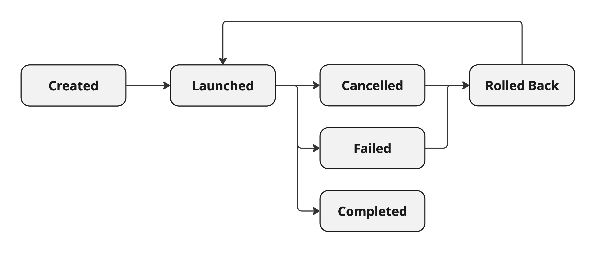

== Structured Concurrency in&nbsp;Action

{toc}

=== Virtual thread potential

Virtual threads are cheap and plentiful:

* no pooling necessary
* allow thread per task
* allow liberal creation +
  of threads for subtasks

⇝ Enable new concurrency programming model.

=== A first step

Whenever you need concurrent subtasks, +
spawn virtual threads for each:

```java
var threads = Executors
	.newVirtualThreadPerTaskExecutor()

var subtaskA = threads.submit(this::taskA);
var subtaskB = threads.submit(this::taskB);
var result = subtaskA.get() + subtaskB.get();
```

[%step]
But we can do (much) better!

=== Structured programming

Emerged when the sea of statements and GOTOs +
became unmaintainable:

* prescribes control structures
* prescribes single entry point +
  and clearly defined exit points
* influenced languages and runtimes

The stricter approach made code (much) clearer!

=== Unstructured concurrency

```java
var threads = Executors
	.newVirtualThreadPerTaskExecutor()

// what's the relationship between
// this and the two spawned threads?
// what happens when one of them fails?
var subtaskA = threads.submit(this::taskA);
var subtaskB = threads.submit(this::taskB);

// what if we only need the faster one?
var result = subtaskA.get() + subtaskB.get();
```

=== Structured concurrency

> When the flow of execution splits +
> into multiple concurrent flows, +
> they rejoin in the same code block.

Term coined/refined by:

* Martin Sustrik in https://www.250bpm.com/p/structured-concurrency[Structured Concurrency]
* Nathaniel J. Smith in https://vorpus.org/blog/notes-on-structured-concurrency-or-go-statement-considered-harmful/[Notes on structured concurrency [...\]]

=== Structured concurrency

Thread lifecycle is simple:

* starts when task begins
* ends on completion

⇝ Enables parent-child/sibling relationships +
  and logical grouping of threads.

=== In action

To put the API into action, we will perform tasks, +
that are represented by _our_ (!) class `Task`.

Methods:

* `public void run(Behavior) throws IOException`: +
** changes state
* `public String compute(Behavior) throws IOException`:
** changes state
** returns result
* `public void rollBack()`: resets state

`Behavior` can be `Run`, `Fail`, etc.

=== Task states

States and transitions of our tasks:



=== Code

Code, code, code, code
