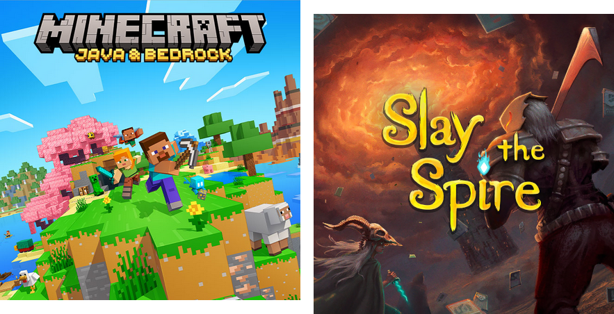

== Java in Education

Who learned Java in +
school, university, etc.?

🖐🏾

=== Java in Education

Java became a cornerstone in CS education because:

* the runtime simplified coding (e.g. GC)
* explicit types and concepts
* well-suited for OOP
* widely used

=== Java as a Hobby

Kids/students/grown-ups learn Java for their hobbies:

* home automation
* static website generation
* game modding

=== Java as a Second Language

Developers move from other languages to Java:

* frontend developers
* ML/AI developers
* developers from other ecosystems

=== Java for Beginners

All these learners benefit from:

* a simple, straightforward language
* a smooth standard library
* a powerful runtime
* a well-trodden path

=== Java in Business

Java is successful in business, science, etc. because:

* multi-paradigm language
* refined programming model
* comprehensive standard library
* powerful runtime
* backwards-compatible evolution
* detailed, varied tools
* strong, diverse ecosystem

=== Tension

There's a tension here:

* education benefits from a simple, straightforward Java
* professional use benefits from a detailed, diverse Java

To stay relevant in education, Java must have an on-ramp.

=== On-Ramp

An on-ramp to Java:

* small starting set of language constructs, +
  APIs, and tools
* features that allow quick achievements
* gradual expansion to the full set

=== Today

* teaching the language
* teaching the tools
* teaching the concepts
* teaching Java

=== Notes

* I'm no teacher/professor
* this is inspiration, not instruction
* slides at https://slides.nipafx.dev/teaching-java[slides.nipafx.dev/teaching-java] +
  (hit "?" to get navigation help)
* ask questions at any time
