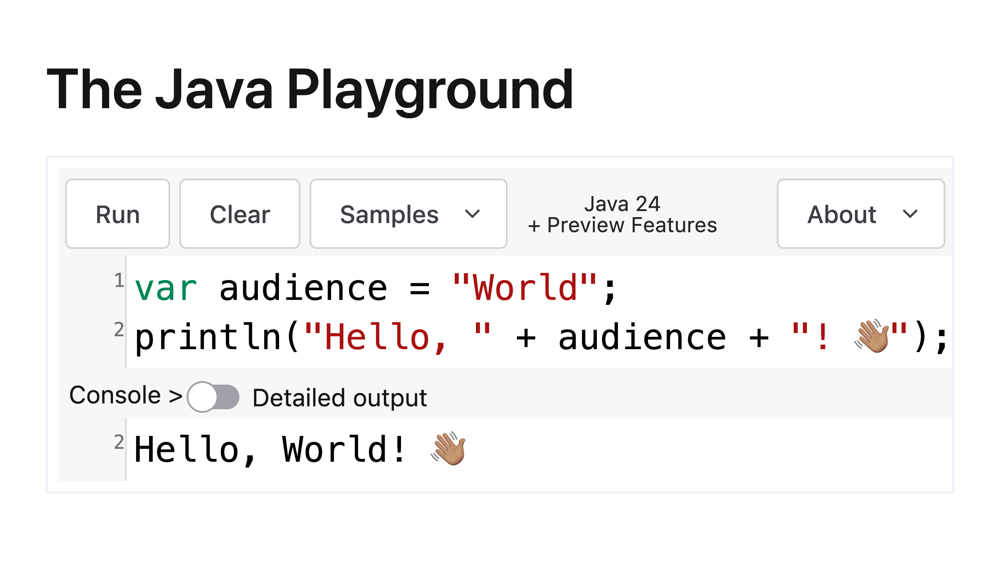

== Teaching the Tools

+++
<table class="toc">
	<tr><td>Teaching the Language</td></tr>
	<tr class="toc-current"><td>Teaching the Tools</td></tr>
	<tr><td>Teaching the Concepts</td></tr>
	<tr><td>Teaching Java</td></tr>
</table>
+++

=== Starting (with) Java

To write and run a simple Java program, you need:

* a JDK
* an editor (IDE?)
* `javac` (build tool? IDE?)
* `java` (IDE?)

=== Simplification

Beginners should be able to run +
simple Java programs with +
no/fewer/simpler tools!

[state="empty"]
=== !


=== The Java Playground

Oracle's Java Platform Group developed https://dev.java/playground/[the Java Playground]:

* *all you need*:
** tools: browser
** concepts: statements & arguments
* *but*:
** limited capabilities +
   (e.g. no file I/O or network)
** no persistence

=== jshell

Java 9 added `jshell`:

* *all you need*:
** tools: JDK, `jshell`
** concepts: statements & arguments
* *but*:
** no syntax highlighting
** no (smooth) persistence
** no progression

=== IDE vs Editor

An IDE:

* makes a few things easier
* is itself a complex tool
* is almost certainly unknown to beginners

Maybe not the best tool to introduce early.

=== IDE vs Editor

VS Code:

* is better known
* has decent Java capabilities

image::images/vs-code-java.png[]


=== Single-file Execution

Java 11 added single-file execution (https://openjdk.org/jeps/330[JEP 330]):

```
java Prog.java
```

* **tools**: JDK, `java`
* **but**: no progression

Much better for beginners, but just a section of an on-ramp.

=== Running Multiple Files

If you have a folder:

```
MyFirstJava
 ├─ Prog.java
 ├─ Helper.java
 └─ Lib
     └─ library.jar
```

Run with:

```
java -cp 'Lib/*' Prog.java
```

Added in Java 22 (https://openjdk.org/jeps/458[JEP 458]).

=== Dependencies

But where do you get dependencies from?

This is an open problem.

=== Progression

Natural progression:

* start experiments in playground
* to persist work:
** download JDK
** move to text editor
** start with single source file
* split into multiple files when code becomes larger
* use visibility & packages to add structure

Ramp up until delivery of artifacts is needed.
